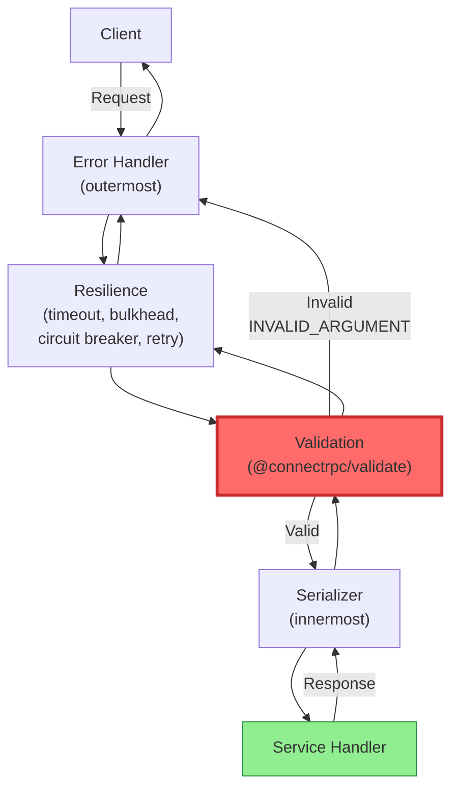

# ADR-005: Input Validation Strategy

## Status

**Accepted** - 2025-12-24

> **Update (2026-02-14)**: Replaced custom `createValidationInterceptor` with the official `@connectrpc/validate` package (`createValidateInterceptor()`). Custom implementation removed. Interceptor chain order revised — validation is now 7th (before serializer), not 1st. See [Implementation](#implementation) section.

---

## Context

### Target Environment

**Embedded devices in production**:
- Critical industrial/medical systems (high reliability requirements)
- Long-running processes (months/years without restart)
- No remote debugging (isolated networks)
- Expensive physical access (embedded devices in the field)

**Quality requirements**:
- Target uptime: 99.9%+ (mission-critical systems)
- Zero tolerance for crashes — failures can have serious consequences
- High confidence in releases — no ability to quick-fix in production
- Must catch bugs before deployment

### Why Input Validation is Critical (P0)

In this environment, **input validation** is the **primary defense mechanism**:

1. **No Auth/Authz Layer** — no traditional authentication protection
2. **Direct Service Access** — clients have direct access to services
3. **Malformed Data Risk** — invalid input can cause crashes or undefined behavior
4. **Data Integrity** — critical for embedded systems (robotics, industrial)

| Mechanism | Priority | Status |
|-----------|----------|--------|
| Input Validation | **P0 (Critical)** | This ADR |
| TLS Encryption | Optional | ADR-004 (internal) |
| Rate Limiting | Not Required | Controlled environment |
| Authentication | Not Required | Isolated network |
| Authorization | Not Required | Trusted devices |

### Requirements

1. **Schema-Based Validation** — rules must be part of proto schemas
2. **Automatic Enforcement** — validation happens automatically for all requests
3. **Fail Fast** — invalid requests rejected before business logic
4. **Clear Error Messages** — clients receive understandable validation errors
5. **Performance** — validation overhead < 1ms per request
6. **Extensibility** — custom validation rules possible

## Decision

**Use `@connectrpc/validate` (official ConnectRPC validation package backed by `@bufbuild/protovalidate`) for schema-based input validation, integrated into the default interceptor chain.**

### Solution Architecture



### Proto Schema with Validation Constraints

```protobuf
syntax = "proto3";
import "buf/validate/validate.proto";

message CreateOrderRequest {
  string customer_id = 1 [(buf.validate.field).string.min_len = 1];
  repeated OrderItem items = 2 [(buf.validate.field).repeated.min_items = 1];
  ShippingAddress shipping_address = 3 [(buf.validate.field).required = true];
  string currency = 4 [(buf.validate.field).string = {min_len: 3, max_len: 3}];
}

message OrderItem {
  string product_id = 1 [(buf.validate.field).string.min_len = 1];
  string name = 2 [(buf.validate.field).string.min_len = 1];
  int32 quantity = 3 [(buf.validate.field).int32.gt = 0];
  int64 price_cents = 4 [(buf.validate.field).int64.gt = 0];
}

message GetOrderRequest {
  string order_id = 1 [(buf.validate.field).string.uuid = true];
}

message ListOrdersRequest {
  int32 page_size = 1 [(buf.validate.field).int32 = {gte: 1, lte: 100}];
  string page_token = 2;
}
```

Available constraints: `min_len`, `max_len`, `pattern`, `email`, `uri`, `uuid` (string); `lt`, `lte`, `gt`, `gte`, `in`, `not_in` (numeric); `min_items`, `max_items`, `unique` (repeated); `required`, `skip` (message); `defined_only` (enum).

### buf.yaml Configuration

Proto files that use validation constraints must declare the dependency:

```yaml
# buf.yaml
version: v2
modules:
  - path: proto
deps:
  - buf.build/bufbuild/protovalidate
lint:
  use:
    - STANDARD
breaking:
  use:
    - FILE
```

## Implementation

### Package: `@connectrpc/validate`

Validation is delegated to the official ConnectRPC package. No custom interceptor implementation exists in Connectum.

**Dependencies** (in `@connectum/interceptors`):

```json
{
  "dependencies": {
    "@connectrpc/validate": "catalog:"
  }
}
```

**Catalog** (in `pnpm-workspace.yaml`):

```yaml
catalog:
  '@connectrpc/validate': ^0.2.0
  '@bufbuild/protovalidate': ^1.1.1
```

`@connectrpc/validate` has peer dependencies on `@bufbuild/protobuf` (^2.9.0), `@bufbuild/protovalidate` (^1.0.0), and `@connectrpc/connect` (^2.0.3).

### Integration with `createDefaultInterceptors()`

Location: `packages/interceptors/src/defaults.ts`

```typescript
import { createValidateInterceptor } from "@connectrpc/validate";

// Inside createDefaultInterceptors():
if (options.validation !== false) {
    interceptors.push(createValidateInterceptor());
}
```

Configuration accepts only `boolean`:

```typescript
export interface DefaultInterceptorOptions {
    /** Validates request messages using @connectrpc/validate. @default true */
    validation?: boolean;
    // ...
}
```

For custom validation configuration, use `createValidateInterceptor()` directly:

```typescript
import { createValidateInterceptor } from "@connectrpc/validate";

const server = createServer({
  services: [routes],
  interceptors: [
    createValidateInterceptor(/* custom options */),
    // ... other interceptors
  ],
});
```

### Interceptor Chain Order

The default chain order is fixed (see [ADR-023](./023-uniform-registration-api.md)):

```
1. errorHandler     — Catch-all error normalization (outermost, must be first)
2. timeout          — Enforce deadline before any processing
3. bulkhead         — Limit concurrency
4. circuitBreaker   — Prevent cascading failures
5. retry            — Retry transient failures (exponential backoff)
6. fallback         — Graceful degradation (DISABLED by default)
7. validation       — @connectrpc/validate (createValidateInterceptor)
8. serializer       — JSON serialization (innermost)
```

**Rationale for validation position (7th, not 1st):**

The original ADR proposed validation as the first interceptor ("reject invalid data immediately"). The current implementation places it after resilience interceptors because:

1. **Error handler must be outermost** — validation errors (ConnectError with `INVALID_ARGUMENT`) need consistent error formatting, which errorHandler provides as the outermost wrapper
2. **Timeout protects validation** — if validation itself is slow (complex constraints), timeout will abort it
3. **Validation before serializer** — data is validated before JSON serialization, ensuring only valid data reaches the handler
4. **Resilience is infrastructure** — timeout, bulkhead, circuit breaker protect the system regardless of payload validity

### Usage

```typescript
import { createServer } from '@connectum/core';
import { createDefaultInterceptors } from '@connectum/interceptors';

// Validation enabled by default
const server = createServer({
  services: [routes],
  interceptors: createDefaultInterceptors(),
});

// Disable validation
const server = createServer({
  services: [routes],
  interceptors: createDefaultInterceptors({ validation: false }),
});
```

### Error Response

When validation fails, `@connectrpc/validate` throws a `ConnectError` with code `INVALID_ARGUMENT` containing structured violation details:

```
Code: INVALID_ARGUMENT
Message: "customer_id: value length must be at least 1 characters [string.min_len]"
```

---

## Consequences

### Positive

1. **Zero Custom Code** — validation logic is fully delegated to the official `@connectrpc/validate` package. No maintenance burden for custom interceptor.

2. **Consistent with Ecosystem** — uses the same validation library as the rest of the ConnectRPC/buf ecosystem.

3. **Schema-Based** — proto schemas are the single source of truth. Validation rules are co-located with message definitions.

4. **Automatic Enforcement** — enabled by default in `createDefaultInterceptors()`. All requests are validated without developer action.

5. **Clear Error Messages** — clients receive structured `INVALID_ARGUMENT` errors with per-field violation details.

6. **Performance** — validation overhead < 1ms per request for typical messages.

### Negative

1. **Proto File Complexity** — proto files become more verbose with constraint annotations. Mitigated: constraints are self-documenting and easier to read than manual validation code.

2. **Limited Custom Validation** — `buf.validate` provides a predefined constraint set. Business-level validation (e.g., "email must be unique") still requires service-layer code.

3. **Boolean-Only Config** — `createDefaultInterceptors()` accepts only `boolean` for validation. Custom configuration requires direct use of `createValidateInterceptor()`.

4. **Upstream Dependency** — relies on `@connectrpc/validate` and `@bufbuild/protovalidate`. Breaking changes upstream would affect Connectum.

---

## Alternatives Considered

| # | Alternative | Rating | Why Rejected |
|---|-------------|--------|--------------|
| 1 | Manual validation in service handlers | 2/10 | Error-prone, inconsistent, boilerplate, does not scale |
| 2 | Joi/Zod runtime validation | 6/10 | Duplicate schemas (proto + Zod), schema drift risk, proto should be single source of truth |
| 3 | Custom `createValidationInterceptor` | 7/10 | Was the original decision. Replaced by official `@connectrpc/validate` — less maintenance, better ecosystem compatibility |
| **4** | **`@connectrpc/validate` (chosen)** | **9/10** | **Official package, zero custom code, ecosystem standard, maintained by ConnectRPC team** |

---

## Migration

The custom validation interceptor was removed in favor of `@connectrpc/validate`:

```typescript
// BEFORE (custom, removed)
import { createValidationInterceptor } from "@connectum/interceptors";
const interceptor = createValidationInterceptor({ skipStreaming: true });

// AFTER (official)
import { createValidateInterceptor } from "@connectrpc/validate";
const interceptor = createValidateInterceptor();

// Or via default chain (recommended)
import { createDefaultInterceptors } from "@connectum/interceptors";
const interceptors = createDefaultInterceptors(); // validation enabled by default
```

---

## References

- [@connectrpc/validate](https://www.npmjs.com/package/@connectrpc/validate) — official ConnectRPC validation interceptor
- [Buf Validate](https://github.com/bufbuild/protovalidate) — constraint library and reference
- [ConnectRPC Interceptors](https://connectrpc.com/docs/node/interceptors)
- [OWASP Input Validation Cheat Sheet](https://cheatsheetseries.owasp.org/cheatsheets/Input_Validation_Cheat_Sheet.html)
- [ADR-023: Uniform Registration API](./023-uniform-registration-api.md) — interceptor chain order

## Changelog

| Date | Author | Change |
|------|--------|--------|
| 2025-12-24 | Claude | Initial ADR — custom createValidationInterceptor, validation-first chain order |
| 2026-02-14 | Claude | Replaced custom interceptor with @connectrpc/validate; updated chain order (7th, not 1st); added migration guide; real proto examples from production-ready example |
