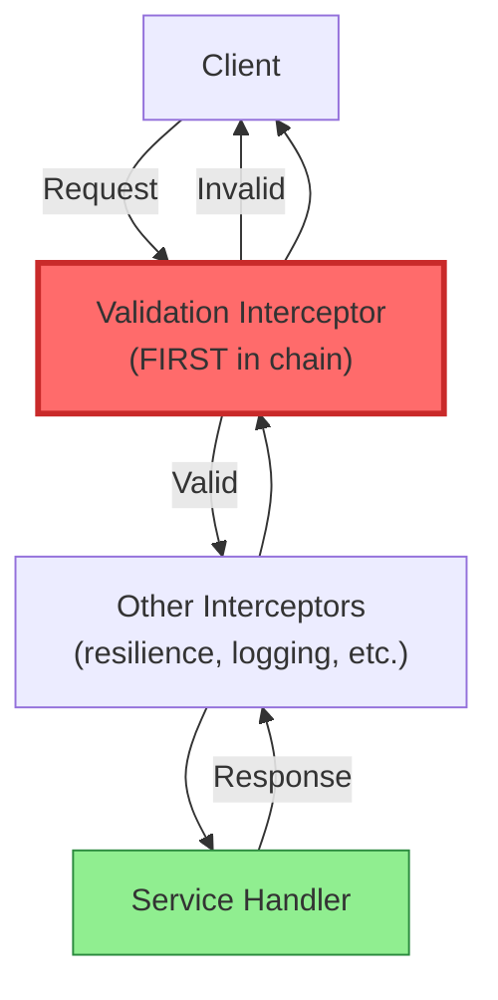

# ADR-005: Input Validation Strategy

## Status

**Accepted** - 2025-12-24

## Context

Connectum is a universal framework for building gRPC/ConnectRPC microservices on **embedded devices in isolated (air-gapped) networks**. This environment demands a specific approach to security.

### Target Environment

- Devices operate in isolated networks with no Internet access
- No external threats due to physical isolation
- No traditional authentication/authorization (no auth server available)
- No rate limiting needed (controlled environment)

**Security model** relies on physical isolation and input validation rather than traditional auth/authz mechanisms.

### Why Input Validation is Critical (P0)

In this environment, **input validation** is the **primary defense mechanism**:

1. **No Auth/Authz Layer** -- no traditional authentication protection
2. **Direct Service Access** -- clients have direct access to services
3. **Malformed Data Risk** -- invalid input can cause crashes or undefined behavior
4. **Data Integrity** -- critical for embedded systems (robotics, industrial)

| Mechanism | Priority | Status |
|-----------|----------|--------|
| Input Validation | **P0 (Critical)** | This ADR |
| TLS Encryption | Optional | ADR-004 (internal) |
| Rate Limiting | Not Required | Controlled environment |
| Authentication | Not Required | Isolated network |
| Authorization | Not Required | Trusted devices |

### Requirements

1. **Schema-Based Validation** -- rules must be part of proto schemas
2. **Automatic Enforcement** -- validation happens automatically for all requests
3. **Fail Fast** -- invalid requests rejected before business logic
4. **Clear Error Messages** -- clients receive understandable validation errors
5. **Performance** -- validation overhead < 1ms per request
6. **Extensibility** -- custom validation rules possible

## Decision

**Use @bufbuild/protovalidate for schema-based input validation, enforced via a validation interceptor.**

### Solution Architecture



### Proto Schema with Validation Constraints

```protobuf
syntax = "proto3";
import "buf/validate/validate.proto";

message CreateUserRequest {
  string email = 1 [(buf.validate.field).string.email = true];
  string password = 2 [(buf.validate.field).string.min_len = 8];
  int32 age = 3 [
    (buf.validate.field).int32.gte = 18,
    (buf.validate.field).int32.lte = 120
  ];
  string username = 4 [
    (buf.validate.field).string.pattern = "^[a-zA-Z0-9_]{3,20}$",
    (buf.validate.field).required = true
  ];
}
```

Available constraints include: `min_len`, `max_len`, `pattern`, `email`, `uri`, `uuid` (string); `lt`, `lte`, `gt`, `gte`, `in`, `not_in` (numeric); `min_items`, `max_items`, `unique` (repeated); `required`, `skip` (message); `defined_only` (enum).

### Validation Interceptor

Location: `packages/interceptors/src/validation.ts`

```typescript
import { Validator } from '@bufbuild/protovalidate';
import type { Interceptor } from '@connectrpc/connect';
import { ConnectError, Code } from '@connectrpc/connect';

export interface ValidationOptions {
  failFast?: boolean;       // Stop on first error (default: true)
  logViolations?: boolean;  // Log validation failures (default: true)
}

export const createValidationInterceptor = (
  options: ValidationOptions = {}
): Interceptor => {
  const validator = new Validator();
  const { failFast = true, logViolations = true } = options;

  return (next) => async (req) => {
    const result = await validator.validate(req.method.input, req.message);

    if (!result.isValid) {
      if (logViolations) {
        console.error('Validation failed:', result.violations);
      }
      throw new ConnectError(
        `Validation failed: ${result.violations.join(', ')}`,
        Code.InvalidArgument,
        undefined,
        undefined,
        { violations: result.violations }
      );
    }

    return await next(req);
  };
};
```

### Integration with createDefaultInterceptors()

Validation interceptor is placed **first** in the default chain:

```typescript
const interceptors: Interceptor[] = [
  // 1. VALIDATION - FIRST! Reject invalid data immediately
  createValidationInterceptor({ failFast: true }),

  // 2. RESILIENCE
  createTimeoutInterceptor({ duration: 30000 }),
  createCircuitBreakerInterceptor({ threshold: 5 }),
  createBulkheadInterceptor({ capacity: 100 }),

  // 3. SECURITY
  createRedactInterceptor(),

  // 4. ERROR HANDLING + OBSERVABILITY
  createErrorHandlerInterceptor(),
  createLoggerInterceptor({ serviceName }),
  createTracingInterceptor({ serviceName }),

  // 5. RETRY + CUSTOM
  createRetryInterceptor({ maxRetries: 3 }),
  ...customInterceptors,
];
```

**Critical order**: Validation MUST be first -- invalid data is rejected immediately, preventing downstream interceptors from processing bad data or logging sensitive invalid payloads.

## Consequences

### Positive

1. **Primary Security Defense** -- all input validated before business logic runs. Service handlers can trust that request data meets schema constraints.

2. **Consistent Validation Across All Services** -- proto schemas are the single source of truth; reusable message types (e.g., `Email`, `Password`) enforce the same rules everywhere.

3. **Developer Experience** -- no manual validation code needed; handlers focus purely on business logic.

4. **Clear Error Messages** -- clients receive structured `INVALID_ARGUMENT` errors with per-field violation details.

5. **Performance** -- validation overhead < 1ms per request (measured in Phase 5 benchmarks).

6. **Type Safety** -- proto validation complements TypeScript types with runtime checks.

### Negative

1. **Proto File Complexity** -- proto files become more verbose with constraint annotations. Mitigated by the fact that constraints are self-documenting and easier to read than manual validation code.

2. **Limited Custom Validation** -- buf validate provides a predefined constraint set. Business-level validation (e.g., "email must be unique") still requires service-layer code.

3. **Breaking Proto Changes** -- adding validation constraints to existing messages is a breaking change for clients sending previously-accepted invalid data. Mitigated by version bumps and migration guides.

4. **Performance Overhead** -- typical ~0.5-1ms per request; complex validations up to 2-3ms. Acceptable for most use cases.

## Alternatives Considered

| # | Alternative | Rating | Why Rejected |
|---|-------------|--------|--------------|
| 1 | Manual validation in service handlers | 2/10 | Error-prone, inconsistent, boilerplate, does not scale |
| 2 | Joi/Zod runtime validation | 6/10 | Duplicate schemas (proto + Zod), schema drift risk, proto should be single source of truth |
| 3 | gRPC Gateway validation | 4/10 | Not viable for embedded devices (no gateway); service-to-service calls bypass it |
| **4** | **@bufbuild/protovalidate (chosen)** | **9/10** | **Best balance of power, consistency, and maintainability; industry standard** |

## References

- [Buf Validate](https://github.com/bufbuild/protovalidate) -- library and constraint reference
- [ConnectRPC Interceptors](https://connectrpc.com/docs/node/interceptors)
- [OWASP Input Validation Cheat Sheet](https://cheatsheetseries.owasp.org/cheatsheets/Input_Validation_Cheat_Sheet.html)
- ADR-004: Validation Strategy (internal planning document)
