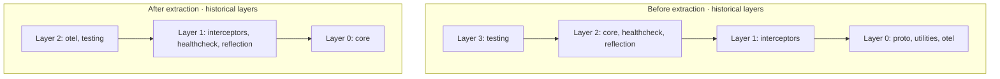

# ADR-022: Protocol Extraction to Separate Packages

## Status

**Accepted** - 2026-02-11

The original interface and backward-compatibility period below are historical.
Current `ProtocolRegistration` separates one-time `setup(context)` from
`register(router)`; see [Custom Protocols](/en/guide/protocols/custom) and the
[setup/register migration](/en/migration/protocol-setup).

## Context

In the current architecture, the `@connectum/core` package contains built-in protocol implementations:

- **Healthcheck** (`./protocols/healthcheck/`) -- gRPC Health Check + HTTP endpoints
- **Reflection** (`./protocols/reflection/`) -- gRPC Server Reflection v1 + v1alpha

### Problems with the current approach

1. **SRP violation**: Core is responsible for both server lifecycle AND protocol implementations
2. **Excessive dependencies**: `@lambdalisue/connectrpc-grpcreflect` is pulled in even if reflection is not used
3. **Tight coupling**: Protocols are hardwired into Server.ts via dynamic `import()` calls
4. **Extensibility**: Cannot add a custom protocol without modifying core
5. **Healthcheck bugs**: `update()` without serviceName updates only the first service instead of all; enum reverse mapping in HTTP handler

### Bugs discovered (fixed in new packages)

| Bug | Description | Fix |
|-----|-------------|-----|
| #1 | `update()` without serviceName updates only the first service | Now updates ALL registered services |
| #2 | `update()` with unknown serviceName silently creates an entry | Throws Error with description |
| #3 | Singleton `Healthcheck` export -- shared state between servers | Removed; each `Healthcheck()` call creates a new manager |
| #4 | `watch()` interval hardcoded to 500ms | Configurable via `watchInterval` option |
| #5 | `ServingStatus[status]` enum reverse mapping in HTTP handler | Replaced with explicit Map |

## Decision

Extract protocols into separate Layer 1 packages:

```
@connectum/healthcheck  -- gRPC Health Check + HTTP endpoints
@connectum/reflection   -- gRPC Server Reflection (v1 + v1alpha)
```

### New Protocol Registration API

Introduce a `ProtocolRegistration` interface in `@connectum/core`:

```typescript
interface ProtocolContext {
    readonly registry: ReadonlyArray<DescFile>;
}

type HttpHandler = (req: Http2ServerRequest, res: Http2ServerResponse) => boolean;

interface ProtocolRegistration {
    readonly name: string;
    register(router: ConnectRouter, context: ProtocolContext): void;
    httpHandler?: HttpHandler;
}
```

### New Usage API

```typescript
import { createServer } from '@connectum/core';
import { Healthcheck, healthcheckManager, ServingStatus } from '@connectum/healthcheck';
import { Reflection } from '@connectum/reflection';

const server = createServer({
    services: [myRoutes],
    protocols: [Healthcheck({ httpEnabled: true, watchInterval: 1000 }), Reflection()],
});

server.on('ready', () => {
    healthcheckManager.update(ServingStatus.SERVING);
});

await server.start();
```

### Backward Compatibility

Legacy options `health` and `reflection` in `CreateServerOptions` are preserved with `@deprecated` annotations. When used, Server.ts automatically loads built-in implementations from `./protocols/`.

## Alternatives Considered

### Alternative 1: Plugin system with auto-discovery

Automatic loading of protocols from node_modules by convention (e.g., `connectum-plugin-*`).

**Rejected**: Excessive complexity, implicit behavior, violates Explicit > Implicit.

### Alternative 2: Middleware pattern (like Express)

```typescript
server.use(healthcheck());
server.use(reflection());
```

**Rejected**: ConnectRPC router registration must happen BEFORE server start and in one place. The middleware pattern is not suitable for gRPC service registration.

### Alternative 3: Keep as-is, only extract types

Extract only TypeScript types, leaving implementations in core.

**Rejected**: Does not solve the excessive dependencies and extensibility problems.

## Consequences

### Positive

- **Modularity**: Core can be used without healthcheck/reflection
- **Extensibility**: Custom protocols via a single interface
- **Fewer dependencies**: Core doesn't pull `@lambdalisue/connectrpc-grpcreflect` for reflection
- **Bugs fixed**: HealthcheckManager correctly updates all services
- **Configurability**: watch interval, HTTP path, httpEnabled

### Negative

- **Breaking change** for code using `server.health`
- **Two packages instead of one** for the typical use case
- **Temporary code duplication** (built-in protocols preserved for backward compat)

### Package Layer Changes



## Migration Guide

### From `server.health.update()` to `healthcheckManager.update()`

```typescript
// Before
const server = createServer({
    services: [routes],
    health: { enabled: true },
});
server.on('ready', () => {
    server.health.update(ServingStatus.SERVING);
});

// After
const server = createServer({
    services: [routes],
    protocols: [Healthcheck()],
});
server.on('ready', () => {
    healthcheckManager.update(ServingStatus.SERVING);
});
```

### From `reflection: true` to `Reflection()`

```typescript
// Before
const server = createServer({
    services: [routes],
    reflection: true,
});

// After
import { Reflection } from '@connectum/reflection';

const server = createServer({
    services: [routes],
    protocols: [Reflection()],
});
```

## References

- ADR-003: Package Decomposition Strategy
- gRPC Health Checking Protocol: https://github.com/grpc/grpc/blob/master/doc/health-checking.md
- gRPC Server Reflection: https://grpc.io/docs/guides/reflection/

## Update (2026-10-01)

`@connectum/reflection` no longer depends on `@lambdalisue/connectrpc-grpcreflect`: it implements the gRPC Server Reflection Protocol itself, on code generated from the upstream `grpc.reflection` protos. The extraction rationale above stands; the reflection package's only external dependencies are now `@bufbuild/protobuf` and `@connectrpc/connect`.

In the same release `ProtocolContext` gained `services` — the services mounted before the protocol, as a frozen snapshot next to `registry`. Healthcheck and Reflection read service names from it, because a file in `registry` may declare services that are not mounted.
