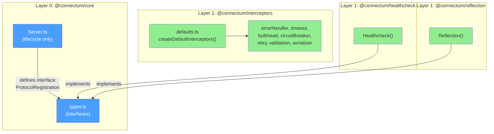

# ADR-023: Uniform Registration API for Services, Interceptors, and Protocols

## Status

**Accepted** - 2026-02-11

## Context

In `@connectum/core` (Layer 2), the `Server.ts` class had tight coupling with `@connectum/interceptors` (Layer 1) through direct import of 6 factory functions and 40+ lines of hardcoded interceptor chain assembly logic.

### Problems with the previous architecture

1. **SRP violation**: `Server.ts` was responsible for both server lifecycle AND interceptor chain configuration (selection, creation, ordering). These are two distinct responsibilities combined in a single module.

2. **Tight coupling**: `@connectum/core` directly imported 6 factories from `@connectum/interceptors`:
   - `createErrorHandlerInterceptor`
   - `createValidationInterceptor`
   - `createSerializerInterceptor`
   - `createLoggerInterceptor`
   - `createTracingInterceptor`
   - `createRedactInterceptor`

   This violated the layered architecture principle (ADR-003): Layer 2 knew about concrete Layer 1 implementations.

3. **`builtinInterceptors` option**: `CreateServerOptions` contained a nested `builtinInterceptors` object with fields for each built-in interceptor (errorHandler, logger, tracing, serializer, redact, validation). This created tight coupling between the `@connectum/core` API and the internal structure of `@connectum/interceptors`.

4. **Asymmetric API**: Services already had `addService()` and a readonly `server.routes` getter, but interceptors and protocols had no analogous runtime registration API:

   ```typescript
   // Services: full API
   server.addService(myRoute);
   console.log(server.routes);   // ReadonlyArray<ServiceRoute>

   // Interceptors: only via options
   createServer({ builtinInterceptors: { logger: false } });
   // No addInterceptor(), no server.interceptors

   // Protocols: only via options
   createServer({ protocols: [...] });
   // No addProtocol(), no server.protocols
   ```

### ADR-022 Context

During the implementation of ADR-022 (Protocol Extraction), the `ProtocolRegistration` interface and `protocols` option were introduced. The logical next step was to bring interceptors to the same pattern and remove the hardcoded logic from core.

## Decision

### 1. Extract `createDefaultInterceptors()` to `@connectum/interceptors`

All interceptor chain assembly logic has been moved to the `createDefaultInterceptors()` factory function in `@connectum/interceptors`:

```typescript
// @connectum/interceptors/src/defaults.ts

export interface DefaultInterceptorOptions {
    errorHandler?: boolean | ErrorHandlerOptions;
    validation?: boolean | ValidationOptions;
    serializer?: boolean | SerializerOptions;
    logger?: boolean | LoggerOptions;
    tracing?: boolean | TracingOptions;
    redact?: boolean | RedactOptions;
}

export function createDefaultInterceptors(
    options?: DefaultInterceptorOptions
): Interceptor[];
```

Interceptor order is fixed and documented:
1. **errorHandler** -- first, catches all downstream errors
2. **validation** -- second, validates before processing
3. **serializer** -- JSON serialization
4. **logger** -- logging (development only by default)
5. **tracing** -- OpenTelemetry distributed tracing
6. **redact** -- sensitive data redaction (last)

### 2. Remove `builtinInterceptors` from `CreateServerOptions`

The `builtinInterceptors` option has been removed from `CreateServerOptions` (breaking change, no deprecation phase).

### 3. Two-way semantics for the `interceptors` option

```typescript
interface CreateServerOptions {
    /**
     * ConnectRPC interceptors.
     * When omitted or [], no interceptors are applied.
     * Use createDefaultInterceptors() from @connectum/interceptors
     * to get the production-ready chain.
     */
    interceptors?: Interceptor[];
}
```

| `interceptors` value | Behavior |
|----------------------|----------|
| `undefined` (omitted) or `[]` | No interceptors |
| `[a, b, c]` (explicit array) | Used as-is |

Implementation in the `ServerImpl` constructor:

```typescript
this._interceptors = [...(options.interceptors ?? [])];
```

> **Note:** This is a further simplification from the original ADR design. The auto-defaults behavior was removed to achieve **zero internal dependencies** for `@connectum/core` (Layer 0). Users explicitly pass `createDefaultInterceptors()` from `@connectum/interceptors` when they want the default chain.

### 4. Uniform Registration API

Added `addInterceptor()` and `addProtocol()` following the existing `addService()` pattern:

```typescript
interface Server {
    // Services (existing)
    addService(service: ServiceRoute): void;
    readonly routes: ReadonlyArray<ServiceRoute>;

    // Interceptors (added)
    addInterceptor(interceptor: Interceptor): void;
    readonly interceptors: ReadonlyArray<Interceptor>;

    // Protocols (added)
    addProtocol(protocol: ProtocolRegistration): void;
    readonly protocols: ReadonlyArray<ProtocolRegistration>;
}
```

All three `addX()` methods work identically:
- Can only be called in the `CREATED` state (before `start()`)
- Throw `Error` if the server is already running
- Append the element to the internal array

All three readonly getters return `ReadonlyArray<T>`.

### Final Architecture



> **Note:** There is no arrow from `core` to `interceptors`. Core has zero internal dependencies. Users compose interceptors and protocols in their application code.

## Alternatives Considered

### Alternative 1: Keep `builtinInterceptors` with a deprecation phase

**Approach**: Keep `builtinInterceptors` as deprecated, map it to `createDefaultInterceptors()` inside core.

**Rating**: 4/10

**Pros:** Backward compatibility for 1-2 releases; smooth migration for users.

**Cons:** Tight coupling persists (core must know about DefaultInterceptorOptions); type duplication between packages; code complexity: two configuration paths, edge cases when combining.

**Why rejected**: Breaking changes are acceptable when a migration guide is provided. Dual configuration creates more confusion than a clean break.

### Alternative 2: Interceptors as ProtocolRegistration

**Approach**: Unify interceptors and protocols under a single interface (e.g., `Plugin`).

**Rating**: 3/10

**Pros:** Single extension mechanism; smaller API surface.

**Cons:** Interceptors and protocols are fundamentally different concepts in ConnectRPC; interceptors are a middleware chain (order matters), protocols are service registration; loss of type safety: `Interceptor` type from `@connectrpc/connect` is not compatible with `ProtocolRegistration`; contradicts ConnectRPC ecosystem.

**Why rejected**: Interceptors and protocols have different semantics. Artificial unification hides the difference and complicates the type system.

### Alternative 3: Builder pattern instead of options object

**Approach**:

```typescript
const server = createServer()
    .withService(routes)
    .withInterceptors(createDefaultInterceptors())
    .withProtocol(Healthcheck())
    .build();
```

**Rating**: 5/10

**Pros:** Fluent API, reads well; explicit configuration sequence.

**Cons:** Requires deep refactoring of the entire API; incompatible with the current EventEmitter-based approach; two APIs (builder + options) = confusion; no precedent in ConnectRPC ecosystem.

**Why rejected**: Too extensive a refactoring for the problem being solved. Options object + runtime `addX()` is a standard pattern in the Node.js ecosystem.

## Consequences

### Positive

- **SRP**: `Server.ts` is responsible only for lifecycle (start/stop/state/events). Knowledge of concrete interceptors is moved to `@connectum/interceptors`.

- **Uniform API**: Services, interceptors, and protocols follow the same pattern:
  ```
  options.X     -> configuration at creation
  server.addX() -> runtime registration (before start)
  server.X      -> readonly getter
  ```

- **Zero coupling**: `@connectum/core` has no dependency on `@connectum/interceptors`. Users explicitly import and pass interceptors.

- **Explicit control**: Users fully control the interceptor chain via the three-way semantics (`undefined` / `[]` / `[...]`).

- **Testability**: `createDefaultInterceptors()` can be tested in isolation from Server.

### Negative

- **Breaking change**: All call sites using `builtinInterceptors` require migration.

- **Runner legacy API**: `Runner()` (deprecated) must call `createDefaultInterceptors()` itself to map from `RunnerOptions.interceptors` (which contained `DefaultInterceptorOptions`).

- **Additional import**: To customize the interceptor chain, users must import `createDefaultInterceptors` from `@connectum/interceptors` (an additional package beyond `@connectum/core`).

- **No zero-config interceptors**: Users must explicitly import `createDefaultInterceptors` from `@connectum/interceptors`. This trades convenience for architectural purity (core = Layer 0).

### Neutral

- Total package count unchanged.
- `@connectum/core` size decreased (chain assembly code removed).
- `@connectum/interceptors` grew by one module (`defaults.ts`).

## Migration Guide

### Removing `builtinInterceptors`

| Before (v0.1.x) | After (v0.2.x) |
|------------------|-----------------|
| `builtinInterceptors: { all: false }` | `interceptors: []` |
| `builtinInterceptors: { logger: false }` | `interceptors: createDefaultInterceptors({ logger: false })` |
| `builtinInterceptors: { errorHandler: { logErrors: true }, logger: false }` | `interceptors: createDefaultInterceptors({ errorHandler: { logErrors: true }, logger: false })` |
| `builtinInterceptors: { ... }` (all defaults) | Omit `interceptors` (auto-defaults) |
| `builtinInterceptors: { ... }, interceptors: [custom]` | `interceptors: [...createDefaultInterceptors(), custom]` |

### New Capabilities

```typescript
import { createServer } from '@connectum/core';
import { createDefaultInterceptors } from '@connectum/interceptors';
import { Healthcheck, healthcheckManager, ServingStatus } from '@connectum/healthcheck';
import { Reflection } from '@connectum/reflection';

const server = createServer({
    services: [myRoutes],
    protocols: [Healthcheck({ httpEnabled: true }), Reflection()],
    // interceptors omitted -> auto-defaults
});

// Runtime registration (before start)
server.addInterceptor(myCustomInterceptor);
server.addProtocol(myCustomProtocol);

// Readonly getters
console.log(server.interceptors);  // ReadonlyArray<Interceptor>
console.log(server.protocols);     // ReadonlyArray<ProtocolRegistration>
console.log(server.routes);        // ReadonlyArray<ServiceRoute>

server.on('ready', () => {
    healthcheckManager.update(ServingStatus.SERVING);
});

await server.start();
```

## References

- [ADR-003: Package Decomposition](./003-package-decomposition.md) -- layered architecture, Layer 2 -> Layer 1 principle
- [ADR-022: Protocol Extraction](./022-protocol-extraction.md) -- introduction of ProtocolRegistration interface

## Changelog

| Date | Author | Change |
|------|--------|--------|
| 2026-02-11 | Claude | Initial ADR -- Uniform Registration API |
