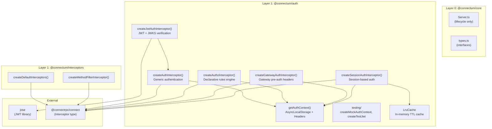
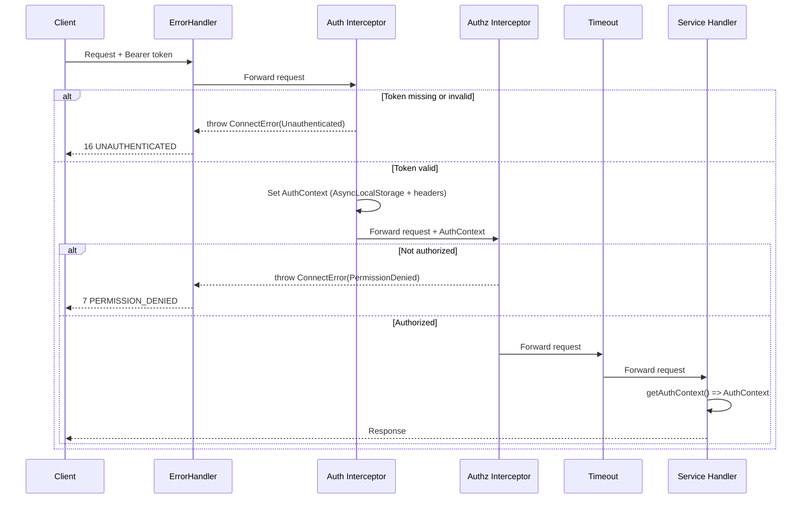

# ADR-024: Auth/Authz Strategy

## Status
Accepted -- 2026-02-15
Revised -- 2026-02-17 (v0.2.0: Gateway, Session interceptors, Security fixes)

## Context

Connectum — a universal gRPC/ConnectRPC framework — has no built-in authentication or authorization. Each team writes custom auth interceptors, there is no standard for context propagation, and no best practices for JWT handling.

The project board references Envoy ext_authz, JWT authentication, JWT claim authorization, and credential injection as requirements.

**Key requirements:**
1. Generic auth mechanism (not locked to JWT)
2. JWT convenience layer (covers 80% of use cases)
3. Declarative authorization (RBAC/claims)
4. Context propagation (in-process + cross-service)
5. Test utilities for auth scenarios

**Constraints:**
- Zero changes to `@connectum/core` (ADR-003 layer rules)
- Standard ConnectRPC `Interceptor` type (composable with existing interceptors)
- Optional dependency — users who don't need auth don't install it

## Decision

Create a new `@connectum/auth` package (Layer 1) with interceptor factories, auth context propagation, and test utilities.

### 1. Package Architecture

**Layer 1** package with zero internal dependencies:

| Dependency | Type | Purpose |
|---|---|---|
| `jose` | dependency | JWT verification, JWKS, signing |
| `@connectrpc/connect` | peer dependency | Interceptor type, ConnectError, Code |
| `@connectum/otel` | optional peer | OTel span enrichment |

### 2. Interceptor Factories

#### 2.1 `createAuthInterceptor()` — Generic Authentication

Pluggable authentication for any credential type (API keys, mTLS, opaque tokens, custom schemes).

```typescript
/**
 * Create a generic authentication interceptor.
 *
 * Extracts credentials from request headers, verifies them using
 * a user-provided callback, and stores the resulting AuthContext
 * in AsyncLocalStorage for downstream access.
 *
 * @param options - Authentication options
 * @returns ConnectRPC interceptor
 *
 * @example API key authentication
 * ```typescript
 * import { createAuthInterceptor } from '@connectum/auth';
 *
 * const auth = createAuthInterceptor({
 *   extractCredentials: (req) => req.header.get('x-api-key'),
 *   verifyCredentials: async (apiKey) => {
 *     const user = await db.findByApiKey(apiKey);
 *     if (!user) throw new Error('Invalid API key');
 *     return {
 *       subject: user.id,
 *       roles: user.roles,
 *       scopes: [],
 *       claims: {},
 *       type: 'api-key',
 *     };
 *   },
 * });
 * ```
 */
export function createAuthInterceptor(options: AuthInterceptorOptions): Interceptor;
```

#### 2.2 `createJwtAuthInterceptor()` — JWT Convenience

Pre-built JWT verification with JWKS support, key rotation, and standard claim mapping.

```typescript
/**
 * Create a JWT authentication interceptor.
 *
 * Convenience wrapper around createAuthInterceptor() that handles
 * JWT extraction from Authorization header, verification via jose,
 * and standard claim mapping to AuthContext.
 *
 * Supports:
 * - JWKS remote key sets (with automatic caching and rotation)
 * - HMAC symmetric secrets
 * - Asymmetric public keys (RSA, EC, Ed25519)
 * - Issuer and audience validation
 * - Custom claim-to-role/scope mapping
 *
 * @param options - JWT authentication options
 * @returns ConnectRPC interceptor
 *
 * @example JWKS-based JWT auth (Auth0, Keycloak, etc.)
 * ```typescript
 * import { createJwtAuthInterceptor } from '@connectum/auth';
 *
 * const jwtAuth = createJwtAuthInterceptor({
 *   jwksUri: 'https://auth.example.com/.well-known/jwks.json',
 *   issuer: 'https://auth.example.com/',
 *   audience: 'my-api',
 *   claimsMapping: {
 *     roles: 'realm_access.roles',
 *     scopes: 'scope',
 *   },
 * });
 * ```
 */
export function createJwtAuthInterceptor(options: JwtAuthInterceptorOptions): Interceptor;
```

#### 2.3 `createAuthzInterceptor()` — Declarative Authorization

Rule-based authorization with RBAC support and programmatic callback escape hatch.

```typescript
/**
 * Create an authorization interceptor.
 *
 * Evaluates declarative rules and/or a programmatic callback against
 * the AuthContext established by the authentication interceptor.
 *
 * IMPORTANT: This interceptor MUST run AFTER an authentication interceptor
 * (createAuthInterceptor or createJwtAuthInterceptor) in the chain.
 *
 * @param options - Authorization options
 * @returns ConnectRPC interceptor
 *
 * @example RBAC with declarative rules
 * ```typescript
 * import { createAuthzInterceptor } from '@connectum/auth';
 *
 * const authz = createAuthzInterceptor({
 *   defaultPolicy: 'deny',
 *   rules: [
 *     {
 *       name: 'public-access',
 *       methods: ['public.v1.PublicService/*'],
 *       effect: 'allow',
 *     },
 *     {
 *       name: 'admin-only',
 *       methods: ['admin.v1.AdminService/*'],
 *       requires: { roles: ['admin'] },
 *       effect: 'allow',
 *     },
 *   ],
 * });
 * ```
 *
 * @example Programmatic authorization callback
 * ```typescript
 * const authz = createAuthzInterceptor({
 *   authorize: async (ctx, req) => {
 *     return await permissionService.check({
 *       subject: ctx.subject,
 *       resource: req.service,
 *       action: req.method,
 *     });
 *   },
 * });
 * ```
 */
export function createAuthzInterceptor(options: AuthzInterceptorOptions): Interceptor;
```

#### 2.4 `createGatewayAuthInterceptor()` — Gateway Pre-Auth (v0.2.0)

For services behind an API gateway that has already performed authentication. Reads pre-authenticated identity from gateway-injected headers.

> **Revision note (v0.2.0):** Replaces `createTrustedHeadersReader()` which relied on `peerAddress` — unavailable in ConnectRPC interceptors. Trust is now established via header verification.

```typescript
export function createGatewayAuthInterceptor(options: GatewayAuthInterceptorOptions): Interceptor;
```

**Trust mechanism:** Verifies a designated header value (shared secret, trusted IP via `x-real-ip`) against a list of expected values. Supports exact match and CIDR ranges.

#### 2.5 `createSessionAuthInterceptor()` — Session-Based Auth (v0.2.0)

Convenience wrapper for session-based auth systems (better-auth, Lucia, etc.).

```typescript
export function createSessionAuthInterceptor(options: SessionAuthInterceptorOptions): Interceptor;
```

**Key difference from `createAuthInterceptor()`:** Passes full `Headers` object to `verifySession()` callback, enabling cookie-based authentication. Includes built-in LRU cache support.

### 3. Auth Context Propagation

Two complementary mechanisms:

#### 3.1 AsyncLocalStorage (In-Process)

Primary mechanism for in-process context access. Zero-overhead, type-safe.

```typescript
export const authContextStorage: AsyncLocalStorage<AuthContext>;
export function getAuthContext(): AuthContext | undefined;
export function requireAuthContext(): AuthContext; // throws ConnectError(Unauthenticated)
```

#### 3.2 Request Headers (Cross-Service)

Secondary mechanism for service-to-service propagation, following the Envoy credential injection pattern.

```typescript
export const AUTH_HEADERS = {
    SUBJECT: 'x-auth-subject',
    ROLES: 'x-auth-roles',
    SCOPES: 'x-auth-scopes',
    CLAIMS: 'x-auth-claims',
    TYPE: 'x-auth-type',
} as const;

export function parseAuthHeaders(headers: Headers): AuthContext | undefined;
```

### 4. Interceptor Chain Position

Auth/authz interceptors are positioned **immediately after errorHandler** and **before all other interceptors**:

```
errorHandler → AUTH → AUTHZ → timeout → bulkhead → circuitBreaker → retry → fallback → validation → serializer
```

**Rationale:**
1. `errorHandler` first — catches all errors including auth errors
2. `AUTH` second — reject unauthenticated requests before consuming timeout/bulkhead resources
3. `AUTHZ` third — reject unauthorized requests before any processing

### 5. Trusted Headers Reader (Deprecated in v0.2.0)

For services behind a proxy/mesh that injects auth headers:

```typescript
export function createTrustedHeadersReader(options: {
    trustedProxies: string[];  // IP/CIDR, REQUIRED — fail-closed
}): (req: { header: Headers; peerAddress?: string }) => AuthContext | null;
```

**Fail-closed by default:** if `trustedProxies` is empty or the request doesn't come from a trusted proxy, returns `null`.

> **Deprecated in v0.2.0:** Replaced by `createGatewayAuthInterceptor()` which uses header-based trust instead of `peerAddress` (unavailable in ConnectRPC interceptors).

### 6. OpenTelemetry Integration

When `otelEnrichment: true`, auth interceptor adds span attributes:

| Attribute | Source | Convention |
|---|---|---|
| `enduser.id` | `AuthContext.subject` | OpenTelemetry Semantic Conventions |
| `enduser.role` | `AuthContext.roles.join(",")` | OpenTelemetry Semantic Conventions |
| `enduser.scope` | `AuthContext.scopes.join(" ")` | OpenTelemetry Semantic Conventions |

### 7. ext_authz: NOT Included

**Decision: Do NOT include Envoy ext_authz implementation.**

**Rationale:**
1. Infrastructure-level concern (Envoy-specific), not application framework
2. Most users will not need it — Envoy/Istio handle this at mesh level
3. Violates universal framework principle
4. Any Connectum service can implement ext_authz as a regular gRPC service

**Instead:** Document in examples/ and docs/ how to build ext_authz with Connectum.

### 8. Test Utilities

Sub-path export `@connectum/auth/testing`:

```typescript
export function createMockAuthContext(overrides?: Partial<AuthContext>): AuthContext;
export function createTestJwt(payload: Record<string, unknown>, options?: { expiresIn?: string }): Promise<string>;
export const TEST_JWT_SECRET: string;
export function withAuthContext<T>(context: AuthContext, fn: () => T | Promise<T>): Promise<T>;
```

---

## Package Structure

```
packages/auth/
├── src/
│   ├── index.ts
│   ├── types.ts
│   ├── context.ts
│   ├── auth-interceptor.ts
│   ├── jwt-auth-interceptor.ts
│   ├── authz-interceptor.ts
│   ├── headers.ts
│   ├── trusted-headers.ts          # Deprecated in v0.2.0
│   ├── gateway-auth-interceptor.ts
│   ├── session-auth-interceptor.ts
│   └── cache.ts
├── src/testing/
│   ├── index.ts
│   ├── mock-context.ts
│   ├── test-jwt.ts
│   └── with-context.ts
├── tests/
│   ├── unit/
│   └── integration/
├── package.json
├── tsconfig.json
└── README.md
```

---

## Architecture Diagram



### Interceptor Chain Flow



---

## Consequences

### Positive

1. **Universal auth primitives** — generic `createAuthInterceptor()` works with any credential type
2. **JWT best practices out-of-the-box** — JWKS caching, key rotation, standard claim validation via `jose`
3. **Declarative authorization** — rule-based RBAC eliminates boilerplate; rules are auditable
4. **Standard context propagation** — dual mechanism covers in-process and cross-service
5. **Zero coupling with core** — only depends on `@connectrpc/connect` and `jose`
6. **Composable** — standard ConnectRPC `Interceptor`, works with `createMethodFilterInterceptor()`
7. **Testable** — built-in test utilities eliminate test boilerplate
8. **OTel-aware** — optional span enrichment with semantic conventions

### Negative

1. **Additional package** — 7th package in monorepo. Mitigation: modular pattern, install only what's needed
2. **jose dependency** — ~50KB for JWT. Mitigation: tree-shakeable if only using generic auth
3. **Chain order is user's responsibility**. Mitigation: clear documentation and examples
4. **AsyncLocalStorage overhead** — <1us per context switch. Mitigation: Node.js ALS is mature
5. **No built-in token refresh** — client-side concern, out of scope

### Risks

1. **jose breaking changes** — Mitigation: pin `jose@^6`, wrap API internally
2. **Security vulnerabilities** — Mitigation: rely on `jose` for crypto, security review, comprehensive tests
3. **Overlap with infrastructure auth** — Mitigation: document when to use app-level vs infra-level auth
4. **Header spoofing** — Mitigation: `createTrustedHeadersReader()` with mandatory `trustedProxies`, fail-closed
5. **ALS fragility in streams** — Mitigation: context set at stream creation, documented

---

## Alternatives Considered

### Alternative 1: Extend `@connectum/interceptors`

**Rating:** 4/10

Forces `jose` dependency on all interceptor users; violates SRP. Auth has different dependencies and lifecycle than resilience patterns.

### Alternative 2: JWT-only interceptor

**Rating:** 5/10

Cannot support API keys, mTLS, opaque tokens. Violates universal framework principle.

### Alternative 3: Include Envoy ext_authz

**Rating:** 3/10

Infrastructure-level concern, Envoy-specific. Document as example instead.

### Alternative 4: ConnectRPC contextValues

**Rating:** 6/10

contextValues available in handlers but NOT in interceptors. AsyncLocalStorage works everywhere in async call stack.

### Alternative 5: Policy-as-code (OPA/Rego)

**Rating:** 5/10

Too heavy for embedded devices. Declarative rules + callback cover same use cases lighter. Users needing OPA can implement as `authorize` callback.

---

## Implementation Plan

### Phase 1: Core Auth
1. Create `packages/auth/` package structure
2. Implement `createAuthInterceptor()` with AsyncLocalStorage context
3. Implement `getAuthContext()`, `requireAuthContext()`, `parseAuthHeaders()`
4. Unit tests (>90% coverage)

### Phase 2: JWT + Authorization
5. Implement `createJwtAuthInterceptor()` with jose integration
6. Implement `createAuthzInterceptor()` with rule engine
7. Implement `createTrustedHeadersReader()` with fail-closed
8. Unit + integration tests

### Phase 3: Test Utilities
9. Implement `@connectum/auth/testing` sub-export
10. Integration tests with full auth chain

### Phase 4: Documentation & Examples
11. README.md, authentication guide, authorization guide
12. Example: `with-jwt-auth/`

---

## References

1. [ADR-003: Package Decomposition](./003-package-decomposition.md)
2. [ADR-006: Resilience Patterns](./006-resilience-pattern-implementation.md)
3. [ADR-014: Method Filter Interceptor](./014-method-filter-interceptor.md)
4. [ADR-023: Uniform Registration API](./023-uniform-registration-api.md)
5. [jose library](https://github.com/panva/jose)
6. [ConnectRPC Interceptors](https://connectrpc.com/docs/node/interceptors/)
7. [Envoy ext_authz](https://www.envoyproxy.io/docs/envoy/latest/configuration/http/http_filters/ext_authz_filter)
8. [OpenTelemetry Semantic Conventions: End User](https://opentelemetry.io/docs/specs/semconv/attributes-registry/enduser/)

---

## Changelog

| Date | Author | Change |
|------|--------|--------|
| 2026-02-15 | Software Architect | Initial ADR: Auth/Authz Strategy |
| 2026-02-17 | Software Architect | v0.2.0 Revision: Gateway/Session interceptors, LRU cache, Security fixes (SEC-001, SEC-002, SEC-005) |
