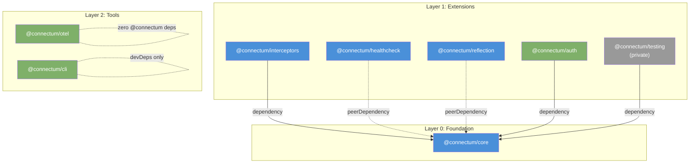
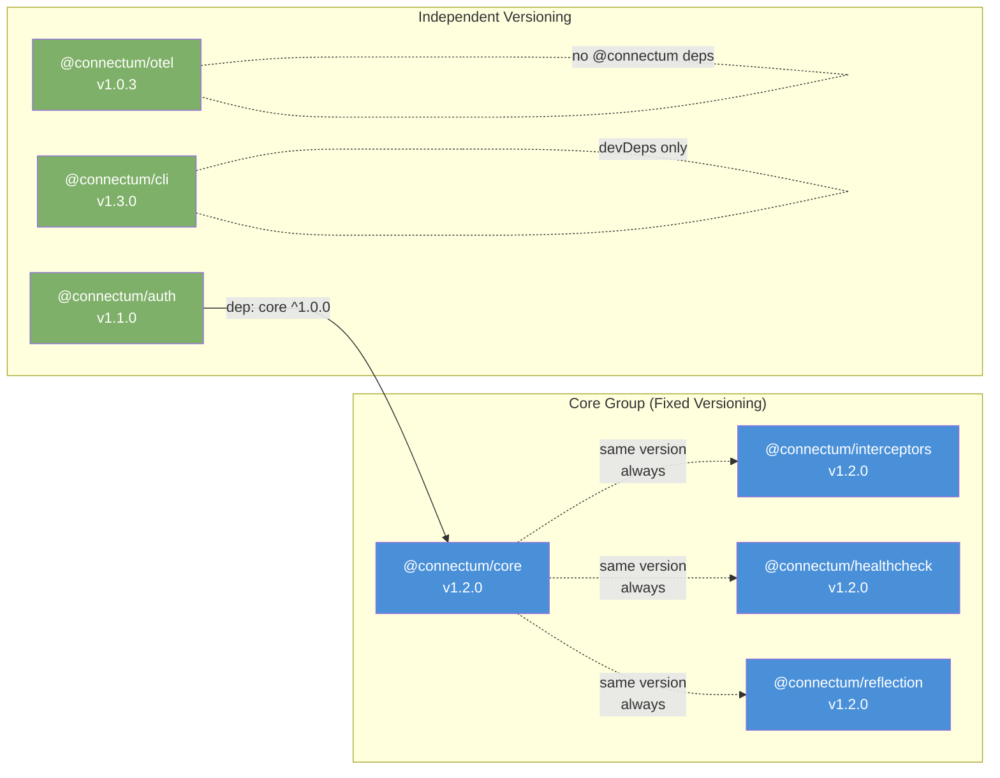

# ADR-025: Package Versioning Strategy

## Status

Accepted -- 2026-02-20

## Context

Connectum is a universal gRPC/ConnectRPC framework composed of 8 `@connectum/*` packages in a pnpm monorepo, managed by [changesets](https://github.com/changesets/changesets) for versioning and publishing. Packages are compiled via tsup before publication (compile-before-publish, see [ADR-001](./001-native-typescript-migration.md)).

### Current State

All 8 packages use a **fixed versioning** strategy (`"fixed": [["@connectum/*"]]`), meaning every package always shares the same version number. The project is currently in a **pre-release (rc) phase** with all packages at `1.0.0-rc.4`.

Current `.changeset/config.json`:

```json
{
  "fixed": [["@connectum/*"]],
  "linked": [],
  "updateInternalDependencies": "patch"
}
```

### Package Dependency Graph

The 8 packages are organized in 3 layers with varying degrees of coupling:



### The Problem

With the current fixed strategy, **all** 8 packages are bumped together. This means:

1. A patch fix in `@connectum/auth` bumps `@connectum/otel` even though otel has zero `@connectum` dependencies
2. A new feature in `@connectum/cli` bumps `@connectum/core` even though core is unchanged
3. CHANGELOGs contain "bumped for consistency" entries with no actual changes
4. Semver loses its semantic meaning for independent packages

While this is acceptable during the pre-release phase (simplicity > precision), it becomes semantically misleading after `1.0.0` stable when consumers rely on version numbers to understand what changed.

### Industry Precedents

| Framework | Strategy | Rationale |
|-----------|----------|-----------|
| **Angular** | Fixed | Tight integration across all packages |
| **NestJS** | Fixed (core) + Independent (modules) | Core packages move together, optional modules versioned independently |
| **tRPC** | Fixed | Server/client API contract must match |
| **Effect** | Independent | Pluggable extensions with peer dependencies |
| **Connectum** | **Hybrid** (this ADR) | Core group tightly coupled, auth/otel/cli are optional extensions |

Connectum is closest to the **NestJS model**: a tightly coupled core group with independently versioned optional extensions.

## Decision

**Adopt a two-phase versioning strategy: Fixed during pre-release, Hybrid after 1.0.0 stable.**

### Phase 1: Pre-release (rc) through 1.0.0 -- Stay Fixed

During the pre-release phase, **keep the current fixed strategy unchanged**.

**Rationale:**
- Changing versioning strategy during rc is unnecessary risk
- "Connectum v1.0.0" as a single unified version is a clearer launch message
- CI/CD (`release.yml`) works without modifications
- Risk = 0, focus remains on stability and API surface finalization

**Configuration (no change):**

```json
{
  "fixed": [["@connectum/*"]],
  "linked": [],
  "updateInternalDependencies": "patch"
}
```

### Phase 2: After 1.0.0 stable -- Transition to Hybrid

After the `1.0.0` stable release, split packages into two groups:

#### Core Group (Fixed)

Packages that are tightly coupled through `createServer()` and are almost always used together by consumers:

| Package | Reason for inclusion |
|---------|---------------------|
| `@connectum/core` | Server factory, lifecycle, plugin system |
| `@connectum/interceptors` | `createDefaultInterceptors()`, direct dependency on core |
| `@connectum/healthcheck` | Protocol plugin for `createServer({ protocols: [...] })` |
| `@connectum/reflection` | Protocol plugin for `createServer({ protocols: [...] })` |

These 4 packages form the **standard Connectum setup**. A typical service uses all four:

```typescript
import { createServer } from '@connectum/core';
import { createDefaultInterceptors } from '@connectum/interceptors';
import { Healthcheck } from '@connectum/healthcheck';
import { Reflection } from '@connectum/reflection';

const server = createServer({
  services: [routes],
  interceptors: createDefaultInterceptors(),
  protocols: [Healthcheck({ httpEnabled: true }), Reflection()],
});
```

#### Independent Group

Packages that are **optional extensions** with distinct lifecycles:

| Package | Reason for independence |
|---------|----------------------|
| `@connectum/auth` | Optional authentication/authorization; consumers may handle auth at the gateway level |
| `@connectum/otel` | Zero `@connectum` dependencies; pure OpenTelemetry instrumentation |
| `@connectum/cli` | Developer tool; only `devDependencies`; not a runtime concern |
| `@connectum/testing` | Private package; `devDependency` only; never published |

#### Hybrid Configuration

```json
{
  "fixed": [
    [
      "@connectum/core",
      "@connectum/interceptors",
      "@connectum/healthcheck",
      "@connectum/reflection"
    ]
  ],
  "linked": [],
  "updateInternalDependencies": "minor",
  "access": "public",
  "baseBranch": "main"
}
```

Key changes from Phase 1:
- `fixed` narrows from `["@connectum/*"]` to the 4 core packages
- `updateInternalDependencies` changes from `"patch"` to `"minor"` -- when a core group package bumps minor, internal dependents (like `auth` depending on `core`) get their dependency range updated to `"minor"` rather than `"patch"`, providing wider compatibility

#### Version Grouping Diagram



#### CI/CD Changes (`release.yml`)

The current `release.yml` extracts the version for GitHub Release tagging using `.[0].version` (first published package). After the transition, it must target the core group explicitly:

**Before (Phase 1):**

```bash
# Any package works since all versions are identical
VERSION=$(jq -r '.[0].version' < published.json)
```

**After (Phase 2):**

```bash
# Target core specifically for tag and GitHub Release
VERSION=$(jq -r '.[] | select(.name == "@connectum/core") | .version' < published.json)
```

The GitHub Release and git tag (`v1.2.0`) are tied to the **core group version**, since the core group represents the framework version. Independent packages (auth, otel, cli) do not create separate GitHub Releases -- their changes are tracked in per-package CHANGELOGs.

### Migration Checklist

When transitioning from Phase 1 to Phase 2 (after `1.0.0` stable release):

- [ ] Update `.changeset/config.json` with the hybrid configuration above
- [ ] Update `release.yml` to use `select(.name == "@connectum/core")` for version extraction
- [ ] Verify all 8 packages are at `1.0.0` before the switch
- [ ] Update `docs/en/contributing/development-setup.md` with versioning guidelines
- [ ] Add a note to each independent package README explaining its versioning policy
- [ ] Create a compatibility matrix in documentation (core group version vs auth/otel/cli versions)
- [ ] Run a dry-run changeset version to confirm the hybrid config works: `pnpm changeset version --snapshot test`
- [ ] Update this ADR status to reflect Phase 2 activation

## Consequences

### Positive

1. **Phase 1: Zero risk** -- proven strategy for the rc phase, no changes needed
2. **Phase 2: Semantic accuracy** -- core group stays synchronized while auth/otel/cli bump only on real changes
3. **Cleaner CHANGELOGs** -- no more "bumped for consistency" entries in independent packages
4. **Smaller consumer updates** -- consumers of `@connectum/otel` don't need to update when only `@connectum/auth` changed
5. **Industry-aligned** -- follows the NestJS model, familiar to Node.js ecosystem developers
6. **Flexible evolution** -- independent packages can iterate faster without blocking or being blocked by core releases

### Negative

1. **CI/CD update required** -- `release.yml` needs modification during Phase 2 transition
2. **Compatibility awareness** -- consumers must understand that core group = one version, while auth/otel/cli are independent; needs clear documentation
3. **Version matrix complexity** -- documentation must maintain a compatibility matrix (e.g., "auth@1.1.0 requires core@^1.0.0")
4. **Changeset discipline** -- contributors must understand which packages belong to the fixed group and which are independent
5. **Potential confusion** -- `@connectum/auth@1.1.0` alongside `@connectum/core@1.2.0` may look inconsistent to users unfamiliar with the strategy

## Alternatives Considered

### Alternative 1: Stay Fixed Forever

**Rating:** 6/10

Keep `"fixed": [["@connectum/*"]]` permanently.

**Pros:**
- Simplest mental model: "Connectum is version X"
- Zero compatibility questions -- all packages always match
- Minimal CI/CD complexity

**Cons:**
- Semantically inaccurate: `@connectum/otel` gets bumped when `@connectum/auth` changes, despite zero coupling
- Noisy CHANGELOGs with empty "bumped for consistency" entries
- Consumers update packages unnecessarily

### Alternative 2: Full Independent

**Rating:** 4/10

Every package versioned independently with no fixed groups.

**Pros:**
- Maximum semantic precision
- Each package bumps only on its own changes
- True semver for every package

**Cons:**
- "Is `core@1.0.5` + `interceptors@1.2.0` + `healthcheck@1.1.3` compatible?" -- consumers cannot easily answer this
- Core group packages are tightly coupled; independent versioning creates a false impression of independence
- Significantly more complex release process and documentation

### Alternative 3: Linked (instead of Fixed for core group)

**Rating:** 5/10

Use `"linked"` instead of `"fixed"` for the core group. With `linked`, packages share the same bump type but only packages with actual changesets are bumped.

**Pros:**
- More precise than fixed -- unchanged packages don't bump
- Same bump type ensures version alignment intent

**Cons:**
- In practice, for 4 tightly coupled packages, nearly every change touches multiple packages
- Creates version drift within the core group (e.g., `core@1.2.0` + `interceptors@1.1.0`), confusing consumers
- For Connectum's core group, the result is approximately the same as fixed but with added complexity

## References

1. [ADR-001: Native TypeScript Migration](./001-native-typescript-migration.md) -- compile-before-publish strategy
2. [ADR-003: Package Decomposition](./003-package-decomposition.md) -- package structure and layer rules
3. [Changesets documentation: Fixed packages](https://github.com/changesets/changesets/blob/main/docs/fixed-packages.md)
4. [Changesets documentation: Linked packages](https://github.com/changesets/changesets/blob/main/docs/linked-packages.md)
5. [NestJS versioning strategy](https://github.com/nestjs/nest) -- similar hybrid approach

---

## Changelog

| Date | Author | Change |
|------|--------|--------|
| 2026-02-20 | Software Architect | Initial ADR: two-phase versioning strategy (Fixed for rc, Hybrid after 1.0.0) |
