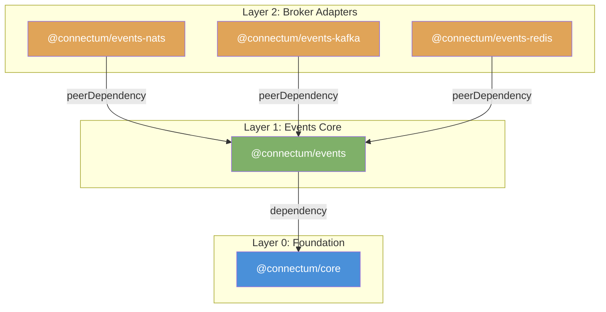

# ADR-026: EventBus Architecture

## Status

Accepted -- 2026-03-07

## Context

Connectum is a universal gRPC/ConnectRPC framework (see [ADR-003](./003-package-decomposition.md) for package structure). Services built with Connectum use synchronous RPC for request-response communication, but many production scenarios require **asynchronous event-driven communication** between microservices -- event sourcing, CQRS, domain event propagation, integration events, and background processing.

### The Problem

The ecosystem lacks a proto-first, adapter-based event system that integrates naturally with ConnectRPC patterns. Existing solutions fall into two categories:

1. **Full ESB / message bus frameworks** (e.g., NestJS CQRS, MassTransit) -- overly complex for simple pub/sub, bring heavy abstractions, and are not proto-first.
2. **Bare broker clients** (kafkajs, nats.js, ioredis) -- minimal abstraction, require per-broker boilerplate, no type safety, no standardized routing.

What we need:

- A minimal adapter interface that abstracts broker differences
- Proto-first event routing with type safety (reusing the protobuf investment from ConnectRPC)
- Familiar API for developers already using Connectum's `createServer()` + `ConnectRouter`
- Built-in middleware pipeline (retry, DLQ) composable like ConnectRPC interceptors
- Server lifecycle integration (start/stop with `createServer()`)
- In-memory adapter for testing without external infrastructure

### Inspiration

The Go ecosystem's [Watermill](https://github.com/ThreeDotsLabs/watermill) library demonstrates that a minimal Publisher/Subscriber interface (5 methods) can abstract any message broker while keeping the surface area small. This ADR adapts that philosophy to Node.js and protobuf-es.

## Decision

Implement a pluggable adapter-based EventBus as a set of 4 packages following the existing layer architecture:

```
@connectum/events         # Layer 1: Core EventBus, router, middleware, MemoryAdapter
@connectum/events-nats    # Layer 2: NATS JetStream adapter
@connectum/events-kafka   # Layer 2: Kafka/Redpanda adapter (KafkaJS)
@connectum/events-redis   # Layer 2: Redis Streams adapter (ioredis)
```

### Key Architectural Decisions

#### 1. EventAdapter Interface -- 5 Core Methods

The adapter interface is intentionally minimal, inspired by Watermill:

```typescript
interface AdapterContext {
    readonly serviceName?: string; // e.g., "order.v1@pod-abc123"
}

interface EventAdapter {
    readonly name: string;
    connect(context?: AdapterContext): Promise<void>;
    disconnect(): Promise<void>;
    publish(eventType: string, payload: Uint8Array, options?: PublishOptions): Promise<void>;
    subscribe(patterns: string[], handler: RawEventHandler, options?: RawSubscribeOptions): Promise<EventSubscription>;
}
```

Broker-specific configuration (connection strings, TLS, consumer options) lives in each adapter's constructor options, not in the interface methods. This keeps the interface stable while allowing full broker-level tuning.

The `connect()` method accepts an optional `AdapterContext` containing service-level metadata. The EventBus derives `serviceName` from registered proto service descriptors using `deriveServiceName()` -- extracting unique package names and appending the hostname for replica disambiguation. Adapters use this for broker-level client identification (Kafka `clientId`, NATS connection `name`, Redis `CLIENT SETNAME`). Explicit adapter options always take priority.

#### 2. Proto-First Event Routing

Event handlers are registered using protobuf service/method descriptors, mirroring the ConnectRouter pattern. The `EventRouter.service()` method iterates service methods, resolves topic names from proto descriptors, and creates typed route entries:

```typescript
// Define event handlers (mirrors ConnectRPC service implementation)
const myEventRoutes: EventRoute = (events) => {
    events.service(OrderEventsDesc, {
        orderCreated: async (event, ctx) => {
            // event is typed as MessageShape<OrderCreatedSchema>
            console.log(event.orderId);
            await ctx.ack();
        },
        orderShipped: async (event, ctx) => {
            // event is typed as MessageShape<OrderShippedSchema>
            await ctx.ack();
        },
    });
};
```

This provides:
- **Full type safety** -- handler input type is inferred from the proto method's input message
- **Compile-time completeness** -- `ServiceEventHandlers<S>` requires all service methods to have handlers
- **Familiar API** -- mirrors `router.service(ServiceDesc, impl)` from ConnectRPC

#### 3. Custom Topic Proto Option

Default topic naming uses `method.input.typeName` (e.g., `mypackage.OrderCreated`). For cases where the topic must differ from the proto type name, a custom proto option is provided:

```protobuf
// proto/connectum/events/v1/options.proto
extend google.protobuf.MethodOptions {
    optional EventOptions event = 50102;
}

message EventOptions {
    optional string topic = 1;
}
```

Usage in service proto:

```protobuf
rpc OrderCreated(OrderCreatedEvent) returns (google.protobuf.Empty) {
    option (connectum.events.v1.event).topic = "orders.created.v2";
}
```

The `resolveTopicName()` function checks for the custom option first, falling back to `method.input.typeName`.

#### 4. Middleware Pipeline

Composable middleware using an onion model (Express/Koa style), applied via `composeMiddleware()` with dispatch:

```
custom (outermost) → DLQ → retry (innermost) → handler
```

Built-in middleware:
- **retryMiddleware** -- configurable backoff (exponential, linear, fixed), max retries, retryable error filter
- **dlqMiddleware** -- publishes failed events to DLQ topic with error metadata, then acks original
- **Typed error classes** -- `NonRetryableError` and `RetryableError` provide declarative retry control via `Symbol.for()` branding

Custom middleware follows the standard signature:

```typescript
type EventMiddleware = (event: RawEvent, ctx: EventContext, next: EventMiddlewareNext) => Promise<void>;
```

#### 5. EventContext with Explicit Ack/Nack

Each event handler receives an `EventContext` with idempotent `ack()` / `nack(requeue?)` operations:

```typescript
interface EventContext {
    readonly signal: AbortSignal;
    readonly eventId: string;
    readonly eventType: string;
    readonly publishedAt: Date;
    readonly attempt: number;
    readonly metadata: ReadonlyMap<string, string>;
    ack(): Promise<void>;
    nack(requeue?: boolean): Promise<void>;
}
```

Supports explicit ack/nack. Auto-ack on successful handler completion if neither called.

#### 6. Wildcard Topic Matching

Two wildcard tokens for flexible subscription patterns:
- `*` matches exactly one dot-separated segment
- `>` matches one or more trailing segments

```typescript
matchPattern("user.*", "user.created")       // true
matchPattern("user.*", "user.created.v2")    // false
matchPattern("user.>", "user.created")       // true
matchPattern("user.>", "user.created.v2")    // true
```

Adapters translate these patterns to broker-native equivalents (NATS subjects, Kafka regex, Redis stream keys).

#### 7. Server Lifecycle Integration via EventBusLike

`@connectum/core` defines a minimal `EventBusLike` interface:

```typescript
interface EventBusLike {
    start(): Promise<void>;
    stop(): Promise<void>;
}
```

`createEventBus()` returns `EventBus & EventBusLike`, allowing seamless integration with the server:

```typescript
const bus = createEventBus({ adapter: NatsAdapter({ servers: "nats://localhost:4222" }), routes });

const server = createServer({
    services: [routes],
    eventBus: bus,  // Lifecycle managed by server
});
```

The server starts the event bus after transport is ready and stops it during graceful shutdown (via `ShutdownManager`).

During graceful shutdown, the EventBus tracks in-flight message handlers via an `inFlight` Set. The `stop()` method follows a drain sequence: (1) stop accepting new messages (nack with requeue), (2) wait for in-flight handlers up to `drainTimeout` (default: 30s), (3) force-abort remaining via AbortSignal if timeout exceeded, (4) disconnect adapter. The `drainTimeout: 0` option skips the drain for immediate shutdown.

#### 8. MemoryAdapter for Testing

An in-memory adapter is included in `@connectum/events` (not in a separate package) to enable unit testing without any external broker:

```typescript
const bus = createEventBus({
    adapter: MemoryAdapter(),
    routes: [myRoutes],
});
```

The MemoryAdapter delivers events synchronously to matching subscribers using the same wildcard matching as production adapters.

### Adapter Implementations

| Package | Broker | Client Library | Key Features |
|---------|--------|---------------|-------------|
| `@connectum/events-nats` | NATS JetStream | `@nats-io/transport-node`, `@nats-io/jetstream` | Durable consumers, wildcard subjects, ack/nak per message |
| `@connectum/events-kafka` | Apache Kafka / Redpanda | `kafkajs` | Consumer groups, regex topic subscription, compression |
| `@connectum/events-redis` | Redis Streams / Valkey | `ioredis` | XREADGROUP with consumer groups, dedicated blocking connection, MAXLEN trimming |

All adapters implement the same `EventAdapter` interface and are interchangeable.

### Package Dependency Graph



## Consequences

### Positive

1. **Consistent API across all brokers** -- switching from NATS to Kafka requires changing only the adapter constructor, not application code
2. **Easy to test** -- MemoryAdapter enables fast, deterministic unit tests without Docker or external services
3. **Proto-first type safety** -- event schemas are defined in protobuf, serialization/deserialization is automatic, handler types are inferred
4. **Familiar pattern** -- `EventRouter.service()` mirrors ConnectRPC's `ConnectRouter.service()`, reducing learning curve for existing Connectum users
5. **Server integration** -- `EventBusLike` interface ensures event bus lifecycle is managed alongside the gRPC transport
6. **Composable middleware** -- retry, DLQ, and custom middleware compose using the same onion model as ConnectRPC interceptors
7. **Minimal adapter surface** -- 5 methods to implement for a new broker, broker-specific config in constructor

### Negative

1. **Adapter abstraction limits broker-specific features** -- advanced features like Kafka exactly-once semantics, NATS Key-Value, or Redis Streams XCLAIM require escape hatches or adapter-specific extensions
2. **Additional complexity for simple pub/sub** -- the proto-first approach requires proto definitions even for simple fire-and-forget events
3. **Each new broker requires a separate package** -- new adapter packages must be created, published, and maintained independently
4. **Auto-ack on success** -- handlers auto-ack on successful completion if neither `ack()` nor `nack()` is called explicitly; explicit control is available when needed
5. **Single consumer group per EventBus** -- all routes in one EventBus share the same consumer group; multiple groups require multiple EventBus instances

### Risks

- **Proto-first routing may not cover all event patterns** -- mitigated by custom topic proto option and direct adapter access for advanced use cases
- **Broker-specific tuning may require escape hatches** -- each adapter's constructor options provide full broker-level configuration; the adapter interface intentionally does not restrict this
- **Wildcard translation across brokers** -- NATS-style wildcards (`*`, `>`) must be translated to broker-native equivalents; tested per adapter with comprehensive pattern matching tests

## Alternatives Considered

### Alternative 1: Direct Broker Clients (No Abstraction)

**Rating:** 4/10

Let each service use broker-specific clients directly (kafkajs, nats.js, ioredis).

**Pros:**
- Full access to broker-specific features
- No adapter overhead
- Simpler for single-broker deployments

**Cons:**
- No code reuse across services using different brokers
- No type safety from proto definitions
- No standardized middleware pipeline
- No server lifecycle integration
- Testing requires real broker instances

### Alternative 2: Full Event Sourcing Framework

**Rating:** 3/10

Implement a complete event sourcing / CQRS framework (like NestJS CQRS module).

**Pros:**
- Complete solution for event-driven architectures
- Built-in aggregate support, event store, projections

**Cons:**
- Massive scope increase -- far beyond the framework's purpose
- Forces specific architectural patterns on consumers
- High complexity for simple pub/sub use cases
- Contradicts Connectum's philosophy of minimal, composable packages

### Alternative 3: CloudEvents Standard

**Rating:** 5/10

Use the CloudEvents specification as the event envelope instead of raw protobuf.

**Pros:**
- Industry standard for event metadata (id, source, type, time)
- Interoperability with non-Connectum services
- Well-defined envelope format

**Cons:**
- Adds a serialization layer on top of protobuf (CloudEvents JSON/proto + protobuf payload)
- Not all brokers have native CloudEvents support
- Increases message size with additional envelope fields
- Can be added later as an optional middleware without changing the core architecture

## References

1. [ADR-003: Package Decomposition](./003-package-decomposition.md) -- package structure and layer rules
2. [ADR-023: Uniform Registration API](./023-uniform-registration-api.md) -- ConnectRouter service registration pattern
3. [ADR-025: Package Versioning Strategy](./025-package-versioning-strategy.md) -- versioning for independent packages
4. [Watermill (Go)](https://github.com/ThreeDotsLabs/watermill) -- inspiration for minimal adapter interface
5. [protobuf-es](https://github.com/bufbuild/protobuf-es) -- DescMessage, DescService, MessageShape types

---

## Changelog

| Date | Author | Change |
|------|--------|--------|
| 2026-03-07 | Software Architect | Initial ADR: EventBus architecture with pluggable adapter pattern |
| 2026-03-09 | Software Architect | Added typed error classes (#48) and graceful drain (#47) |
| 2026-03-22 | Software Architect | Added AdapterContext for automatic broker-level client identification |
