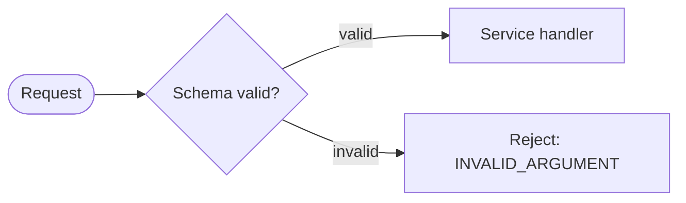

# Documentation Style Guide

Connectum documentation serves two readers at once: someone completing a task
for the first time and someone looking up one exact interface or option. Pages
stay useful when each has one reader outcome, one content type, and one canonical
owner.

The source code is the technical oracle. Verify public symbols and defaults
against `packages/<package>/src`, exports, and `package.json`. Generated TypeDoc
is the canonical exact API reference; hand-written pages teach, explain, and
route readers to it.

## Content types

Choose one type before drafting a page. Do not combine a tutorial, an exhaustive
reference, and architecture history on one URL.

| Type | Reader outcome | Required content | Exclude | Location |
|---|---|---|---|---|
| Tutorial | Complete a bounded learning path | Prerequisites, goal, sequential steps, verification, next steps | Optional production hardening, exhaustive options | `en/guide/**` |
| How-to | Accomplish one real task | Problem, prerequisites, focused steps, verification, failure path | Product pitch, unrelated alternatives, full API tables | `en/guide/**` |
| Concept | Understand a mental model or decision | Context, model, boundaries, links to tasks | Step-by-step setup, exhaustive symbols | `en/guide/**` |
| Package hub | Decide whether and how to use one module | Purpose, install variants, minimal example when applicable, load-bearing entry points, Learn / Configure / API links | Exhaustive option/type catalog, copied guide chapters | `en/packages/<name>.md` |
| Reference | Look up exact signatures, fields, defaults, or compatibility | Generated symbols or a deliberately maintained matrix | Narrative tutorials, duplicated rationale | `en/api/**` or a named canonical matrix |
| Migration | Determine whether an upgrade requires action | Affected versions, required action, before/after, verification | Complete release history and unrelated features | `en/migration/**` |
| ADR | Understand why an architectural decision was made | Status, context, decision, consequences, alternatives | Current task instructions that belong in guides | `en/contributing/adr/**` |

Contributor workflow pages are a separate audience. They describe how to work on
Connectum itself and use the repository's supported Node.js and pnpm toolchain,
not consumer-facing runtime or package-manager choices.

## Page templates

### Tutorial

```md
---
title: <Outcome>
description: <What the reader will have working>
docType: tutorial
---

# <Outcome>

<One paragraph: goal, expected result, and approximate scope.>

## Prerequisites
## 1. <First step>
## 2. <Next step>
## Verify the result
## Troubleshooting
## Next steps
```

Keep the mandatory path linear. Production options belong in Next steps unless
the tutorial cannot succeed safely without them.

### How-to

```md
---
title: <Verb + task>
description: <Specific result>
docType: how-to
---

# <Verb + task>

## Before you begin
## Configure <task>
## Verify
## Troubleshooting
## Learn / Configure / API reference
```

### Concept

```md
---
title: <Concept>
description: <Decision or model this page clarifies>
docType: concept
---

# <Concept>

## Why it exists
## Mental model
## Boundaries and trade-offs
## Apply the concept
```

### Package hub

```md
---
title: @connectum/<name>
description: <One-sentence module purpose>
docType: package-hub
---

# @connectum/<name>

<Who needs it and when.>

## Install
## Start here
## Key entry points
## Learn / Configure / API reference
## Related modules
```

List only entry points a reader needs to orient themselves. Link every exact
interface or function to generated TypeDoc. Architecture layer may appear as
metadata, but it does not determine reader navigation.

### Migration

```md
---
title: <Version or capability migration>
description: <Who must act>
docType: migration
---

# <Migration>

## Does this apply to you?
## Required changes
## Before and after
## Verify the upgrade
## Related release notes
```

### ADR

Use Status, Context, Decision, Consequences, Alternatives, and References. An ADR
records rationale; link to current guides rather than turning the ADR into a
second operational manual.

## Canonical ownership

When information could appear in several places, these locations win:

| Information | Canonical owner | Other pages may contain |
|---|---|---|
| Function signatures, option fields, exported types, defaults | Generated API reference | A task-essential subset plus a direct API link |
| Node.js/Bun support and known runtime limitations | [Runtime Compatibility](/en/guide/runtime-compatibility) | A one-line prerequisite and canonical link |
| Request/response versus events choice | [Choosing a Communication Mechanism](/en/guide/service-communication/choosing-a-mechanism) | A contextual recommendation and link |
| Broker comparison | [Event Adapters](/en/guide/events/adapters) | Adapter-specific setup only |
| Package installation and orientation | Package hub | A command required by the current task |
| Required upgrade actions | [Migration](/en/migration/) | A release-note link to the migration |
| Architectural rationale | ADR | Current behavior and an ADR link |

If two pages contain the same complete table or explanation, keep the better
canonical version and replace the other with task context plus a link.

## Learn / Configure / API reference pattern

End module and task pages with routes that match the reader's next intent:

```md
## Learn / Configure / API reference

- **Learn:** [How authentication fits the request lifecycle](/en/guide/auth)
- **Configure:** [Configure JWT authentication](/en/guide/auth/jwt)
- **API reference:** [`JwtAuthInterceptorOptions`](/en/api/@connectum/auth/interfaces/JwtAuthInterceptorOptions)
```

A guide may omit one route if it is genuinely irrelevant. A package hub should
normally include all three. Link to the exact TypeDoc symbol when the text names
one; link to the package API index only when several symbols are equally relevant.

## Page and navigation conventions

- Add `title`, `description`, and `docType` frontmatter to hand-written pages.
- Use one H1. Keep headings descriptive and preserve established anchors during
  rewrites; add explicit `{#legacy-anchor}` headings when compatibility requires it.
- Use root-relative internal links beginning with `/en/`, without `.md`.
- Put every user-facing page in a logical sidebar group, unless it is a documented
  compatibility page intentionally excluded from navigation.
- Use task language in navigation. Package dependency layers belong in
  architecture content, not as the primary package taxonomy.
- Use `::: tip`, `::: info`, `::: warning`, and `::: danger` for meaningful
  callouts. Do not use a callout as decoration.
- Generated files under `en/api/**` are never edited manually.

## Runtime variants

Use `::: runtime` only when execution differs between Node.js and Bun. Runtime is
independent from the tool used to install dependencies.

````md
::: runtime
== node
```bash
node --test tests/
```
== bun
```bash
bun test tests/
```
:::
````

Rules:

- A grouped block contains both `== node` and `== bun` with equivalent outcomes.
- Do not put headings inside variant blocks; duplicate headings create unstable
  outline anchors.
- Use a normal block when the commands are identical.
- A single-runtime block such as `::: runtime bun` is a short, always-visible
  compatibility note.
- Verify Bun commands before publishing them.
- Contributor pages do not use consumer runtime variants.

## Package-manager variants

Use `::: pm` for installation or script commands that differ among npm, pnpm,
and bun. Each group must contain all three tools and perform the same operation.

````md
::: pm
== npm
```bash
npm install @connectum/core
```
== pnpm
```bash
pnpm add @connectum/core
```
== bun
```bash
bun add @connectum/core
```
:::
````

Hoist commands that do not vary. Do not nest package-manager blocks inside code
groups. Build-time validation checks completeness, the command tool, and semantic
parity between tabs.

## Source accuracy

### Diagrams and process flows

Use Mermaid for process flows, state machines, sequences, and architecture diagrams.
Do not represent a diagram as aligned text, Unicode arrows, or ASCII boxes inside a
plain code fence. Mermaid diagrams inherit light/dark colors, remain readable at narrow
widths, and provide a keyboard-accessible fullscreen view.

Use a fenced text block only for literal command output or a file tree. Use a generated
image only when the subject cannot be expressed clearly in Mermaid; include useful alt
text, preserve the editable source, and verify both themes.

#### The shared diagram theme

Every diagram is painted by one theme, configured centrally. Write the diagram; do not
write its appearance. Typography, node surfaces and borders, subgraph framing, edge
routing, arrowheads, edge labels, and the sequence and state primitives all arrive from
the shared configuration, in both light and dark mode and in the fullscreen view.

Never put a literal color in a diagram. A `fill:#4a90d9` or `stroke:red` becomes an
inline attribute on the rendered node, which outranks the theme -- the node then keeps
its light-mode color when the reader switches to dark. A per-diagram `%%{init: ...}%%`
theme directive is rejected for the same reason. Build validation fails on both.

When a node genuinely needs to stand apart, use one of the five shared variants:

| Variant | Use for |
| --- | --- |
| `accent` | the subject of the page, or the foundation everything else builds on |
| `positive` | a success destination or a healthy terminal state |
| `warning` | a degraded, deferred, or rejected-but-expected path |
| `critical` | a failure path or an unrecoverable state |
| `muted` | a de-emphasised element: private, deprecated, or out of scope |

Apply one with `class` or `:::`, and never let color be the only carrier of the meaning:



A reader who cannot distinguish the colors must still get the same answer from the node
text, the edge labels, or the subgraph titles. If the distinction is already carried by
structure -- a subgraph named `Layer 0: Foundation`, for instance -- leave the nodes
unstyled rather than repeating it in color.

#### Styling is not layout

The shared theme controls how a diagram looks, never where anything sits. Crossing
edges, a label crammed against an arrowhead, a route that implies the wrong order, or a
node colliding with an unrelated edge are all defects in the diagram source. Fix them by
reordering nodes, reversing an edge, changing the direction, splitting the diagram, or
shortening a label. Do not add page-local CSS, and do not move anything after render.

Give arrows room to be seen. A connection needs a visible line segment and an
arrowhead that touches neither node; the shared spacing provides this, so a collapsed
arrow means the diagram is packing too much into one rank. Prefer `TD` for anything
deeper than about five stages -- a long `LR` chain scales down to unreadable inside the
documentation column, even though the fullscreen view can recover it.

Documentation contract failures are user-facing defects.

1. Verify every named symbol, option, field, default, and export against current
   package source and metadata. Do not document removed APIs.
2. Check code blocks, imports, `.env` examples, and diagrams as carefully as prose.
3. The license is Apache-2.0.
4. Published packages support Node.js `>=22.13.0`. Consumer projects that execute
   TypeScript source directly follow the higher development/runtime prerequisite
   stated by the current Quickstart and Runtime Compatibility page.
5. The default interceptor order and enabled defaults must agree with current
   source and [ADR-024](/en/contributing/adr/024-auth-authz-strategy).
6. Consumer examples use the generated import extension configured by their
   `buf.gen.yaml`; current TypeScript-direct examples use `.ts`.
7. Never infer a claim from a test fixture when production source provides the
   contract.

## Redirect and retirement rules

The site is currently a static GitHub Pages deployment. A moved route therefore
keeps a compatibility page unless the hosting layer gains real HTTP redirects.
Before changing a URL:

1. Record the old route, target, inbound links, and anchors in the migration matrix.
2. Update internal links to the canonical target.
3. Keep a compatibility page with a canonical URL and `noindex, follow`.
4. Exclude the compatibility page from primary navigation, local search, and LLM
   navigation outputs.
5. Preserve fragments where the destination still has an equivalent section.

Do not describe a client-side compatibility page as a permanent HTTP redirect.

## Review checklist

### Reader and structure

- [ ] The page promises and delivers one reader outcome.
- [ ] `docType` matches the content and location.
- [ ] Beginner steps precede optional production or expert detail.
- [ ] Navigation label, title, H1, and contextual links agree.

### Accuracy and duplication

- [ ] Public symbols, options, defaults, imports, and versions were checked against source.
- [ ] Exact API detail links to TypeDoc instead of being copied.
- [ ] Runtime, broker, migration, and architecture facts defer to their canonical owners.
- [ ] Existing complete explanations were consolidated rather than repeated.

### Variants and accessibility

- [ ] Runtime and package-manager variants are complete and semantically equivalent.
- [ ] Heading order is logical and established anchors remain valid.
- [ ] Images have useful alt text or are explicitly decorative.
- [ ] Process, state, sequence, and architecture diagrams use Mermaid instead of aligned text.
- [ ] Diagrams carry no literal colors; any semantic variant is also readable without color.
- [ ] Diagram labels, arrows, and routes were checked in both themes; collisions were fixed in the source.
- [ ] Links and controls have visible keyboard focus and meaningful labels.
- [ ] Mobile layouts have usable touch targets and no horizontal overflow.
- [ ] Motion is non-essential and respects reduced-motion preferences.

### Delivery

- [ ] Internal links, target anchors, and compatibility routes validate.
- [ ] Local search finds both task phrases and exact symbols.
- [ ] Sitemap and LLM outputs contain canonical pages and exclude compatibility noise.
- [ ] The production build succeeds in light/dark desktop/mobile review.

## Documented version and release checklist

`.vitepress/data/site.json` is the single maintained source for the documented
Connectum release line. The documentation maintainer updates it in the release
documentation change; components must not hard-code a second version string.
Runtime floors and environment-specific support belong in the canonical
[Runtime Compatibility](/en/guide/runtime-compatibility) matrix rather than shared
site metadata.

For every release line:

1. Update the documented release line when the portal begins targeting that line.
2. Regenerate TypeDoc from the targeted framework source; do not hand-edit output.
3. Add focused migration instructions for required user action.
4. Review Quickstart, Runtime Compatibility, package hubs, and representative
   interface links against the released source.
5. Run route/link/module/variant checks and the production build.
6. Verify search, sitemap, LLM outputs, and representative user journeys.
7. Review desktop/mobile light/dark screenshots before deployment.
