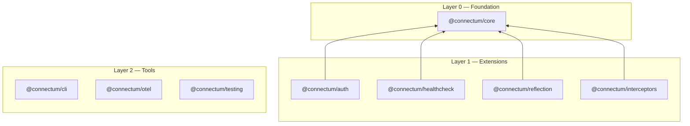

# Connectum Framework

## What is Connectum?

**Connectum** is a production-ready framework for building gRPC/ConnectRPC microservices on Node.js 18+. It eliminates boilerplate by bundling health checks, observability, resilience, authentication, and graceful shutdown into a single `createServer()` call.

Engineering teams with enterprise requirements -- observability, mTLS, RBAC, circuit breakers -- need a unified, well-designed framework instead of gluing together dozens of libraries. Connectum provides that foundation with a pluggable architecture where every capability is an explicit, optional package.

## The Problem

Building production-ready gRPC/ConnectRPC microservices on Node.js requires:

- A lot of boilerplate code for every new service
- Manual observability setup (tracing, metrics, logging)
- Integration of health checks and graceful shutdown
- TLS, validation, and reflection configuration
- Understanding multiple libraries and their interactions

Existing solutions (NestJS, tRPC) are either too heavy or lack native gRPC support.

## What Connectum Provides

| Feature | Description |
|---------|-------------|
| gRPC/ConnectRPC Server | HTTP/2 server with gRPC, ConnectRPC, and gRPC-Web support |
| TLS Support | Built-in TLS, mTLS, auto-reload certificates |
| Health Checks | gRPC Health protocol + HTTP `/healthz`, `/readyz` endpoints |
| Graceful Shutdown | Drain connections, configurable timeout, ordered shutdown hooks |
| Interceptors Chain | Resilience interceptors with fixed execution order |
| OpenTelemetry | Distributed tracing, RPC metrics, structured logging |
| Server Reflection | gRPC Server Reflection for grpcurl and similar tools |
| Auth & Authz | JWT, gateway, session auth; declarative RBAC; proto-based authorization |
| Input Validation | protovalidate integration for automatic request validation |
| CLI Tools | Code generation and project scaffolding |

## Core Principles

These principles guide every design decision in Connectum. Each links to its Architecture Decision Record for full rationale.

1. **Native TypeScript** -- write TypeScript natively on Node.js 25+; packages compile to JS + type declarations for consumers on Node.js 18+. [ADR-001](/en/contributing/adr/001-native-typescript-migration)

2. **Modular Architecture** -- eight packages organized in dependency layers where each layer can only depend on lower layers. [ADR-003](/en/contributing/adr/003-package-decomposition)

3. **Pluggable Protocols** -- health checks and server reflection are separate packages registered via the `protocols` array; custom protocols implement the same interface. [ADR-022](/en/contributing/adr/022-protocol-extraction)

4. **Resilience by Default** -- a fixed-order interceptor chain (errorHandler, timeout, bulkhead, circuitBreaker, retry, fallback, validation) with per-interceptor configuration. [ADR-006](/en/contributing/adr/006-resilience-pattern-implementation)

5. **Proto-First Validation** -- request validation uses protovalidate constraints defined directly in `.proto` files and enforced automatically by the validation interceptor. [ADR-005](/en/contributing/adr/005-input-validation-strategy)

6. **Explicit Lifecycle** -- `createServer()` is the single entry point with no hidden defaults; interceptors and protocols are explicit parameters. [ADR-023](/en/contributing/adr/023-uniform-registration-api)

7. **Observable by Design** -- OpenTelemetry instrumentation is a first-class package providing distributed tracing, RPC metrics, and structured logging out of the box.

8. **Production-Ready** -- TLS/mTLS, graceful shutdown with dependency-ordered hooks, JWT/RBAC auth, and Kubernetes-compatible health probes are built-in capabilities.

## Architecture Overview

**Layer 0 (Foundation):** `@connectum/core` -- server factory with lifecycle control, zero internal dependencies.

**Layer 1 (Extensions):** Authentication, interceptors, health checks, reflection -- depends on Layer 0 or external packages only.

**Layer 2 (Tools):** OpenTelemetry, CLI, testing utilities -- may depend on all lower layers.

## Non-Goals

- **Not an ORM** -- Connectum does not manage databases
- **Not a full-stack framework** -- gRPC/ConnectRPC server-side only
- **Not CommonJS** -- ESM only
- **Not legacy Node.js** -- requires Node.js 18+ (development requires Node.js 25+)

## Next Steps

- [Quickstart](/en/guide/quickstart) -- create your first service
- [Server](/en/guide/server) -- understand server lifecycle
- [Interceptors](/en/guide/interceptors) -- the interceptor chain
- [Architecture Overview](#architecture-overview) -- package layers and dependency rules

## External Resources

- [ConnectRPC Documentation](https://connectrpc.com/docs)
- [OpenTelemetry Node.js](https://opentelemetry.io/docs/instrumentation/js/)
- [gRPC Health Checking Protocol](https://github.com/grpc/grpc/blob/master/doc/health-checking.md)
- [protovalidate](https://github.com/bufbuild/protovalidate)
