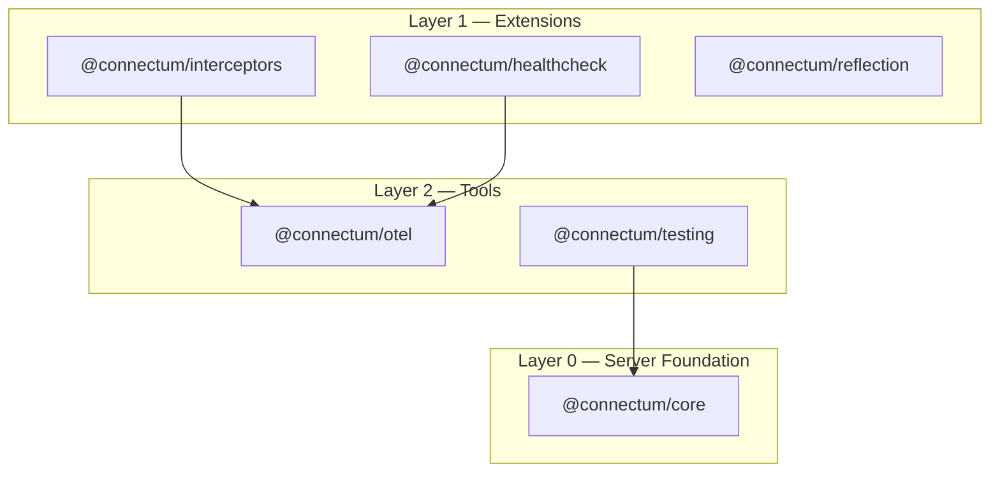

# Architecture Overview

Connectum is a modular gRPC/ConnectRPC framework for Node.js. Development uses Node.js 25+ with native TypeScript; published packages work on Node.js 18+. It is organized as 6 packages in 3 dependency layers.

## Package Layers

## Package Overview

| Package | Layer | Purpose | Key Exports |
|---------|-------|---------|-------------|
| `@connectum/core` | 0 | Server factory with lifecycle control (zero internal deps) | `createServer()`, `ServerState` |
| `@connectum/interceptors` | 1 | Resilience interceptors + method filter | `createDefaultInterceptors()`, `createMethodFilterInterceptor()` |
| `@connectum/healthcheck` | 1 | gRPC Health Check protocol + HTTP | `Healthcheck()`, `healthcheckManager` |
| `@connectum/reflection` | 1 | gRPC Server Reflection | `Reflection()` |
| `@connectum/otel` | 2 | OpenTelemetry instrumentation | `initProvider()`, `createOtelInterceptor()` |
| `@connectum/testing` | 2 | Testing utilities (planned) | -- |

## Dependency Rules

1. **Layer 0** (`core`) has **zero internal dependencies** -- only external npm packages
2. **Layer 1** (extensions) depends only on Layer 0 or external packages
3. **Layer 2** (tools) can depend on all layers
4. **No circular dependencies** -- enforced by layered structure

## Key Design Decisions

| Decision | Summary | ADR |
|----------|---------|-----|
| Native TypeScript | Native TypeScript development + compile-before-publish with tsup | [ADR-001](/en/contributing/adr/001-native-typescript-migration) |
| Modular packages | 7 packages in 4 layers for clear separation | [ADR-003](/en/contributing/adr/003-package-decomposition) |
| Uniform API | `createServer()` + `createDefaultInterceptors()` | [ADR-023](/en/contributing/adr/023-uniform-registration-api) |
| Protocol plugins | Healthcheck/Reflection as separate packages | [ADR-022](/en/contributing/adr/022-protocol-extraction) |
| Resilience chain | 8 interceptors in fixed order (cockatiel) | [ADR-006](/en/contributing/adr/006-resilience-pattern-implementation) |

## Further Reading

- [Core Principles](/en/guide/core-principles) -- all 12 design principles with code examples
- [CLI Commands](/en/contributing/cli-commands) -- development commands for the monorepo
- [Package Reference](/en/packages/core) -- detailed package documentation
