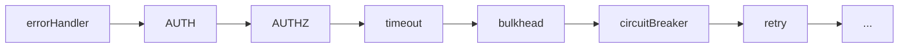

# Authorization

`createAuthzInterceptor` enforces access control after authentication using code-based rules and an optional fallback callback. Use `createProtoAuthzInterceptor` when policy is declared in proto options.

## Declarative Rules

Define rules as an ordered list. The first rule whose method pattern and requirements both match wins. A rule whose role or scope requirements fail is skipped; it does not deny the request by itself.

```typescript
import { createAuthzInterceptor } from '@connectum/auth';

const authz = createAuthzInterceptor({
  defaultPolicy: 'deny',
  rules: [
    { name: 'admin-only', methods: ['admin.v1.AdminService/*'], requires: { roles: ['admin'] }, effect: 'allow' },
    { name: 'write-scope', methods: ['data.v1.DataService/Write'], requires: { scopes: ['write'] }, effect: 'allow' },
  ],
});
```

### Rule Fields

| Field | Type | Description |
|-------|------|-------------|
| `name` | `string` | Rule name for logging and debugging |
| `methods` | `readonly string[]` | Exact method, `Service/*`, or `*` |
| `requires` | `{ roles?, scopes? }` | Required roles and/or scopes |
| `effect` | `'allow' \| 'deny'` | What to do when the rule matches |

### Matching Semantics

- **Roles** use **any-of** semantics -- the user needs at least one of the listed roles.
- **Scopes** use **all-of** semantics -- the user needs all listed scopes.
- Rules without `requires` match all authenticated users for the named methods.
- This interceptor requires an `AuthContext` before evaluating any rule. A rule named `public` does not bypass authentication. Put intentionally public methods in both authentication and authorization `skipMethods` lists.

### Method Patterns

| Pattern | Description |
|---------|-------------|
| `'public.v1.PublicService/*'` | All methods of the service |
| `'*'` | All services and methods |
| `'admin.v1.AdminService/DeleteUser'` | Exact method match |

Partial wildcards such as `Write*` or `admin.v1.*/*` are not supported by auth interceptors. List exact methods or use a complete `Service/*` pattern.

## Programmatic Callback

For complex logic that can not be expressed as rules, add an `authorize` callback. It is invoked only when no rule matches:

```typescript
const authz = createAuthzInterceptor({
  defaultPolicy: 'deny',
  rules: [],
  authorize: (context, req) => context.roles.includes('superadmin'),
});
```

If `authorize` returns `true`, the request is allowed. If it returns `false`, the request fails with `Code.PermissionDenied`, including when `defaultPolicy` is `allow`. The default policy applies only when no rule matches and no callback is configured.

## Proto-Based Authorization

For defining authorization rules directly in `.proto` files using custom options, see the dedicated [Proto-Based Authorization](/en/guide/auth/proto-authz) page. Proto options are read at runtime by `createProtoAuthzInterceptor()` and take priority over programmatic rules.

## Interceptor Chain Position

Auth and authz interceptors must be placed **after** `errorHandler` and **before** resilience interceptors:



This ensures:

- Authentication errors are properly formatted by `errorHandler`
- Unauthenticated requests are rejected before consuming resilience resources
- Auth context is available to all downstream interceptors

```typescript
const server = createServer({
  services: [routes],
  interceptors: [
    createErrorHandlerInterceptor(),
    jwtAuth,   // immediately after errorHandler
    authz,     // immediately after authentication
    ...createDefaultInterceptors({ errorHandler: false }),
  ],
});
```

## Full Example

```typescript
import { createServer } from '@connectum/core';
import { createDefaultInterceptors, createErrorHandlerInterceptor } from '@connectum/interceptors';
import { createJwtAuthInterceptor, createAuthzInterceptor } from '@connectum/auth';

const publicMethods = ['public.v1.PublicService/*'];

const jwtAuth = createJwtAuthInterceptor({
  jwksUri: 'https://auth.example.com/.well-known/jwks.json',
  issuer: 'https://auth.example.com/',
  skipMethods: publicMethods,
});

const authz = createAuthzInterceptor({
  defaultPolicy: 'deny',
  skipMethods: publicMethods,
  rules: [
    { name: 'admin-only', methods: ['admin.v1.AdminService/*'], requires: { roles: ['admin'] }, effect: 'allow' },
    { name: 'write-scope', methods: ['data.v1.DataService/Write'], requires: { scopes: ['write'] }, effect: 'allow' },
  ],
  authorize: (context, req) => {
    // Fallback: superadmins can do anything
    return context.roles.includes('superadmin');
  },
});

const server = createServer({
  services: [routes],
  // Recommended order: errorHandler -> AUTH -> AUTHZ -> rest.
  interceptors: [
    createErrorHandlerInterceptor(),
    jwtAuth,
    authz,
    ...createDefaultInterceptors({ errorHandler: false }),
  ],
});

await server.start();
```

## Verify

Call the admin method with an `admin` role and without it, then repeat without
credentials. For the example above, the admin succeeds, a caller with neither
`admin` nor the fallback `superadmin` role receives `Code.PermissionDenied`,
and the unauthenticated caller receives `Code.Unauthenticated`. Call a public
method without credentials to check that both skip lists agree.

If an allow rule is never reached, check the exact service/method names and its
requirements. If a later fallback unexpectedly grants access, remember that
failing a rule's requirements skips that rule rather than denying immediately.

## Related

- [Auth Overview](/en/guide/auth) -- all authentication strategies
- [JWT Authentication](/en/guide/auth/jwt) -- token verification
- [Proto-Based Authorization](/en/guide/auth/proto-authz) -- declarative authz via `.proto` options
- [Auth Context](/en/guide/auth/context) -- accessing identity in handlers
- [Method Filtering](/en/guide/interceptors/method-filtering) -- per-method interceptor routing
- [@connectum/auth](/en/packages/auth) -- Package Guide
- [@connectum/auth API](/en/api/@connectum/auth/) -- Full API Reference
- [ADR-024: Auth/Authz Strategy](/en/contributing/adr/024-auth-authz-strategy) -- design rationale
