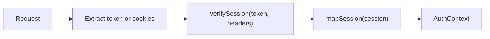

# Session Authentication

`createSessionAuthInterceptor` verifies session credentials through an application-provided `verifySession` callback, then maps the result to an `AuthContext`.

## Before you begin

Provide a session backend and a mapper that validates its returned data. The
bearer examples below use your `verifySessionToken(token, headers)` callback.
The cookie example uses your `auth.api.getSession({ headers })` callback. Both
return a session with `user.id`, an optional `user.name`, and optional `user.roles`.
The interceptor has no built-in integration with a session provider.

## Configuration

```typescript
import { createSessionAuthInterceptor } from '@connectum/auth';
import type { AuthContext } from '@connectum/auth';

function mapSession(session: unknown): AuthContext {
  if (!session || typeof session !== 'object' || !('user' in session)) {
    throw new Error('Invalid session');
  }
  const user = session.user;
  if (!user || typeof user !== 'object' || !('id' in user)
    || typeof user.id !== 'string' || user.id.length === 0) {
    throw new Error('Invalid session identity');
  }
  return {
    subject: user.id,
    name: 'name' in user && typeof user.name === 'string' ? user.name : undefined,
    roles: 'roles' in user && Array.isArray(user.roles)
      ? user.roles.filter((role): role is string => typeof role === 'string') : [],
    scopes: [],
    claims: { ...user },
    type: 'session',
  };
}

const sessionAuth = createSessionAuthInterceptor({
  verifySession: verifySessionToken,
  mapSession,
});
```

The two application-owned callbacks are `verifySession`, which talks to the session
backend, and `mapSession`, which creates the stable `AuthContext`. The default
extractor reads only `Authorization: Bearer <token>` and rejects a missing token
before calling `verifySession`. Cookie-only requests need a custom extractor. The full cache
and callback contract lives in
[`SessionAuthInterceptorOptions`](/en/api/@connectum/auth/interfaces/SessionAuthInterceptorOptions).

## How It Works

The session callback receives request `Headers`, including cookies, after the
interceptor removes incoming `x-auth-*` identity headers. Passing headers lets
the backend verify cookies; it does not replace token extraction.



## Cookie-Based Auth

When your session backend reads cookies directly from headers, extract the actual
credential cookie first. This example assumes its name is `session`; use the
cookie name and encoding your backend defines:

```typescript
const sessionAuth = createSessionAuthInterceptor({
  extractToken: ({ header }) =>
    /(?:^|;\s*)session=([^;]+)/.exec(header.get('cookie') ?? '')?.[1] ?? null,
  verifySession: async (_token, headers) => {
    // The session framework reads the cookie from headers
    const session = await auth.api.getSession({ headers });
    if (!session) throw new Error('Invalid session');
    return session;
  },
  mapSession,
});
```

## Session Caching

Enable caching to avoid calling the session backend on every request:

```typescript
const sessionAuth = createSessionAuthInterceptor({
  verifySession: verifySessionToken,
  mapSession,
  cache: { ttl: 60_000 },  // Cache for 60 seconds
});
```

Here `verifySessionToken` is your backend callback that verifies the supplied
token. Cached identities are keyed only by that extracted token; do not cache a
header-dependent verifier unless the key uniquely identifies the session it
verifies. The cache is bypassed when the mapped `expiresAt` has passed, or when
its TTL expires. Revoking a session in the backend does not invalidate an already
cached identity, so choose the TTL to fit your revocation policy.

## Full Example

```typescript
import { createServer } from '@connectum/core';
import { createDefaultInterceptors, createErrorHandlerInterceptor } from '@connectum/interceptors';
import { createSessionAuthInterceptor } from '@connectum/auth';

const sessionAuth = createSessionAuthInterceptor({
  verifySession: verifySessionToken,
  mapSession,
});

const server = createServer({
  services: [routes],
  interceptors: [
    createErrorHandlerInterceptor(),
    sessionAuth,
    ...createDefaultInterceptors({ errorHandler: false }),
  ],
});

await server.start();
```

## Verify

Call a protected method with a valid session credential and confirm its
`AuthContext.subject` in the handler. Repeat with no credential, an invalid
session, and a backend response missing `user.id`; the examples reject all
three with `Code.Unauthenticated`. For the cookie configuration, also check a
cookie-only request and an unrelated cookie: only the configured credential
cookie should reach verification.

If cookie-only calls fail before the backend runs, check `extractToken`. If a
revoked session still works, check whether its identity remains cached and
whether your mapper supplies `expiresAt`.

## Related

- [Auth Overview](/en/guide/auth) -- all authentication strategies
- [JWT Authentication](/en/guide/auth/jwt) -- token-based authentication
- [Auth Context](/en/guide/auth/context) -- accessing identity in handlers
- [@connectum/auth](/en/packages/auth) -- Package Guide
- [@connectum/auth API](/en/api/@connectum/auth/) -- Full API Reference
