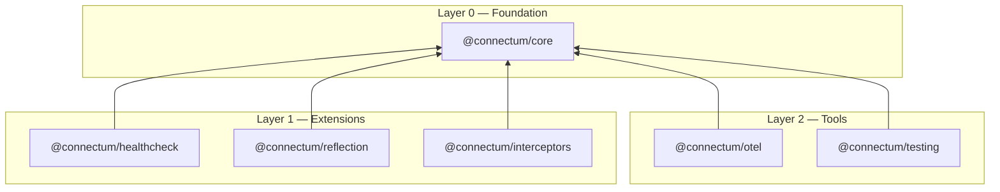

# Core Principles

These principles guide every design decision in Connectum. Each links to its full Architecture Decision Record (ADR) for rationale, alternatives, and consequences.

## 1. Native TypeScript Execution

Run `.ts` files directly on Node.js 25.2.0+ with stable type stripping. No build step, no transpilation.

**Constraints:** No `enum` (use `as const` objects), no runtime `namespace`, no parameter properties, explicit `import type`, `.ts` extensions in imports.

```typescript
// Enum replacement pattern
export const ServerState = {
  CREATED: 'created',
  RUNNING: 'running',
  STOPPED: 'stopped',
} as const;

export type ServerState = typeof ServerState[keyof typeof ServerState];
```

[ADR-001: Native TypeScript Migration](/en/contributing/adr/001-native-typescript-migration)

## 2. Modular Package Architecture

6 packages in 3 dependency layers. Each layer can only depend on lower layers.



[ADR-003: Package Decomposition](/en/contributing/adr/003-package-decomposition)

## 3. Uniform Server API

`createServer()` is the single entry point. Interceptors and protocols are explicit parameters -- no magic, no hidden defaults.

```typescript
import { createServer } from '@connectum/core';
import { createDefaultInterceptors } from '@connectum/interceptors';
import { Healthcheck } from '@connectum/healthcheck';
import { Reflection } from '@connectum/reflection';

const server = createServer({
  services: [routes],
  interceptors: createDefaultInterceptors(),
  protocols: [Healthcheck({ httpEnabled: true }), Reflection()],
  shutdown: { autoShutdown: true },
});

await server.start();
```

[ADR-023: Uniform Registration API](/en/contributing/adr/023-uniform-registration-api)

## 4. Protocol Plugin System

Health checks and server reflection are separate packages (`@connectum/healthcheck`, `@connectum/reflection`) registered via the `protocols` array. Custom protocols implement the same `ProtocolRegistration` interface.

[ADR-022: Protocol Extraction](/en/contributing/adr/022-protocol-extraction)

## 5. Resilience Interceptor Chain

8 interceptors in a fixed order, built with the [cockatiel](https://github.com/connor-peet/cockatiel) library:

```
errorHandler → timeout → bulkhead → circuitBreaker → retry → fallback → validation → serializer
```

Use `createDefaultInterceptors()` to configure individual interceptors or disable any of them.

[ADR-006: Resilience Pattern Implementation](/en/contributing/adr/006-resilience-pattern-implementation)

## 6. Input Validation via Protovalidate

Request validation uses `@connectrpc/validate` (protovalidate) -- constraints are defined in `.proto` files, validated automatically by the validation interceptor.

[ADR-005: Input Validation Strategy](/en/contributing/adr/005-input-validation-strategy)

## 7. Per-Method Interceptor Routing

`createMethodFilterInterceptor()` routes interceptors to specific services/methods using wildcard patterns:

```typescript
createMethodFilterInterceptor({
  '*': [logRequest],
  'admin.v1.AdminService/*': [requireAdmin],
  'user.v1.UserService/DeleteUser': [requireAdmin, auditLog],
});
```

[ADR-014: Per-Method Interceptor Routing](/en/contributing/adr/014-method-filter-interceptor)

## 8. Proto Generation with Buf CLI

Buf CLI v2 manages proto code generation, linting (STANDARD rules), and breaking change detection. Two-step generation (protoc-gen-es → tsc) is required when proto files use `enum`.

[ADR-009: Buf CLI Migration](/en/contributing/adr/009-buf-cli-migration)

## 9. Testing with node:test

Native `node:test` runner with 90%+ coverage target. Unit tests for individual packages, integration tests for server lifecycle.

[ADR-007: Testing Strategy](/en/contributing/adr/007-testing-strategy)

## 10. Performance Benchmarking with k6

k6 load testing with p95 < 100ms SLA and > 1000 req/sec throughput target. 5-server architecture for overhead profiling.

[ADR-008: Performance Benchmarking](/en/contributing/adr/008-performance-benchmarking)

## 11. Reflection-Based Proto Synchronization

4-phase roadmap: BSR dependencies (Phase 0), reflection server completion (Phase 1), CLI proto sync (Phase 2), OpenAPI generation (Phase 3).

[ADR-020: Reflection Proto Sync](/en/contributing/adr/020-reflection-proto-sync)
