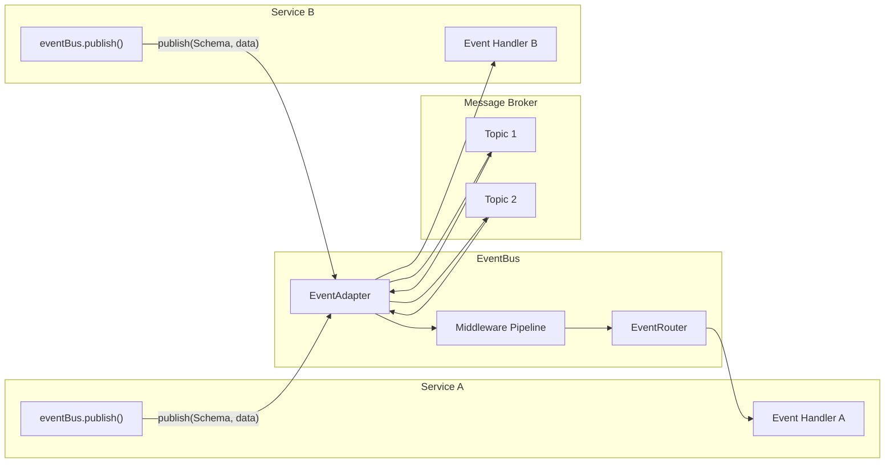

# Events

Connectum EventBus provides event-driven communication between microservices with proto-first routing, pluggable broker adapters, and a composable middleware pipeline.

## Architecture



The EventBus sits between your service handlers and the message broker. It handles:

- **Serialization** -- automatically serializes/deserializes protobuf messages
- **Routing** -- maps proto service methods to topic subscriptions
- **Middleware** -- applies retry, DLQ, and custom middleware to every event
- **Lifecycle** -- manages adapter connect/disconnect with the server

## Core Concepts

### Proto-First Routing

Event handlers are defined as proto services, mirroring ConnectRPC's `ConnectRouter` pattern. Each handler method receives a typed protobuf message and an `EventContext`:

```protobuf
// proto/orders/v1/events.proto
service OrderEventHandlers {
  rpc OnOrderCreated(OrderCreated) returns (google.protobuf.Empty);
  rpc OnOrderCancelled(OrderCancelled) returns (google.protobuf.Empty);
}
```

```typescript
import type { EventRoute } from '@connectum/events';
import { OrderEventHandlers } from '#gen/orders/v1/events_pb.js';

const orderEvents: EventRoute = (events) => {
  events.service(OrderEventHandlers, {
    onOrderCreated: async (msg, ctx) => {
      console.log(`Order ${msg.orderId} created`);
      await ctx.ack();
    },
    onOrderCancelled: async (msg, ctx) => {
      console.log(`Order ${msg.orderId} cancelled`);
      await ctx.ack();
    },
  });
};
```

### Adapter Pattern

The `EventAdapter` interface abstracts away broker-specific details. Adapters handle connection management, message serialization at the wire level, and subscription lifecycle. Broker-specific configuration (credentials, tuning, stream names) is passed to the adapter constructor:

```typescript
// NATS JetStream
import { NatsAdapter } from '@connectum/events-nats';
const adapter = NatsAdapter({ servers: 'nats://localhost:4222', stream: 'orders' });

// Kafka / Redpanda
import { KafkaAdapter } from '@connectum/events-kafka';
const adapter = KafkaAdapter({ brokers: ['localhost:9092'], clientId: 'my-service' });

// Redis Streams / Valkey
import { RedisAdapter } from '@connectum/events-redis';
const adapter = RedisAdapter({ url: 'redis://localhost:6379' });

// In-memory (testing)
import { MemoryAdapter } from '@connectum/events';
const adapter = MemoryAdapter();
```

### Middleware Pipeline

Middleware wraps event handlers in an onion model. Built-in middleware provides retry with configurable backoff and dead letter queue routing:

```
Custom → DLQ → Retry → Handler
```

Each middleware receives the raw event, the event context, and a `next()` function to call the inner handler.

### EventContext

Every event handler receives an `EventContext` with explicit acknowledgment control:

| Property | Description |
|----------|-------------|
| `eventId` | Unique event identifier |
| `eventType` | Topic / event type name |
| `publishedAt` | Publish timestamp |
| `attempt` | Delivery attempt number (1-based) |
| `metadata` | Event headers as `ReadonlyMap<string, string>` |
| `signal` | `AbortSignal` -- aborted on server shutdown |
| `ack()` | Acknowledge successful processing |
| `nack(requeue?)` | Negative acknowledge -- request redelivery |

Both `ack()` and `nack()` are idempotent -- calling either multiple times after the first call has no effect.

## Adapter Comparison

| Feature | Memory | NATS JetStream | Kafka | Redis Streams |
|---------|--------|---------------|-------|---------------|
| **Package** | `@connectum/events` | `@connectum/events-nats` | `@connectum/events-kafka` | `@connectum/events-redis` |
| **Use case** | Testing | Low-latency, cloud-native | High-throughput, event sourcing | Simple streaming, caching stack |
| **Persistence** | No | Yes (JetStream) | Yes (log-based) | Yes (AOF/RDB) |
| **Consumer groups** | No | Yes (durable consumers) | Yes (native) | Yes (XREADGROUP) |
| **Ordering** | Per-publish | Per-subject | Per-partition | Per-stream |
| **Wildcard topics** | Yes (`*`, `>`) | Yes (NATS native) | No | No |
| **Delivery guarantee** | At-most-once | At-least-once | At-least-once | At-least-once |
| **Compatible with** | -- | NATS 2.x+ | Apache Kafka, Redpanda | Redis 5+, Valkey |

## When to Use Events

| Pattern | Use Case | Transport |
|---------|----------|-----------|
| **Request-response** | Synchronous queries, CRUD operations | gRPC / ConnectRPC |
| **Pub/sub events** | Decoupled notifications, saga orchestration | EventBus |
| **Streaming** | Real-time data feeds, change data capture | gRPC server streaming |

Use EventBus when services need to react to events **asynchronously** without direct coupling. For synchronous communication, use [Service Communication](/en/guide/service-communication) with gRPC clients.

## Learn More

- [Getting Started](/en/guide/events/getting-started) -- step-by-step setup tutorial
- [Custom Topics](/en/guide/events/custom-topics) -- proto options for topic naming
- [Middleware](/en/guide/events/middleware) -- retry, DLQ, custom middleware
- [Adapters](/en/guide/events/adapters) -- detailed adapter comparison and configuration
- [@connectum/events](/en/packages/events) -- Package Guide
- @connectum/events API -- Full API Reference (coming soon)
