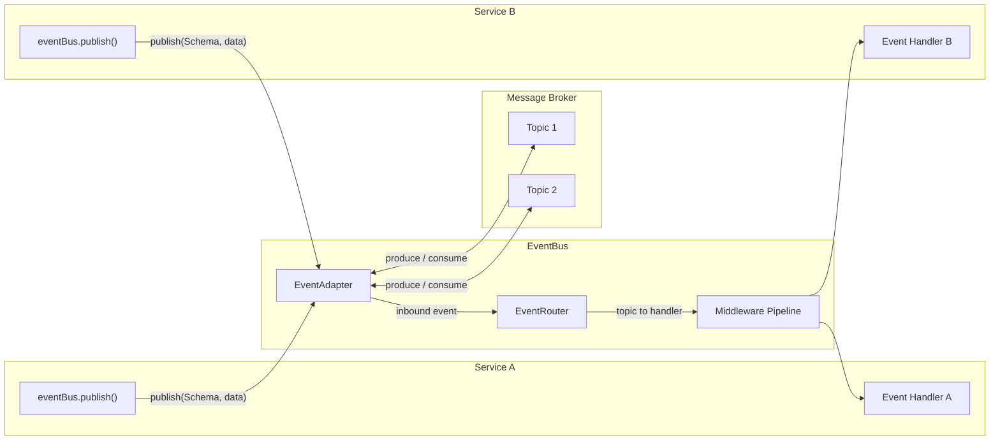

# Events

Connectum EventBus provides event-driven communication between microservices with proto-first routing, pluggable broker adapters, and a composable middleware pipeline.

This guide targets the documented `1.3.x` release line. Features marked `Since
1.3.0` require the corresponding package release; they are unavailable from the
published `1.2.x` packages until 1.3.0 is released.

## Architecture


```mermaid
graph LR
    subgraph Service A
        HA["Event Handler A"]
        PA["eventBus.publish()"]
    end

    subgraph EventBus
        AD["EventAdapter"]
        R["EventRouter"]
        MW["Middleware Pipeline"]
    end

    subgraph Broker["Message Broker"]
        T1["Topic 1"]
        T2["Topic 2"]
    end

    subgraph Service B
        HB["Event Handler B"]
        PB["eventBus.publish()"]
    end

    PA -->|"publish(Schema, data)"| AD
    PB -->|"publish(Schema, data)"| AD

    AD <-->|"produce / consume"| T1
    AD <-->|"produce / consume"| T2

    AD -->|"inbound event"| R
    R -->|"topic to handler"| MW
    MW --> HA
    MW --> HB
```

The EventBus sits between your service handlers and the message broker. It handles:

- **Serialization** -- automatically serializes/deserializes protobuf messages
- **Routing** -- maps proto service methods to topic subscriptions
- **Middleware** -- applies retry, DLQ, and custom middleware to every event
- **Lifecycle** -- manages adapter connect/disconnect with the server, graceful drain on shutdown

## Core Concepts

### Proto-First Routing

Event handlers are defined as proto services, mirroring ConnectRPC's `ConnectRouter` pattern. Each handler method receives a typed protobuf message and an `EventContext`:

```protobuf
// proto/orders/v1/events.proto
service OrderEventHandlers {
  rpc OnOrderCreated(OrderCreated) returns (google.protobuf.Empty);
  rpc OnOrderCancelled(OrderCancelled) returns (google.protobuf.Empty);
}
```

```typescript
import type { EventRoute } from '@connectum/events';
import { OrderEventHandlers } from '#gen/orders/v1/events_pb.js';

const orderEvents: EventRoute = (events) => {
  events.service(OrderEventHandlers, {
    onOrderCreated: async (msg, ctx) => {
      console.log(`Order ${msg.orderId} created`);
      await ctx.ack();
    },
    onOrderCancelled: async (msg, ctx) => {
      console.log(`Order ${msg.orderId} cancelled`);
      await ctx.ack();
    },
  });
};
```

### Adapter Pattern

The `EventAdapter` interface abstracts away broker-specific details. Adapters handle connection management, message serialization at the wire level, and subscription lifecycle. Broker-specific configuration (credentials, tuning, stream names) is passed to the adapter constructor:

```typescript
// NATS JetStream
import { NatsAdapter } from '@connectum/events-nats';
const adapter = NatsAdapter({ servers: 'nats://localhost:4222', stream: 'orders' });

// Kafka / Redpanda
import { KafkaAdapter } from '@connectum/events-kafka';
const adapter = KafkaAdapter({ brokers: ['localhost:9092'], clientId: 'my-service' });

// Redis Streams / Valkey
import { RedisAdapter } from '@connectum/events-redis';
const adapter = RedisAdapter({ url: 'redis://localhost:6379' });

// AMQP / RabbitMQ / LavinMQ
import { AmqpAdapter } from '@connectum/events-amqp';
const adapter = AmqpAdapter({ url: 'amqp://localhost:5672' });

// In-memory (testing)
import { MemoryAdapter } from '@connectum/events';
const adapter = MemoryAdapter();
```

### Middleware Pipeline

Middleware wraps event handlers in an onion model. Built-in middleware provides retry with configurable backoff and dead letter queue routing. See the [middleware pipeline diagram](/en/guide/events/middleware#pipeline-order) for execution and error flow.

Each middleware receives the raw event, the event context, and a `next()` function to call the inner handler.

### EventContext

Every event handler receives an `EventContext` with explicit acknowledgment control:

| Property | Description |
|----------|-------------|
| `eventId` | Unique event identifier |
| `eventType` | Topic / event type name |
| `publishedAt` | Publish timestamp |
| `attempt` | Delivery attempt number (1-based) |
| `metadata` | Event headers as `ReadonlyMap<string, string>` |
| `signal` | `AbortSignal` -- aborted on server shutdown |
| `ack()` | Acknowledge successful processing |
| `nack(requeue?)` | Negative acknowledge -- request redelivery |

Both `ack()` and `nack()` are idempotent -- calling either multiple times after the first call has no effect.

### Shutdown Drain {#shutdown-drain}

`eventBus.stop()` closes every subscription, so no new events are delivered,
and drains outstanding work at the same time. It disconnects the adapter once
both have finished. Closing a subscription on the Redis, Kafka, and NATS
adapters waits for the handler that is running, so the handler drain does not
wait for the close: `drainTimeout` aborts a stuck handler, and that is what lets
the close finish. Two budgets control the drain:

| Option | Default | Waits for | When the budget runs out |
|---|---|---|---|
| `drainTimeout` | `30000` ms | Event handlers that are still running | Remaining handlers are aborted through their `AbortSignal` (`0` aborts them immediately), and the bus then waits for them to return |
| `drainPublishTimeout` | Off | `publish()` calls that were already pending when `stop()` began | Nothing is aborted; the bus stops waiting and disconnects the adapter. The bus does not settle an unfinished `publish()` itself: the caller's promise settles later or stays pending, as the adapter decides |

Without `drainPublishTimeout`, a pending `publish()` races the adapter
disconnect, and a broker confirmation can fail because the connection closed
first. Set the option to give those publishes time to settle:

```typescript
const eventBus = createEventBus({
  adapter,
  routes: [orderEvents],
  drainTimeout: 15_000,
  drainPublishTimeout: 5_000,
});
```

Both drains run at the same time, so the bus waits for the longer budget,
not their sum. A handler that ignores its abort signal extends the handler
drain until it returns. The publish drain is available since 1.3.0 and works
with every adapter. `undefined`, `0`, and negative values disable it. Tracking
a publish for the drain adds no unhandled rejection of its own; each caller
still receives the result of its `publish()` promise and must handle it.

The publish drain does not cover:

- `publish()` calls made after `stop()` begins. They reject immediately,
  including calls from handlers that are still draining.
- The dead letter republish of the [DLQ middleware](/en/guide/events/middleware).
  It publishes through the adapter inside the handler, so it belongs to the
  handler drain.

`createBroadcastSubscribers` accepts the same `drainTimeout` and
`drainPublishTimeout` options and passes them to every bus it creates.

When the bus is passed to `createServer({ eventBus })`, the server stops it in a
shutdown hook. Hooks run after the server's `shutdown.timeout` phase, so drain
time adds to total shutdown time. Keep the sum below your orchestrator's grace
period; see [Graceful shutdown](/en/guide/server/graceful-shutdown).
Exact option types are in
[`EventBusOptions`](/en/api/@connectum/events/types/interfaces/EventBusOptions).

## Adapter Comparison

Use the canonical [Event Adapter selection matrix](/en/guide/events/adapters#adapter-comparison)
for broker trade-offs and direct links to exact adapter options. This overview
owns the EventBus mental model; it does not duplicate broker configuration.

## When to Use Events

| Pattern | Use Case | Transport |
|---------|----------|-----------|
| **Request-response** | Synchronous queries, CRUD operations | gRPC / ConnectRPC |
| **Pub/sub events** | Decoupled notifications, saga orchestration | EventBus |
| **Streaming** | Real-time data feeds, change data capture | gRPC server streaming |

Use EventBus when services need to react to events **asynchronously** without direct coupling. For synchronous communication, use [Service Communication](/en/guide/service-communication) with gRPC clients.

## Learn More

- [Getting Started](/en/guide/events/getting-started) -- step-by-step setup tutorial
- [Custom Topics](/en/guide/events/custom-topics) -- proto options for topic naming
- [Middleware](/en/guide/events/middleware) -- retry, DLQ, custom middleware
- [Adapters](/en/guide/events/adapters) -- detailed adapter comparison and configuration
- [@connectum/events](/en/packages/events) -- Package Guide
- [@connectum/events API](/en/api/@connectum/events/) -- Full API Reference
