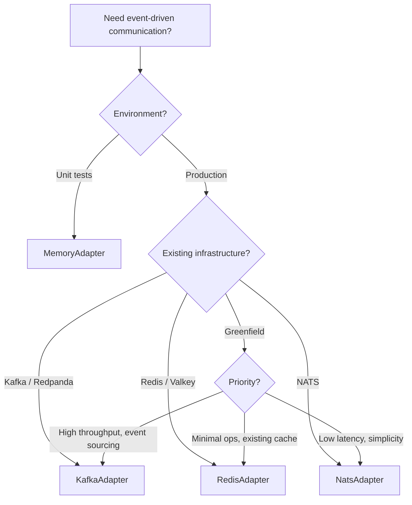

# Adapters

The EventBus uses pluggable adapters to communicate with different message brokers. Each adapter implements the `EventAdapter` interface, handling connection management, serialization at the wire level, and subscription lifecycle. Broker-specific configuration is isolated in the adapter constructor.

## Adapter Comparison

| Feature | Memory | NATS JetStream | Kafka | Redis Streams |
|---------|--------|---------------|-------|---------------|
| **Package** | `@connectum/events` | `@connectum/events-nats` | `@connectum/events-kafka` | `@connectum/events-redis` |
| **Broker** | None (in-process) | NATS 2.x+ | Apache Kafka | Redis 5+ |
| **Compatible with** | -- | -- | Redpanda | Valkey |
| **Client library** | -- | `@nats-io/transport-node` | KafkaJS | ioredis |
| **Persistence** | No | Yes (JetStream) | Yes (log-based) | Yes (AOF/RDB) |
| **Consumer groups** | No | Yes (durable consumers) | Yes (native) | Yes (XREADGROUP) |
| **Ordering** | Per-publish | Per-subject | Per-partition | Per-stream |
| **Wildcard topics** | Yes (`*`, `>`) | Yes (NATS native) | No | No |
| **Delivery guarantee** | At-most-once | At-least-once | At-least-once | At-least-once |
| **Ideal for** | Unit tests, dev | Low-latency, cloud-native | High-throughput, event sourcing | Existing Redis stack |

## Memory Adapter

Built into `@connectum/events`. Delivers events synchronously in-process with no external dependencies. Supports wildcard patterns (`*` and `>`).

**Use case**: Unit testing, local development, prototyping.

```typescript
import { MemoryAdapter } from '@connectum/events';

const adapter = MemoryAdapter();
```

No configuration options. Connect and disconnect are no-ops (they only toggle an internal `connected` flag).

::: warning Not for Production
MemoryAdapter provides no persistence, no consumer groups, and at-most-once delivery. Events are lost on process restart. Use it only for testing.
:::

## NATS JetStream Adapter

Provides persistent at-least-once delivery through NATS JetStream with durable consumers, wildcard routing, and metadata propagation via NATS headers.

```bash
pnpm add @connectum/events-nats
```

```typescript
import { NatsAdapter } from '@connectum/events-nats';

const adapter = NatsAdapter({
  servers: 'nats://localhost:4222',
  stream: 'orders',
  consumerOptions: {
    deliverPolicy: 'new',
    ackWait: 30_000,
    maxDeliver: 5,
  },
});
```

### NatsAdapterOptions

| Option | Type | Default | Description |
|--------|------|---------|-------------|
| `servers` | `string \| string[]` | *required* | NATS server URL(s) |
| `stream` | `string` | `"events"` | JetStream stream name. Subjects are prefixed with `{stream}.` |
| `connectionOptions` | `Partial<NodeConnectionOptions>` | `undefined` | Advanced NATS connection config |
| `consumerOptions` | `NatsConsumerOptions` | `undefined` | JetStream consumer tuning |

### NatsConsumerOptions

| Option | Type | Default | Description |
|--------|------|---------|-------------|
| `deliverPolicy` | `"new" \| "all" \| "last"` | `"new"` | Where new consumers start reading |
| `ackWait` | `number` | `30000` | Ack timeout in ms before redelivery |
| `maxDeliver` | `number` | `5` | Max delivery attempts before server-side discard |

### When to Use NATS

- **Cloud-native** microservices needing lightweight, low-latency messaging
- **Wildcard routing** for flexible topic hierarchies
- **Cluster-native** with built-in clustering and no external dependencies (like ZooKeeper)
- **JetStream** provides persistence, replay, and exactly-once semantics

## Kafka Adapter

KafkaJS-based adapter for Apache Kafka and Kafka-compatible brokers like **Redpanda**.

```bash
pnpm add @connectum/events-kafka
```

```typescript
import { KafkaAdapter } from '@connectum/events-kafka';

const adapter = KafkaAdapter({
  brokers: ['localhost:9092'],
  clientId: 'order-service',
  consumerOptions: {
    sessionTimeout: 30_000,
    fromBeginning: false,
  },
});
```

### KafkaAdapterOptions

| Option | Type | Default | Description |
|--------|------|---------|-------------|
| `brokers` | `string[]` | *required* | Kafka broker addresses |
| `clientId` | `string` | `"connectum"` | Client identifier for the producer/consumer |
| `kafkaConfig` | `Omit<Partial<KafkaConfig>, "brokers" \| "clientId">` | `undefined` | Additional KafkaJS configuration overrides |
| `producerOptions.compression` | `CompressionTypes` | `undefined` | Message compression type |
| `consumerOptions.sessionTimeout` | `number` | `30000` | Session timeout in ms |
| `consumerOptions.fromBeginning` | `boolean` | `false` | Start consuming from beginning of topics |
| `consumerOptions.allowAutoTopicCreation` | `boolean` | `false` | Allow automatic topic creation when subscribing |

### Redpanda Compatibility

[Redpanda](https://redpanda.com/) implements the Kafka wire protocol. The `@connectum/events-kafka` adapter works with Redpanda out of the box -- no configuration changes needed:

```typescript
const adapter = KafkaAdapter({
  brokers: (process.env.REDPANDA_BROKERS ?? 'localhost:9092').split(','),
  clientId: 'my-service',
});
```

See the [with-events-redpanda](https://github.com/Connectum-Framework/examples/tree/main/with-events-redpanda) example for a full saga pattern with Redpanda and Redpanda Console.

### When to Use Kafka

- **High-throughput** event streaming with millions of events/second
- **Event sourcing** with persistent log-based storage
- **Existing Kafka infrastructure** or need for the Kafka ecosystem (Connect, Streams, ksqlDB)
- **Redpanda** deployments for Kafka-compatible, ZooKeeper-free operation

## Redis Streams Adapter

Uses Redis Streams (`XADD` / `XREADGROUP` / `XACK`) for durable, ordered event delivery with consumer groups.

```bash
pnpm add @connectum/events-redis
```

```typescript
import { RedisAdapter } from '@connectum/events-redis';

const adapter = RedisAdapter({
  url: 'redis://localhost:6379',
  brokerOptions: {
    maxLen: 100_000,
    blockMs: 5_000,
    count: 10,
  },
});
```

### RedisAdapterOptions

| Option | Type | Default | Description |
|--------|------|---------|-------------|
| `url` | `string` | `undefined` | Redis connection URL (e.g., `redis://localhost:6379`) |
| `redisOptions` | `RedisOptions` | `undefined` | ioredis connection options (alternative to `url`) |
| `brokerOptions` | `RedisBrokerOptions` | `undefined` | Redis Streams tuning |

### RedisBrokerOptions

| Option | Type | Default | Description |
|--------|------|---------|-------------|
| `maxLen` | `number` | `undefined` | Maximum stream length (MAXLEN approximate for XADD) |
| `blockMs` | `number` | `5000` | Block timeout in ms for XREADGROUP |
| `count` | `number` | `10` | Messages per XREADGROUP call |

### Valkey Compatibility

[Valkey](https://valkey.io/) is an open-source Redis fork that implements the same Streams API. The `@connectum/events-redis` adapter works with Valkey without modification:

```typescript
const adapter = RedisAdapter({
  url: 'redis://valkey-host:6379',
});
```

### When to Use Redis Streams

- **Existing Redis/Valkey infrastructure** you want to reuse for messaging
- **Simple streaming** without the complexity of a dedicated broker
- **Ordered delivery** within a single stream
- **Moderate throughput** with low operational overhead

## Choosing an Adapter

### Decision Tree



### Quick Reference

| Scenario | Recommended Adapter |
|----------|-------------------|
| Unit / integration tests | `MemoryAdapter` |
| Cloud-native, Kubernetes-first | `NatsAdapter` |
| High-throughput event streaming | `KafkaAdapter` |
| Redpanda deployment | `KafkaAdapter` |
| Already running Redis/Valkey | `RedisAdapter` |
| Wildcard topic routing needed | `NatsAdapter` or `MemoryAdapter` |
| Event sourcing / audit log | `KafkaAdapter` |
| Minimal infrastructure | `NatsAdapter` (single binary) |

## Automatic Client Identification

When the EventBus starts, it derives a service name from registered proto service descriptors and passes it to the adapter via `AdapterContext`. Adapters use this for broker-level client identification, which improves observability in broker dashboards and monitoring tools.

The derived name follows the format `{packageNames}@{hostname}`:

| Registered Services | Derived Name |
|---------------------|--------------|
| `order.v1.OrderEventService` | `order.v1@pod-abc123` |
| `order.v1.OrderEventService` + `payment.v1.PaymentEventService` | `order.v1/payment.v1@pod-abc123` |

Each adapter maps this to the appropriate broker concept:

| Adapter | Broker Concept | Config Override |
|---------|---------------|-----------------|
| Kafka | `clientId` | `KafkaAdapterOptions.clientId` |
| NATS | Connection `name` (visible in `/connz`) | `connectionOptions.name` |
| Redis | `CLIENT SETNAME` | `redisOptions.connectionName` |
| Memory | Not used | -- |

Explicit adapter options always take priority over the derived name. If you set `clientId`, `connectionOptions.name`, or `redisOptions.connectionName` directly, the adapter uses your value.

## EventAdapter Interface

All adapters implement this interface:

```typescript
interface EventAdapter {
  /** Adapter name (e.g., "nats", "kafka", "redis", "memory") */
  readonly name: string;

  /** Connect to the message broker */
  connect(context?: AdapterContext): Promise<void>;

  /** Disconnect from the message broker */
  disconnect(): Promise<void>;

  /** Publish a serialized event to a topic */
  publish(eventType: string, payload: Uint8Array, options?: PublishOptions): Promise<void>;

  /** Subscribe to event patterns with a raw handler */
  subscribe(
    patterns: string[],
    handler: RawEventHandler,
    options?: RawSubscribeOptions,
  ): Promise<EventSubscription>;
}
```

### Implementing a Custom Adapter

To integrate with a broker not covered by the built-in adapters, implement the `EventAdapter` interface:

```typescript
import type { EventAdapter, EventSubscription, PublishOptions, RawEventHandler, RawSubscribeOptions } from '@connectum/events';

export function MyBrokerAdapter(options: MyOptions): EventAdapter {
  return {
    name: 'my-broker',

    async connect() {
      // Establish connection to broker
    },

    async disconnect() {
      // Clean up connections and subscriptions
    },

    async publish(eventType, payload, publishOptions) {
      // Serialize and send to broker
    },

    async subscribe(patterns, handler, subscribeOptions): Promise<EventSubscription> {
      // Set up subscription, deliver events to handler
      return {
        async unsubscribe() {
          // Clean up this subscription
        },
      };
    },
  };
}
```

## Related

- [Events Overview](/en/guide/events) -- architecture and core concepts
- [Getting Started](/en/guide/events/getting-started) -- step-by-step setup
- [Custom Topics](/en/guide/events/custom-topics) -- topic naming and wildcards
- [Middleware](/en/guide/events/middleware) -- retry, DLQ, custom middleware
- [@connectum/events](/en/packages/events) -- Package Guide
