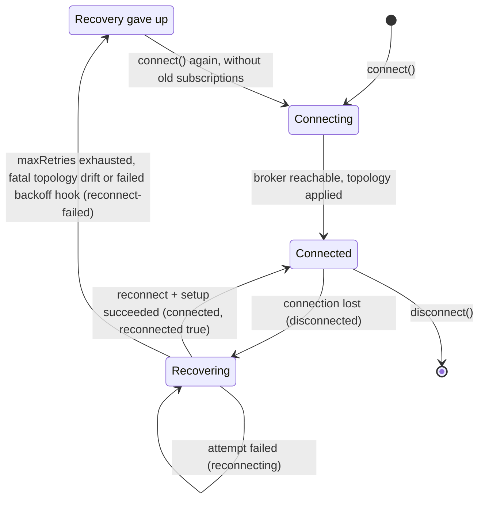

# Run the AMQP Adapter Reliably

`@connectum/events-amqp` publishes with per-message broker confirms and recovers
lost connections automatically. This page shows how to tune that behavior for
production: what a failed publish means, when the adapter retries on its own,
what happens while the broker is away, how to observe it, and how to test it
without a broker. Exact option fields and defaults live in the generated
[`AmqpAdapterOptions`](/en/api/@connectum/events-amqp/types/interfaces/AmqpAdapterOptions)
reference.

## Before you begin

- `@connectum/events-amqp` 1.3 or later. Upgrading from 1.2? Read
  [events-amqp 1.3 behavior changes](/en/migration/events-amqp-1.3) first.
- The package depends on `amqplib` `^2.2.0`. Connection recovery and the reconnect
  backoff are amqplib's built-in recovery; the adapter configures it and adds its
  own channel, topology, and subscription replay on top.
- A RabbitMQ (or other AMQP 0-9-1) broker for integration tests. Unit tests can use
  the [fake adapter](#testing-subpath-exports) instead.

## Reliable publishing {#reliable-publishing}

Every `publish()` waits for the broker's outcome for that one message and either
resolves (the broker acknowledged it) or rejects with a typed error. The error
class tells an at-least-once producer whether to send the message again:

| Error | Message state | Republish? |
|---|---|---|
| `AmqpConnectionError` | Not sent, or unknown (confirm lost with the connection) | Yes |
| `AmqpPublishTimeoutError` | Unknown: no outcome within `publishTimeoutMs` (default 30 s) | Yes |
| `AmqpPublishNackError` | Sent and refused by the broker | Yes, by policy |
| `AmqpUnroutableError` | Sent with `mandatory: true` and dropped: no queue bound | No |
| `AmqpSerializationError` | Never sent: the `serialization.encode` hook threw | No |
| `AmqpTopologyError` | Not a publish outcome: fix the topology configuration | No |

### Retry connection failures in place {#publish-retry}

By default a publish made while the connection is down (or recovering) rejects
immediately with `AmqpConnectionError`. Set `publishRetry` to turn a short broker
outage into a delay instead:

```typescript
import { AmqpAdapter } from '@connectum/events-amqp';

const adapter = AmqpAdapter({
  url: process.env.AMQP_URL ?? 'amqp://localhost:5672',
  publishRetry: {
    maxRetries: 5,          // default: 5 retries = up to 6 attempts
    initialDelay: 100,      // same backoff knobs as `recovery`
    maxDelay: 30_000,
    onRetry: ({ attempt, delay, routingKey, error }) => {
      logger.warn({ attempt, delay, routingKey, err: error }, 'AMQP publish retry');
    },
  },
});
```

`publishRetry: true` uses the defaults. The option is off unless you set it.

What is retried, and what is not:

- **Retried:** `AmqpConnectionError`, which covers a publish made during a recovery
  window and an in-flight confirm lost to a connection drop. Each attempt uses the
  publish channel that is current at that moment, so a channel re-created by recovery
  is picked up.
- **Retried only with `retryOnTimeout: true`:** `AmqpPublishTimeoutError`. The
  message state at a timeout is unknown, so this raises the chance of duplicates.
- **Never retried inline:** a broker nack, an unroutable message, a serialization
  failure, and a topology error.
- **Not retried when retrying cannot help:** when the broker closes the *current*
  publish channel with a reply code of any kind (`404` for a publish to a missing
  exchange under `topologyMode: 'skip'`, `403` for a publish to an internal exchange,
  `406`, `541`), the publish rejects at once with the broker reply as `cause`, without
  using the budget. The connection stays up and recovery does not re-create a channel
  the broker closed, so every further attempt would meet the same closed channel; with
  `maxRetries: Infinity` this is what keeps the loop from running forever. A
  connection loss closes channels without a reply code and stays retriable, and so does
  a failure that arrived on a channel recovery had already replaced. A publish made
  when the adapter has no connection at all (never connected, after `disconnect()`, or
  after recovery [gave up](#recovery-gives-up)) also rejects at once without using the
  budget.
- **Shutdown:** `disconnect()` aborts the backoff wait and the publish rejects with
  the error of its last attempt. Because the retry loop runs inside the
  `adapter.publish()` promise, the EventBus
  [`drainPublishTimeout`](/en/api/@connectum/events/types/interfaces/EventBusOptions)
  covers it.

::: warning Retries can duplicate
If a confirm was lost in flight, the broker may already hold the message, and the
retry sends it again. `x-event-id` and the AMQP `messageId` stay the same across all
attempts (including a caller-supplied `messageId` under `externalContract`), so
consumers can deduplicate on them.
:::

A single `publish()` can take up to `maxRetries + 1` attempts, each bounded by
`publishTimeoutMs`, plus the backoff delays between them. With
`publisherOptions.mandatory: true` and `correlationHeader: false` (also forced by
`externalContract`), mandatory publishes run one at a time; a retrying publish holds
that queue, so order is kept at the cost of the publishes behind it waiting.

### Apply the same boundary in your own code {#auto-retriable-errors}

`isAutoRetriablePublishError(err, { retryOnTimeout })` is the error-class part of the
`publishRetry` rule: it returns `true` for any `AmqpConnectionError`, plus
`AmqpPublishTimeoutError` when `retryOnTimeout` is `true`. `publishRetry` adds two
stops on top of it, described above: a publish channel closed by the broker, and an
adapter with no connection. Use the helper when a producer retries at a higher level
(an outbox, a job queue) and should agree with the adapter, and add the reply-code
check yourself, because a publish channel closed by the broker fails the same way
every time. The adapter decides by channel identity; the check below is the part
visible to application code, a numeric broker reply code in `cause`:

```typescript
import { isAutoRetriablePublishError } from '@connectum/events-amqp';

function isRepublishable(err: unknown): boolean {
  if (!isAutoRetriablePublishError(err)) return false;
  const cause = (err as Error).cause as { code?: unknown } | undefined;
  return typeof cause?.code !== 'number'; // a broker reply code: fix the config instead
}

try {
  await adapter.publish('orders.created', payload);
} catch (err) {
  if (isRepublishable(err)) {
    scheduleRepublish(); // connection-class failure: safe to try again later
  } else {
    throw err;
  }
}
```

The helper is narrower than the republish column above on purpose: a nack is safe to
republish later, but it is not retried in a tight loop.

## Connection recovery {#connection-recovery}

Recovery is on by default (`recovery: true`). After a connection loss amqplib
reconnects with backoff, and on every successful reconnect the adapter re-creates
its publish channel, re-applies the declared topology according to `topologyMode`,
and restarts every active subscription before the connection is reported ready.

While the connection is down, a publish rejects with `AmqpConnectionError` (or
waits, with [`publishRetry`](#publish-retry)), and confirms that were in flight at the
moment of the loss reject with `AmqpConnectionError`.



### Bound the retry budget {#retry-budget}

[`AmqpRecoveryOptions`](/en/api/@connectum/events-amqp/types/interfaces/AmqpRecoveryOptions)
`maxRetries` (default `Infinity`) is the number of retries in one series. The same
value applies to the initial connect and to every recovery series, and the counter
resets after each successful connect. Two consequences:

- With the default `Infinity`, `connect()` (and therefore `bus.start()`) waits until
  the broker is reachable instead of failing.
- A finite `maxRetries` chosen to bound startup also stops steady-state recovery
  after that many consecutive failures in one outage.

To bound only startup, set `recovery.initialConnectMaxRetries`:

```typescript
const adapter = AmqpAdapter({
  url: process.env.AMQP_URL ?? 'amqp://localhost:5672',
  recovery: {
    initialConnectMaxRetries: 10, // 11 attempts at startup, then connect() rejects
    // maxRetries stays Infinity: recovery after the first connect never gives up
  },
});
```

With `initialConnectMaxRetries` set to a finite number, amqplib runs the startup
attempts on the recovering connection the adapter keeps (its `initialMaxRetries`
option). Every attempt includes the full topology setup, so a success leaves exactly
one adapter connection open on the broker and exhaustion leaves none:

- each failed attempt except the last reports `reconnecting { attempt, delay }`, and
  a topology failure also reports `setup-failed { initial: true, attempt }`;
- when the budget is spent, the adapter reports `reconnect-failed` and `connect()`
  rejects with `AmqpConnectionError("Initial connect failed after N attempt(s)
  (initialConnectMaxRetries: M)")` whose `cause` is the last failure;
- `failFastOnInitialSetupError: true` still rejects on the first topology error,
  whatever the budget;
- `disconnect()` during the backoff cancels the pending retry at once and
  `connect()` rejects with `AmqpConnectionError`;
- `publish()` and `subscribe()` reject with the typed "not connected" error until
  the first attempt succeeds.

A negative value is treated as `0` (a single attempt), a fraction is rounded down,
and a non-finite value is the same as leaving the option unset. Without it,
amqplib's own startup loop runs under the shared `maxRetries`, and its per-attempt
events are not reported. If that loop gives up (finite `maxRetries`), `connect()`
rejects with `AmqpConnectionError` and the original error (for example
`ECONNREFUSED`) as `cause`; when a [`backoff` hook](#custom-backoff-hook) ended the
loop, the message cannot name the last connection error and says "none observed".
With `recovery: false` the original error is thrown unchanged.

### When recovery gives up {#recovery-gives-up}

Recovery ends for good in three cases: a finite `maxRetries` is exhausted,
[`treatTopologyErrorAsFatal`](#topology-drift) stopped it, or a
[`backoff` hook](#custom-backoff-hook) failed. Before reporting the
terminal `reconnect-failed` event, the adapter drops the dead connection, its publish
channel, and all subscription records. After that:

- `publish()` and `subscribe()` reject immediately with `AmqpConnectionError`
  ("not connected");
- a `subscribe()` that was waiting for a channel when the cycle died rejects with
  `AmqpConnectionError`;
- `connect()` is accepted again and starts with **no subscriptions**: subscribe again
  explicitly.

With the EventBus, restarting the bus does both: `bus.stop()` followed by
`bus.start()` connects the adapter and subscribes the registered routes again.
Alternatively, treat `reconnect-failed` as fatal and let your process supervisor
restart the service.

### Stop on topology drift {#topology-drift}

Under the default unlimited budget, a queue or exchange that was deleted, or
redeclared with incompatible arguments, makes every reconnect fail the same way, and
the adapter retries forever. `treatTopologyErrorAsFatal: true` stops recovery on the
first such failure: the adapter reports `setup-failed`, then `reconnect-failed`, and
enters the [terminal state](#recovery-gives-up).

The decision reads the AMQP reply code of the failure's `cause` **together with** the
broker's message text. Only replies that name a condition which cannot heal without a
configuration or topology change are fatal:

| Reply code | Fatal when the text says |
|---|---|
| `404` (NOT_FOUND) | `no queue '…'` or `no exchange '…'`: the object is missing |
| `406` (PRECONDITION_FAILED) | `inequivalent arg`, `invalid arg`, `unknown exchange type` or `invalid exchange type`: the redeclare or the exchange type is incompatible or invalid |

Everything else stays in recovery: a restarting broker (`320`), an internal error
(`541`), a locked resource (`405`), a connection drop during setup, the `404`s that
heal on their own (a queue's home node down or inaccessible, its process stopped by
the supervisor or crashed, a timeout, a leader being demoted), and `406` "exchange
limit reached", which clears when exchanges are removed. A `404` or `406` whose
message is not recognised is treated as transient, so a broker release that rewords a
message degrades to "keep retrying", visible through `reconnecting` and
`setup-failed`, never to a silent permanent stop. A failure that races your own
`disconnect()` does not trigger the stop.

The fatal stop is quiet: no exception reaches your code. Observe `reconnect-failed`
through `lifecycle.onLifecycle` or `onReconnectFailed` and
[restart the bus](#recovery-gives-up) from there; until then the adapter stays down.

The option covers recovery after the first successful connect. For startup use
`failFastOnInitialSetupError` (and `initialConnectMaxRetries` when the broker may also
be unreachable at startup).

### Identify the failing topology object {#topology-errors}

`AmqpTopologyError.object` names the object whose declaration or check failed, as an
[`AmqpTopologyObject`](/en/api/@connectum/events-amqp/type-aliases/AmqpTopologyObject):
`{ kind: 'exchange' | 'queue', name }`, or for a binding
`{ kind: 'binding', source, destination, destinationType, routingKey }`. Use it in
drift checks and logs instead of parsing the broker's reply text:

```typescript
import { AmqpTopologyError } from '@connectum/events-amqp';

function describeSetupFailure(error: Error): string {
  if (error instanceof AmqpTopologyError && error.object) {
    const target = error.object;
    return target.kind === 'binding'
      ? `binding ${target.source} -> ${target.destination} (${target.routingKey})`
      : `${target.kind} ${target.name}`;
  }
  return error.message;
}
```

`object` says what was being declared; why it failed stays in `cause`. It is optional:
a binding declared with neither `queue` nor `exchange` is rejected without it, and so
is an unexpected error outside a single declaration step.

## Tuning the reconnect backoff {#tuning-the-reconnect-backoff}

The delay before reconnect attempt `n` uses amqplib 2.2's built-in formula:

```text
base  = min(maxDelay / (1 + jitter), initialDelay × factor^(n − 1))
delay = round(uniform(base × (1 − jitter), base × (1 + jitter)))
```

Because the base is capped at `maxDelay / (1 + jitter)`, the largest jitter offset
lands exactly on `maxDelay`, so a delay never exceeds it. With the defaults
(`initialDelay: 100`, `factor: 2`, `jitter: 0.2`, `maxDelay: 30000`) a saturated
delay is between 20 000 and 30 000 ms. The [startup attempts](#retry-budget) use the
same schedule, and [`publishRetry`](#publish-retry) uses the same formula and the
same option names.

For full jitter with a hard cap — a delay uniform in `[0, min(I × factor^(n − 1), C)]`
— set `jitter: 1`, `initialDelay: I / 2`, and `maxDelay: C`:

```typescript
const adapter = AmqpAdapter({
  url: process.env.AMQP_URL ?? 'amqp://localhost:5672',
  recovery: { jitter: 1, initialDelay: 50, maxDelay: 10_000 }, // I = 100 ms, C = 10 s
});
```

### Set your own reconnect delay {#custom-backoff-hook}

Since 1.3.0, `recovery.backoff` replaces the built-in schedule with your own
function. It receives the attempt number and returns the delay in milliseconds
before that attempt; the adapter forwards it to amqplib's `calculateDelay`:

```typescript
const adapter = AmqpAdapter({
  url: process.env.AMQP_URL ?? 'amqp://localhost:5672',
  recovery: {
    // full jitter over an exponential schedule, capped at 30 s
    backoff: (n) => Math.random() * Math.min(30_000, 100 * 2 ** (n - 1)),
  },
});
```

- **`attempt`** is 1-based and restarts at 1 after every successful connect.
- **Coverage.** The hook sets the delay of every reconnect attempt: steady-state
  recovery and the retries of the initial connect, with or without
  `initialConnectMaxRetries`. It does **not** cover `publishRetry`, which keeps its
  own numeric backoff.
- **Return value.** A finite number greater than or equal to 0, rounded to whole
  milliseconds and applied as is. It is **not** clamped to `maxDelay`, so put the cap
  into the function. `0` retries at once. The `reconnecting` event reports the
  applied delay; the adapter never calls the hook a second time to fill it.
- **Budgets.** The hook only sets intervals. `maxRetries` and
  `initialConnectMaxRetries` still bound the number of attempts.
- **Not combinable with the delay knobs.** `initialDelay`, `maxDelay`, `factor` and
  `jitter` have no effect once a hook is set, so combining any of them with `backoff`
  throws a `TypeError` when the adapter is constructed.
- **State across calls.** A schedule that depends on the previous delay, such as
  decorrelated jitter, keeps that state in a closure; the hook receives only the
  attempt number.

::: warning A failing hook ends recovery for good
The hook must be synchronous. If it throws, returns anything but a finite number
greater than or equal to 0 (`NaN`, `Infinity`, a negative number, a numeric string),
or returns a Promise (an `async` function), recovery gives up. There is no fallback
to the built-in schedule.

- During the initial connect, `connect()` rejects.
- In steady state, the terminal `reconnect-failed` fires once and the adapter drops
  the dead connection and its subscriptions, as after an exhausted `maxRetries`.

Either way the error is an `AmqpConnectionError`. Its `cause` is the hook's error:
the thrown error, or an error stating the invalid return or that the hook must be
synchronous. Its message names the last connection error, or says "none observed"
when the hook failed during an initial connect without `initialConnectMaxRetries`,
a window the adapter cannot observe.
:::

## Adapter lifecycle {#adapter-lifecycle}

Observe the connection through `lifecycle.onLifecycle`, which receives one
[`AmqpLifecycleEvent`](/en/api/@connectum/events-amqp/types/type-aliases/AmqpLifecycleEvent)
per change:

```typescript
const adapter = AmqpAdapter({
  url: process.env.AMQP_URL ?? 'amqp://localhost:5672',
  lifecycle: {
    onLifecycle: (event) => {
      switch (event.type) {
        case 'connected':
          metrics.amqpConnected.set(1);
          break;
        case 'disconnected':
          metrics.amqpConnected.set(0);
          metrics.amqpDisconnects.inc();
          break;
        case 'reconnect-failed':
          logger.error({ err: event.error }, 'AMQP recovery gave up');
          break;
        case 'blocked':
          logger.warn({ reason: event.reason }, 'broker flow control');
          break;
        default:
          break;
      }
    },
  },
});
```

| `type` | Fields | When |
|---|---|---|
| `connected` | `reconnected` | Once per successful connect; `reconnected` is `false` for the first connect and `true` after recovery. |
| `disconnected` | `error` | Once per connection loss. Not reported for your own `disconnect()`. With `recovery: false`, `error` is the broker's own close error when there is one (`code` carries the reply code, for example `320` for a forced close). |
| `reconnecting` | `attempt`, `delay`, `error` | Once per scheduled reconnect, and per startup attempt with `initialConnectMaxRetries`. |
| `reconnect-failed` | `error` | Terminal: retry budget exhausted, fatal topology drift, startup budget exhausted, or a failed `backoff` hook. See [When recovery gives up](#recovery-gives-up). |
| `setup-failed` | `initial`, `attempt`, `error` | Topology setup failed: at startup (`initial: true`) or on a reconnect (`initial: false`, `attempt` ≥ 1). Reported for `AmqpTopologyError` failures only. |
| `blocked` | `reason` | The broker applied flow control (RabbitMQ `connection.blocked`, for example under a memory or disk alarm). |
| `unblocked` | — | Flow control lifted. |
| `settlement-skipped` | `action`, `queue`, `routingKey`, `deliveryTag`, `error` | A delivery could not be acknowledged because its channel was already closed; `action` is `ack`, `requeue` or `reject`. The broker returns the delivery to the queue, but on a quorum queue each return counts toward its delivery limit. See [Settling a delivery after the channel closed](#settlement-skipped). |
| `lifecycle-error` | `callback`, `event`, `error` | A lifecycle callback threw or returned a rejected promise. `callback` names it (`onLifecycle` or a flat callback such as `onReconnecting`); `event` is the `type` it was handling. |

Rules for the callback:

- **It should not throw.** The adapter isolates a thrown exception, or a returned
  promise that rejects, so a faulty callback cannot break recovery, and reports it as
  a `lifecycle-error` event instead of dropping it. A failure of the callback that is
  handling `lifecycle-error` itself is dropped, so the report path cannot recurse.
- **A returned promise is not awaited.** The callback types return `void`, so an
  `async` function is accepted, but events are dispatched in order without waiting for
  it: a slow callback may finish after later events. The adapter isolates any returned
  value with a callable `then`, not only a native `Promise`. The same holds for the
  flat callbacks.
- **It enables a startup check.** With recovery enabled and
  `initialConnectMaxRetries` unset, setting `onLifecycle` (like `onSetupFailed` or
  `failFastOnInitialSetupError`) makes `connect()` open one extra short-lived
  connection and validate the topology first, so a misconfiguration at startup is
  reported as `setup-failed { initial: true, attempt: 0 }`. Without
  `failFastOnInitialSetupError` the adapter then continues with normal recovery.
- **The flat callbacks are deprecated.** `onConnected`, `onDisconnected`,
  `onReconnecting`, `onReconnectFailed`, and `onSetupFailed` still work (removal not
  before 2.0) and receive the same events. When both are set, the flat callback runs
  after `onLifecycle`. `blocked`, `unblocked`, `settlement-skipped` and
  `lifecycle-error` have no flat callback.

With the default startup path (no `initialConnectMaxRetries`), amqplib's startup
retries happen before the adapter can report them, so no `reconnecting` events appear
while `connect()` waits for an unreachable broker.

With `recovery: false` there is no reconnect: `disconnected` is reported once when
the connection closes, including a close forced by the server, and later operations
reject with `AmqpConnectionError` until you call `connect()` again. The event's
`error` is the one amqplib reports for the close, so a broker-forced close exposes its
reply `code`; only a close that carries no cause at all gets a generic
`Error('Connection closed')`.

### Settling a delivery after the channel closed {#settlement-skipped}

A handler can outlive its connection: it rejects, or calls `ack()` or `nack()`, after
the connection dropped and the consumer channel closed. amqplib throws on a closed
channel, and the adapter treats that one error as a no-op instead of letting it escape
as an unhandled rejection. It reports a `settlement-skipped` event. The broker returns
a delivery that was not acknowledged before the channel closed to the queue, and it
arrives again with `attempt` greater than 1, so handlers must stay idempotent. The
return is not unconditional: on a quorum queue each such return counts toward the
queue's delivery limit (default 20 since RabbitMQ 4.0), and past the limit the broker
drops the message or dead-letters it. Any other settlement error is not hidden.

## Testing {#testing-subpath-exports}

`@connectum/events-amqp/testing` exports
[`FakeAmqpAdapter`](/en/api/@connectum/events-amqp/testing/functions/FakeAmqpAdapter),
an in-memory `EventAdapter` that reproduces the adapter's failure behavior
deterministically. It needs no broker and does not import `amqplib`.

```typescript
import assert from 'node:assert/strict';
import { test } from 'node:test';
import { createEventBus } from '@connectum/events';
import { AmqpPublishTimeoutError } from '@connectum/events-amqp';
import { FakeAmqpAdapter } from '@connectum/events-amqp/testing';

test('a publish with an unknown outcome is reported to the caller', async () => {
  const events: string[] = [];
  const fake = FakeAmqpAdapter({ lifecycle: { onLifecycle: (e) => events.push(e.type) } });
  const bus = createEventBus({ adapter: fake, routes: [orderEvents] });
  await bus.start();

  fake.control.nextPublish(new AmqpPublishTimeoutError('no broker outcome'));
  await assert.rejects(() => bus.publish(OrderCreatedSchema, order), AmqpPublishTimeoutError);

  fake.control.dropConnection();   // disconnected, then reconnecting
  fake.control.completeRecovery(); // connected { reconnected: true }
  assert.deepEqual(events, ['connected', 'disconnected', 'reconnecting', 'connected']);

  await bus.stop();
});
```

The [`control`](/en/api/@connectum/events-amqp/testing/interfaces/FakeAmqpControl)
object drives the fake:

| Method | Effect |
|---|---|
| `nextPublish(...outcomes)` | Queue outcomes for the next publishes: `'ack'` or an error instance, such as `AmqpPublishNackError` or `AmqpPublishTimeoutError`. An empty queue acknowledges. |
| `published` | Successfully acknowledged publishes, in order, as the adapter received them. |
| `deliver(eventType, payload, { metadata, attempt })` | Deliver an event to matching subscriptions (one handler per consumer group) and resolve with `{ delivered, acked, nacked, requeued, failed }`. |
| `dropConnection(error?)` | Enter recovery: publishes reject with `AmqpConnectionError`, and new `subscribe()` calls wait for the outcome. |
| `completeRecovery()` | Finish recovery, or report a failure queued with `failSetup()` and stay in recovery. |
| `exhaustRecovery(error?)` | Report `reconnect-failed` and enter the terminal state: subscriptions are dropped and a new `connect()` is accepted. |
| `failSetup(error?, object?)` | Queue a setup failure for the next `connect()` or `completeRecovery()`; defaults to a `404` `AmqpTopologyError`. |
| `block(reason?)` / `unblock()` | Report broker flow control. |

The fake does not model time: recovery advances only through control calls and
`reconnecting.delay` is always `0`. The fake has no consumer channel to close, so it
never emits `settlement-skipped`. Handler acknowledgements are counted, not acted on;
model a redelivery by calling `deliver()` again with a higher `attempt`. A topology
failure queued before `connect()` without `failFastOnInitialSetupError` is reported
and the fake then connects, where the real adapter would keep retrying. For wire-level
behavior, run integration tests against a broker.

## Verify

- Stop the broker while the service runs: you should see `disconnected`, then
  `reconnecting` events, then `connected { reconnected: true }` after the broker is
  back, and subscriptions should receive events again.
- With `publishRetry` enabled, publishes made during a short outage resolve after
  the broker returns instead of rejecting.
- With a finite `initialConnectMaxRetries` and the broker down, `bus.start()` rejects
  with `AmqpConnectionError` after the budget is spent.

## Troubleshooting

- **`connect()` never returns.** The broker is unreachable and `maxRetries` is
  `Infinity`. Set `initialConnectMaxRetries` to bound startup.
- **`TypeError: AmqpAdapter: recovery.backoff cannot be combined with recovery.<knob>`
  at construction.** `backoff` was set together with `initialDelay`, `maxDelay`,
  `factor` or `jitter`. Remove the knob and compute the delay, including its cap,
  inside the hook.
- **`AmqpConnectionError: Recovery gave up: recovery.backoff failed at attempt N`.**
  The hook threw, returned an invalid value, or is `async`. Read `error.cause`, make
  the hook synchronous and return a finite number greater than or equal to 0.
- **`AmqpConnectionError: AmqpAdapter: already connected`.** `connect()` was called on
  an adapter that is connected or still recovering. Call `disconnect()` first.
- **Events stopped arriving after an outage.** Check for a `reconnect-failed` event:
  recovery gave up and dropped all subscriptions. Restart the bus or the service.
- **The same event arrives twice.** Expected under at-least-once delivery, more often
  with `publishRetry`. Deduplicate on `eventId` (`x-event-id`).

## Learn / Configure / API reference

- **Learn:** [Choose an event adapter](/en/guide/events/adapters#amqp--rabbitmq-adapter)
- **Configure:** [`AmqpAdapterOptions`](/en/api/@connectum/events-amqp/types/interfaces/AmqpAdapterOptions),
  [`AmqpRecoveryOptions`](/en/api/@connectum/events-amqp/types/interfaces/AmqpRecoveryOptions),
  [`AmqpPublishRetryOptions`](/en/api/@connectum/events-amqp/types/interfaces/AmqpPublishRetryOptions),
  [`AmqpLifecycleCallbacks`](/en/api/@connectum/events-amqp/types/interfaces/AmqpLifecycleCallbacks)
- **API reference:** [`@connectum/events-amqp`](/en/api/@connectum/events-amqp/),
  [`@connectum/events-amqp/testing`](/en/api/@connectum/events-amqp/testing/)
