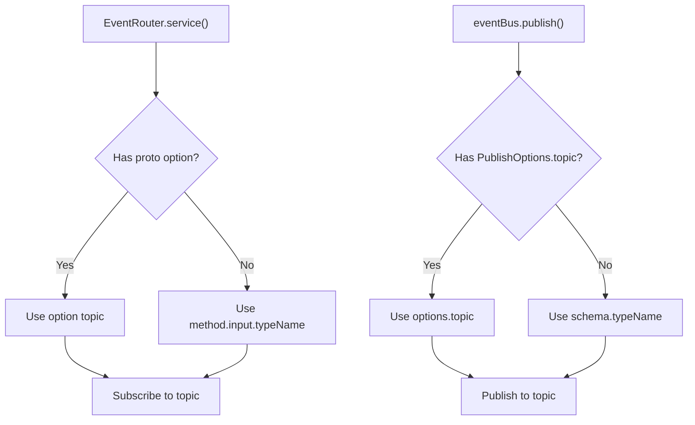

# Custom Topics

By default, the EventBus routes events using the protobuf message's `typeName` (e.g., `orders.v1.OrderCreated`). You can override this with a custom topic name using proto options or publish-time overrides.

## Default Topic Naming

When you register event handlers with `events.service()`, the EventRouter resolves the topic for each method:

1. Check for a custom `(connectum.events.v1.event).topic` proto option on the method
2. Fall back to `method.input.typeName` (the fully-qualified protobuf message name)

For example, this handler subscribes to the topic `orders.v1.OrderCreated`:

```protobuf
service InventoryEventHandlers {
  // Topic: "orders.v1.OrderCreated" (default — from message typeName)
  rpc OnOrderCreated(OrderCreated) returns (google.protobuf.Empty);
}
```

## Proto Option: Custom Topic

Import the Connectum events options proto and set a custom topic on any method:

```protobuf
syntax = "proto3";

package orders.v1;

import "google/protobuf/empty.proto";
import "connectum/events/v1/options.proto";

service InventoryEventHandlers {
  // Default topic: "orders.v1.OrderCreated"
  rpc OnOrderCreated(OrderCreated) returns (google.protobuf.Empty);

  // Custom topic: "orders.cancelled"
  rpc OnOrderCancelled(OrderCancelled) returns (google.protobuf.Empty) {
    option (connectum.events.v1.event).topic = "orders.cancelled";
  }
}
```

The `connectum/events/v1/options.proto` file defines the method option:

```protobuf
// connectum/events/v1/options.proto
syntax = "proto2";

package connectum.events.v1;

import "google/protobuf/descriptor.proto";

message EventOptions {
  optional string topic = 1;
}

extend google.protobuf.MethodOptions {
  optional EventOptions event = 50102;
}
```

::: tip
The `options.proto` file is included in the `@connectum/events` package proto directory. Add it to your `buf.yaml` dependencies or copy it into your project's proto tree.
:::

## Publishing to Custom Topics

When publishing an event whose handler uses a custom topic, you must specify the same topic in `PublishOptions`:

```typescript
import { OrderCancelledSchema } from '#gen/orders/v1/orders_pb.js';

// Publish to custom topic "orders.cancelled"
await eventBus.publish(OrderCancelledSchema, {
  orderId: 'abc-123',
  reason: 'Changed my mind',
}, { topic: 'orders.cancelled' });
```

Without the `topic` override, the event would be published to the default topic (`orders.v1.OrderCancelled`), which would not match the subscriber.

::: warning Consistency Required
The custom topic in the proto option and the `topic` in `PublishOptions` must match exactly. A mismatch means the subscriber will never receive the event.
:::

## Topic Resolution Flow



## Wildcard Topic Matching

The MemoryAdapter and NATS adapter support wildcard patterns for topic matching:

| Pattern | Matches | Does Not Match |
|---------|---------|----------------|
| `orders.*` | `orders.created`, `orders.cancelled` | `orders.v1.created` |
| `orders.>` | `orders.created`, `orders.v1.created`, `orders.v1.created.eu` | `inventory.reserved` |
| `orders.v1.*` | `orders.v1.OrderCreated`, `orders.v1.OrderCancelled` | `orders.v1.sub.topic` |

Two wildcard tokens are supported:

- **`*`** -- matches exactly one dot-separated segment
- **`>`** -- matches one or more trailing segments

::: info Broker Limitations
Wildcard patterns are natively supported by NATS. Kafka and Redis Streams do not support server-side wildcards -- the adapter subscribes to exact topic names only.
:::

## Best Practices

### Use default topics for simple cases

If your events have unique message types, the default `typeName` works well and requires no extra configuration:

```typescript
// Publisher uses the default topic
await eventBus.publish(OrderCreatedSchema, data);

// Subscriber listens on the default topic automatically
events.service(InventoryEventHandlers, {
  onOrderCreated: async (msg, ctx) => { /* ... */ },
});
```

### Use custom topics for shared message types

When multiple events share the same message type or when you want domain-oriented naming:

```protobuf
service OrderEventHandlers {
  // Same OrderStatus message, different business events
  rpc OnOrderConfirmed(OrderStatus) returns (google.protobuf.Empty) {
    option (connectum.events.v1.event).topic = "orders.confirmed";
  }

  rpc OnOrderShipped(OrderStatus) returns (google.protobuf.Empty) {
    option (connectum.events.v1.event).topic = "orders.shipped";
  }
}
```

### Keep topic naming consistent

Adopt a convention across your project:

| Convention | Example | When to Use |
|------------|---------|-------------|
| Default (`typeName`) | `orders.v1.OrderCreated` | Single message type per event |
| Domain-based | `orders.created`, `inventory.reserved` | Shared messages, simpler names |
| Hierarchical | `domain.aggregate.event` | Complex event taxonomies |

## Related

- [Events Overview](/en/guide/events) -- architecture and core concepts
- [Getting Started](/en/guide/events/getting-started) -- step-by-step setup
- [Adapters](/en/guide/events/adapters) -- wildcard support per adapter
- [@connectum/events](/en/packages/events) -- Package Guide
