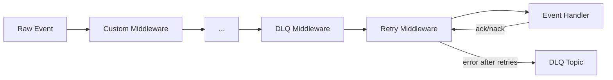
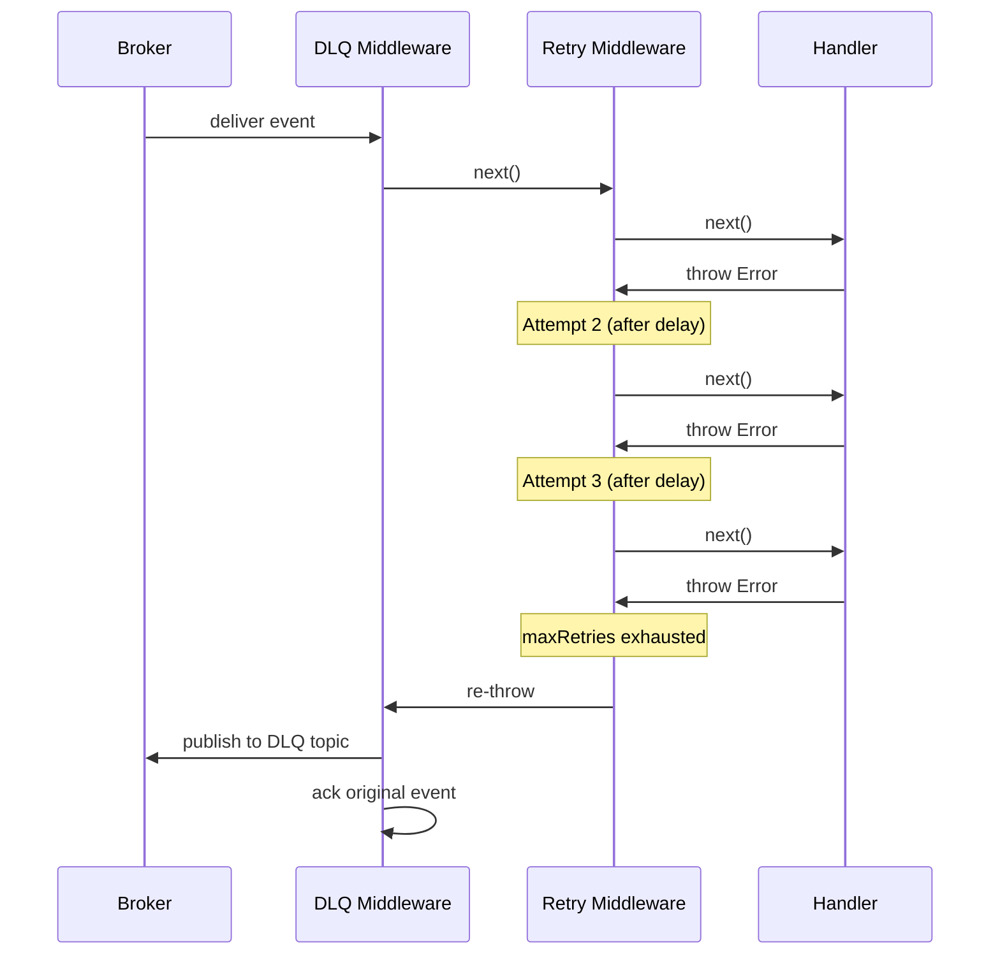

# Middleware

The EventBus middleware pipeline wraps event handlers in a composable onion model. Built-in middleware provides retry with configurable backoff and dead letter queue (DLQ) routing. You can add custom middleware for logging, metrics, validation, or any cross-cutting concern.

## Pipeline Order

Middleware executes from outermost to innermost:

```
Custom[0] → Custom[1] → ... → DLQ → Retry → Handler
```



Each middleware receives three arguments:

```typescript
type EventMiddleware = (
  event: RawEvent,
  ctx: EventContext,
  next: EventMiddlewareNext,
) => Promise<void>;
```

Call `next()` to pass control to the inner middleware. Errors thrown from `next()` propagate outward through the chain.

## Retry Middleware

Retries failed event handlers with configurable backoff strategy. If all attempts are exhausted, the error is re-thrown for the next middleware in the chain (typically DLQ).

### Configuration

```typescript
const eventBus = createEventBus({
  adapter,
  routes: [myEvents],
  middleware: {
    retry: {
      maxRetries: 3,
      backoff: 'exponential',
      initialDelay: 1000,
      maxDelay: 30_000,
      multiplier: 2,
    },
  },
});
```

### RetryOptions

| Option | Type | Default | Description |
|--------|------|---------|-------------|
| `maxRetries` | `number` | `3` | Maximum retry attempts before giving up |
| `backoff` | `"exponential" \| "linear" \| "fixed"` | `"exponential"` | Backoff strategy between retries |
| `initialDelay` | `number` | `1000` | Initial delay in milliseconds |
| `maxDelay` | `number` | `30000` | Maximum delay cap in milliseconds |
| `multiplier` | `number` | `2` | Multiplier for exponential backoff |
| `retryableErrors` | `(error: unknown) => boolean` | `undefined` | Filter function: only retry if it returns `true` |

### Backoff Strategies

| Strategy | Delay Formula | Example (initialDelay=1000, multiplier=2) |
|----------|--------------|-------------------------------------------|
| `exponential` | `initialDelay * multiplier^(attempt-1)` | 1000ms, 2000ms, 4000ms, 8000ms |
| `linear` | `initialDelay * attempt` | 1000ms, 2000ms, 3000ms, 4000ms |
| `fixed` | `initialDelay` | 1000ms, 1000ms, 1000ms, 1000ms |

All strategies are capped at `maxDelay`.

### Selective Retry

Use `retryableErrors` to only retry specific error types:

```typescript
middleware: {
  retry: {
    maxRetries: 3,
    backoff: 'exponential',
    retryableErrors: (error) => {
      // Only retry transient errors
      if (error instanceof Error) {
        return error.message.includes('ECONNREFUSED')
            || error.message.includes('timeout');
      }
      return false;
    },
  },
}
```

Non-retryable errors are thrown immediately without delay.

## DLQ Middleware

When a handler fails after all retries are exhausted, the DLQ middleware publishes the failed event to a dedicated dead letter topic and acknowledges the original event. This prevents poison messages from blocking the queue.

### Configuration

```typescript
const eventBus = createEventBus({
  adapter,
  routes: [myEvents],
  middleware: {
    retry: { maxRetries: 3, backoff: 'exponential' },
    dlq: { topic: 'my-service.dlq' },
  },
});
```

### DlqOptions

| Option | Type | Default | Description |
|--------|------|---------|-------------|
| `topic` | `string` | *required* | Topic name for dead letter events |
| `errorSerializer` | `(error: unknown) => Record<string, unknown>` | `undefined` | Custom error serializer for DLQ metadata |

### DLQ Metadata

When an event is routed to the DLQ, the middleware attaches diagnostic metadata:

| Key | Description |
|-----|-------------|
| `dlq.original-topic` | Topic the event was originally published to |
| `dlq.original-id` | Unique event ID from the original message |
| `dlq.error` | Error message from the last failed handler invocation |
| `dlq.attempt` | Number of delivery attempts before DLQ routing |

### Monitoring the DLQ

Subscribe directly to the DLQ topic using the adapter to monitor and process failed events:

```typescript
adapter.subscribe(
  ['my-service.dlq'],
  async (rawEvent) => {
    const originalTopic = rawEvent.metadata.get('dlq.original-topic') ?? 'unknown';
    const error = rawEvent.metadata.get('dlq.error') ?? 'unknown';
    console.error(`DLQ event from ${originalTopic}: ${error}`);
    // Log, alert, or attempt recovery
  },
  { group: 'dlq-monitor' },
);
```

## Retry + DLQ Together

The most common pattern combines retry and DLQ: retry transient errors, route persistent failures to DLQ.

```typescript
const eventBus = createEventBus({
  adapter: NatsAdapter({ servers: 'nats://localhost:4222', stream: 'orders' }),
  routes: [orderEvents],
  group: 'order-service',
  middleware: {
    retry: { maxRetries: 2, backoff: 'fixed', initialDelay: 200 },
    dlq: { topic: 'dead-letter-queue' },
  },
});
```

Execution flow on handler error:



## Custom Middleware

### Writing Custom Middleware

A middleware is any function matching the `EventMiddleware` signature:

```typescript
import type { EventMiddleware } from '@connectum/events';

const loggingMiddleware: EventMiddleware = async (event, ctx, next) => {
  const start = performance.now();
  console.log(`[${ctx.eventType}] Processing event ${ctx.eventId}`);

  try {
    await next();
    const duration = performance.now() - start;
    console.log(`[${ctx.eventType}] Completed in ${duration.toFixed(1)}ms`);
  } catch (error) {
    const duration = performance.now() - start;
    console.error(`[${ctx.eventType}] Failed after ${duration.toFixed(1)}ms:`, error);
    throw error; // Re-throw to let retry/DLQ handle it
  }
};
```

### Registering Custom Middleware

Pass custom middleware in the `middleware.custom` array. They execute outermost, wrapping retry and DLQ:

```typescript
const eventBus = createEventBus({
  adapter,
  routes: [myEvents],
  middleware: {
    custom: [loggingMiddleware, metricsMiddleware],
    retry: { maxRetries: 3 },
    dlq: { topic: 'my-service.dlq' },
  },
});
```

Execution order: `loggingMiddleware → metricsMiddleware → DLQ → retry → handler`

### Metrics Middleware Example

```typescript
import type { EventMiddleware } from '@connectum/events';

const metricsMiddleware: EventMiddleware = async (event, ctx, next) => {
  const labels = { event_type: ctx.eventType, attempt: String(ctx.attempt) };

  try {
    await next();
    eventCounter.inc({ ...labels, status: 'success' });
  } catch (error) {
    eventCounter.inc({ ...labels, status: 'error' });
    throw error;
  }
};
```

### Validation Middleware Example

```typescript
import type { EventMiddleware } from '@connectum/events';

const payloadSizeMiddleware: EventMiddleware = async (event, ctx, next) => {
  const MAX_PAYLOAD_SIZE = 1024 * 1024; // 1 MB

  if (event.payload.length > MAX_PAYLOAD_SIZE) {
    console.warn(`Event ${ctx.eventId} payload exceeds 1MB, skipping`);
    await ctx.nack(false); // Don't requeue
    return;
  }

  await next();
};
```

## Advanced: Manual Composition

For advanced use cases, you can compose middleware manually using `composeMiddleware()`:

```typescript
import { composeMiddleware, retryMiddleware, dlqMiddleware } from '@connectum/events';
import type { EventMiddleware } from '@connectum/events';

const middlewares: EventMiddleware[] = [
  loggingMiddleware,
  retryMiddleware({ maxRetries: 3 }),
  dlqMiddleware({ topic: 'my.dlq' }, adapter),
];

const composed = composeMiddleware(middlewares, async (rawEvent, ctx) => {
  // Final handler
  console.log(`Processing ${ctx.eventId}`);
  await ctx.ack();
});
```

## Related

- [Events Overview](/en/guide/events) -- architecture and core concepts
- [Getting Started](/en/guide/events/getting-started) -- step-by-step setup
- [with-events-dlq](https://github.com/Connectum-Framework/examples/tree/main/with-events-dlq) -- full DLQ example with NATS JetStream
- [@connectum/events](/en/packages/events) -- Package Guide
