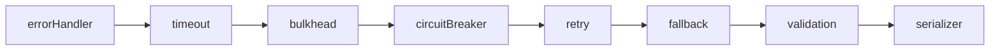
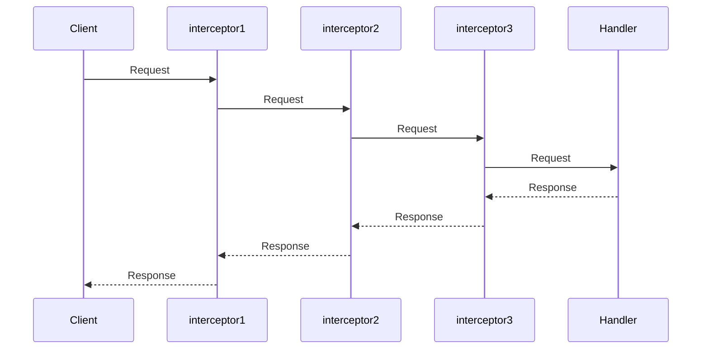

# Built-in Interceptors

`createDefaultInterceptors()` provides eight built-in interceptors in a fixed order for error handling, resilience, validation, and serialization.

## The Default Chain



| # | Interceptor | Purpose | Default |
|---|-------------|---------|---------|
| 1 | **errorHandler** | Normalizes errors into `ConnectError` | Enabled |
| 2 | **timeout** | Limits request execution time | **Opt-in** (30s when enabled) |
| 3 | **bulkhead** | Limits concurrent requests | **Opt-in** (capacity 10, queue 10 when enabled) |
| 4 | **circuitBreaker** | Prevents cascading failures (outbound pattern, see below) | **Opt-in** (threshold 5 when enabled) |
| 5 | **retry** | Retries transient failures with exponential backoff | **Opt-in** (3 retries when enabled) |
| 6 | **fallback** | Graceful degradation | **Opt-in** (requires a handler) |
| 7 | **validation** | Validates via `@connectrpc/validate` | Enabled |
| 8 | **serializer** | JSON serialization for protobuf | **Opt-in** |

The order is deliberate: `errorHandler` is outermost (catches everything), `serializer` is innermost (closest to the handler). The order applies to whichever interceptors you enable. In particular, `circuitBreaker` wraps `retry`, so one logical request increments the failure counter at most once regardless of retry attempts.

::: warning No hidden behavioral logic
Only structural interceptors (errorHandler, validation) are enabled by default. Resilience interceptors (timeout, bulkhead, circuitBreaker, retry) alter request behavior and must be enabled explicitly with `true` or an options object.
:::

`skipGrpcServices` matches service names beginning with `grpc.`, such as Health
and Reflection. It does not skip every request using the gRPC wire protocol.

## Cancellation and Streaming Scope {#cancellation-and-streaming-scope}

::: info Upcoming in 1.3.0
This cancellation behavior is planned for the upcoming `@connectum/interceptors`
1.3.0 release. The published 1.2.x package does not forward timeout cancellation
to downstream handler work.
:::

An enabled timeout forwards its own deadline and caller cancellation to
downstream work. Its own deadline rejects with `DeadlineExceeded`. Caller
cancellation preserves an existing `ConnectError`, including its code, message,
metadata, and details; other caller reasons become `Canceled`. The first
observed cancellation cause wins. Custom interceptors observe `req.signal`; RPC
handlers observe `ctx.signal` and pass it to cancellable I/O.

Retry interrupts a pending backoff and starts no further attempts after
cancellation. It waits for an already running handler to settle, then rejects a
late success with the cancellation reason. This keeps the bulkhead slot occupied
until the work actually finishes. An outer timeout or transport can stop the
caller's wait earlier.

Handlers that ignore the signal can still finish and commit side effects.
Cancellation does not roll them back. Retry only idempotent operations.

Timeout and retry skip streaming calls by default. With `skipStreaming: false`,
they cover opening the streaming response, not subsequent iteration. Successful
opening clears the timeout without aborting the stream; later caller cancellation
still reaches it. Retry can repeat opening failures, but cannot restart a response
iterator that fails after opening.

## Circuit Breaker: Placement and Error Classification

The circuit breaker is an **outbound/client-side pattern**: it protects the caller from a sick upstream (fail fast instead of waiting on timeouts) and gives that upstream room to recover. On a server's inbound stack it degenerates into error-rate load shedding — for inbound protection prefer explicit `timeout` + `bulkhead`.

```typescript
// Recommended: circuit breaker on an outbound client transport
import { createConnectTransport } from '@connectrpc/connect-node';
import { createCircuitBreakerInterceptor } from '@connectum/interceptors';

const transport = createConnectTransport({
  baseUrl: 'http://upstream:5000',
  interceptors: [
    createCircuitBreakerInterceptor({ threshold: 5, halfOpenAfter: 30_000 }),
  ],
});
```

**Error classification.** By default only infrastructure errors count as circuit failures: `Unknown`, `DeadlineExceeded`, `Internal`, `Unavailable`, `DataLoss`, `ResourceExhausted` (plus any non-`ConnectError` thrown value). Business codes (`invalid_argument`, `not_found`, `failed_precondition`, `already_exists`, ...) are expected responses of a healthy service: they never open the breaker, and in half-open state they close it.

Customize with `failurePredicate(error, defaultPredicate)` — the default predicate (exported as `defaultFailurePredicate`) is passed in for composition:

```typescript
import { Code, ConnectError } from '@connectrpc/connect';
import { createCircuitBreakerInterceptor } from '@connectum/interceptors';

// Exclude upstream per-client rate limits from tripping the breaker
createCircuitBreakerInterceptor({
  failurePredicate: (err, def) =>
    def(err) && !(err instanceof ConnectError && err.code === Code.ResourceExhausted),
});

// Restore legacy behavior (every error trips the breaker)
createCircuitBreakerInterceptor({ failurePredicate: () => true });
```

::: tip When to enable the serializer
Ordinary Connect JSON calls need no serializer interceptor: ConnectRPC's transport
already handles protobuf JSON encoding. Use the server's `jsonOptions` for wire
JSON settings. The optional serializer instead converts the request message to
JSON before `next()` and converts its response back to a protobuf message, so the
inner handler must accept and return protobuf JSON shapes.

```typescript
// Opt in only for an inner handler that intentionally works with JSON shapes
const interceptors = createDefaultInterceptors({
  serializer: true,
});

// Normal protobuf handlers over Connect or gRPC: leave it disabled
const interceptors = createDefaultInterceptors();

// Custom serializer options
const interceptors = createDefaultInterceptors({
  serializer: {
    alwaysEmitImplicit: true,
    ignoreUnknownFields: false,
  },
});
```
:::

## Using with createServer

The recommended way to add the built-in interceptors:

```typescript
import { createServer } from '@connectum/core';
import { Healthcheck, healthcheckManager, ServingStatus } from '@connectum/healthcheck';
import { Reflection } from '@connectum/reflection';
import { createDefaultInterceptors } from '@connectum/interceptors';

const server = createServer({
  services: [routes],
  port: 5000,
  protocols: [Healthcheck({ httpEnabled: true }), Reflection()],
  interceptors: createDefaultInterceptors(),
  shutdown: { autoShutdown: true },
});

server.on('ready', () => {
  healthcheckManager.update(ServingStatus.SERVING);
});

await server.start();
```

## Customizing the Default Chain

Pass options to `createDefaultInterceptors()` to customize individual interceptors. Pass `true` or an options object to enable an opt-in interceptor; set one of the default-enabled interceptors to `false` to disable it:

```typescript
import { createDefaultInterceptors } from '@connectum/interceptors';

const interceptors = createDefaultInterceptors({
  timeout: { duration: 10_000 },   // Enable timeout (10s)
  bulkhead: { capacity: 20, queueSize: 20 }, // Enable bulkhead with custom limits
  // errorHandler and validation remain enabled by default
});

const server = createServer({
  services: [routes],
  port: 5000,
  protocols: [Healthcheck({ httpEnabled: true }), Reflection()],
  interceptors,
  shutdown: { autoShutdown: true },
});
```

## Combining with Custom Interceptors

Spread the default chain and append your own interceptors:

```typescript
import { createDefaultInterceptors } from '@connectum/interceptors';

const server = createServer({
  services: [routes],
  port: 5000,
  protocols: [Healthcheck({ httpEnabled: true }), Reflection()],
  interceptors: [
    ...createDefaultInterceptors(),
    myCustomInterceptor,  // Added after the built-in chain
  ],
  shutdown: { autoShutdown: true },
});
```

::: tip Auth interceptors require a specific position
If your custom interceptor is an authentication or authorization interceptor from `@connectum/auth`, it must be placed **immediately after** `errorHandler` -- before `timeout` and other resilience interceptors. See the [Custom Interceptors](/en/guide/interceptors/custom) guide for a manual chain example and [ADR-024](/en/contributing/adr/024-auth-authz-strategy) for the rationale.
:::

## Standalone Usage

You can use `createDefaultInterceptors()` outside of `createServer`:

```typescript
import { createDefaultInterceptors } from '@connectum/interceptors';

const interceptors = createDefaultInterceptors({
  timeout: { duration: 10_000 },
  retry: { maxRetries: 5 },
});
```

For exact factory options, see the [interceptor API](/en/api/@connectum/interceptors/).

## Request Logging

`createLoggerInterceptor()` is not part of the default chain. Add it to `interceptors` when you want every RPC except health checks (`skipHealthCheck` defaults to `true`) logged with a request line, a response line and its duration:

```typescript
import { createServer } from '@connectum/core';
import { createDefaultInterceptors, createLoggerInterceptor } from '@connectum/interceptors';

const server = createServer({
  services: [routes],
  interceptors: [
    ...createDefaultInterceptors(),
    createLoggerInterceptor({
      level: 'info',            // default: 'debug'
      skipHealthCheck: true,    // default: true
      includeTransport: true,   // default: false
      includeBodies: false,     // default: false
    }),
  ],
});
```

With `includeTransport: true`, every line of a call carries the transport right after the `RPC` / `STREAM` prefix — `[in-process]` for calls made through `server.localClient()` or `createLocalTransport()` (see [In-Process Transport](/en/guide/production/in-process-transport)), `[http]` for all other calls:

```text
RPC [in-process] /greeter.v1.GreeterService/SayHello request
RPC [http] /greeter.v1.GreeterService/SayHello completed in 1.84ms
```

`includeTransport` is off by default; without it the log lines carry no tag.

::: warning Telemetry only
The transport tag comes from a framework-internal request marker. Use it to read logs, never to authorize: base access decisions on `req.service.typeName` and `req.method.name`.
:::

### What a call writes

Every call writes a request line, a response line and a completion line:

```text
RPC /greeter.v1.GreeterService/SayHello request
RPC /greeter.v1.GreeterService/SayHello response
RPC /greeter.v1.GreeterService/SayHello completed in 1.84ms
```

A call that fails writes `RPC <path> failed with <Code>` before the completion line. `<Code>` is the Connect code name, or `Unknown` for an error that is not a `ConnectError`; the original error reaches the caller unchanged. A streaming call writes `STREAM <path> request` and `STREAM <path> response` for every message, and its completion line when the stream ends: fully read, failed midway, or closed early by the reader with `break` or `return()`. The duration therefore covers the whole stream.

### Message bodies are opt-in

By default a log line carries only metadata: no request or response body reaches the `logger` function, because bodies can hold credentials, tokens and personal data, and a log outlives the call and has more readers. Set `includeBodies: true` to pass them. A unary call then hands its request and response message to `logger` as an extra argument, and a streaming call hands each request message and the JSON form of each response message:

```typescript
createLoggerInterceptor({ includeBodies: true });
// logger('RPC /greeter.v1.GreeterService/SayHello request', { name: 'Ada' })
```

::: warning Bodies in logs
Enable `includeBodies` only where the log is as protected as the traffic itself. The upcoming 1.3.0 release makes bodies opt-in; **that release is not yet published to npm**. See [Logger bodies are opt-in](/en/migration/logger-bodies).
:::

### The logger cannot break a call

Logging never changes the outcome of a call. If the `logger` function you pass throws, or returns a promise that rejects, the call still returns its response or its original error: the first failure is reported once on the console, and later ones are dropped. A streamed message that cannot be converted to JSON is logged as a marker and the stream continues.

## Execution Order

Interceptors execute in the order they are defined. Each interceptor wraps the next one:



This means:

- **Before-logic** of the first interceptor runs first
- **After-logic** of the first interceptor runs last
- The first interceptor is the outer layer (ideal for error handling)
- The last interceptor is closest to the handler (ideal for serialization)

This is why the default chain places `errorHandler` first and `serializer` last.

## Best Practices

1. **Error handler first** -- place the error handler first in the chain so it catches errors from all subsequent interceptors.

2. **Do not mutate `req.message`** -- create a new request object via spread: `{ ...req, message: newMessage }`.

3. **Always call `next()`** -- if the interceptor does not abort the chain, it must call `next(req)` and return the result.

4. **Cleanup in `finally`** -- use `try/finally` for resource cleanup (timers, counters).

5. **Type safety** -- use `import type { Interceptor }` for type-safe interceptor definitions.

6. **Use factories** -- wrap interceptors in `create*Interceptor(options)` for configurability.

7. **`skip*` options for technical limitations** -- options like `skipStreaming` and `skipGrpcServices` are meant for technical limitations of the interceptor, not for business routing.

8. **`createMethodFilterInterceptor` for routing** -- use it for declarative interceptor routing by service and method.

## Related

- [Interceptors Overview](/en/guide/interceptors) -- quick start and key concepts
- [Custom Interceptors](/en/guide/interceptors/custom) -- factory pattern, error handling, testing
- [Method Filtering](/en/guide/interceptors/method-filtering) -- per-service and per-method routing
- [@connectum/interceptors](/en/packages/interceptors) -- Package Guide
- [@connectum/interceptors API](/en/api/@connectum/interceptors/) -- Full API Reference
- [ADR-006: Resilience Patterns](/en/contributing/adr/006-resilience-pattern-implementation) -- design rationale for the interceptor chain
