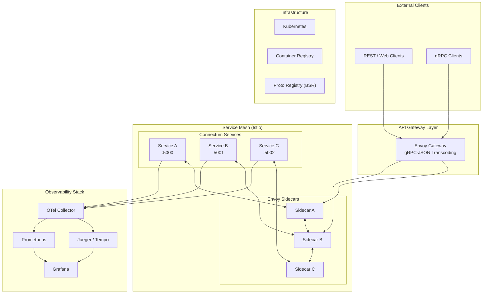
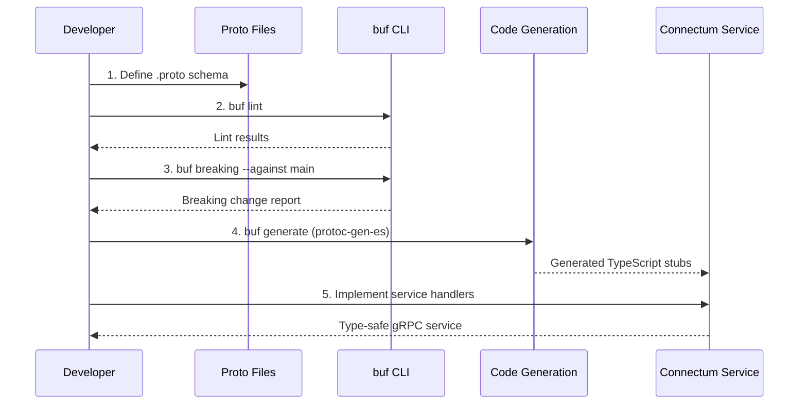
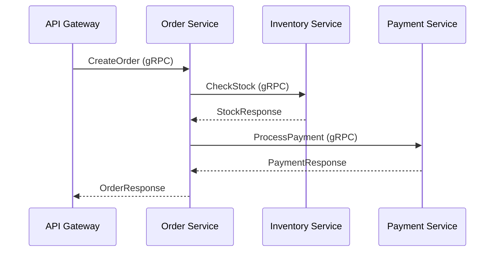

# Microservice Architecture Patterns

This guide covers proven architecture patterns for building production-grade gRPC/ConnectRPC microservices with Connectum. It addresses service communication, proto-first design workflows, service discovery, and repository strategies.

## High-Level Production Architecture

A typical Connectum production deployment consists of multiple gRPC services behind an API gateway, with centralized observability and service discovery.



## Proto-First Design Workflow

Connectum follows a **proto-first** approach: you define your API contract in Protocol Buffers before writing any service code. This guarantees type safety, backward compatibility checks, and automatic documentation generation.

### Workflow



### Proto file structure

Organize proto files in a dedicated directory with clear versioning:

```
proto/
├── buf.yaml                # Buf module configuration
├── buf.gen.yaml            # Code generation configuration
└── mycompany/
    └── myservice/
        └── v1/
            ├── myservice.proto    # Service definition
            └── types.proto        # Shared message types
```

### Example proto definition

```protobuf
syntax = "proto3";

package mycompany.orders.v1;

import "google/api/annotations.proto";
import "buf/validate/validate.proto";

service OrderService {
  // Create a new order
  rpc CreateOrder(CreateOrderRequest) returns (CreateOrderResponse) {
    option (google.api.http) = {
      post: "/v1/orders"
      body: "*"
    };
  }

  // Get order by ID
  rpc GetOrder(GetOrderRequest) returns (Order) {
    option (google.api.http) = {
      get: "/v1/orders/{order_id}"
    };
  }
}

message CreateOrderRequest {
  string customer_id = 1 [(buf.validate.field).string.min_len = 1];
  repeated OrderItem items = 2 [(buf.validate.field).repeated.min_items = 1];
}
```

::: tip
Common proto definitions such as `google.api.http`, `google.api.annotations`, `google.protobuf.*`, `buf.validate`, and `openapiv3` schemas are available through buf BSR deps. Add them to your `buf.yaml` as dependencies and import them directly without vendoring.
:::

::: tip Guide-Level Documentation
For a quick introduction to inter-service calls, see [Service Communication](/en/guide/service-communication).
:::

## Service Communication Patterns

### Synchronous: Unary gRPC

The most common pattern. One service calls another and waits for a response.

```typescript
import { createClient } from '@connectrpc/connect';
import { createGrpcTransport } from '@connectrpc/connect-node';
import { OrderService } from '#gen/mycompany/orders/v1/orders_pb.js';

const transport = createGrpcTransport({
  baseUrl: 'http://order-service:5000',
  httpVersion: '2',
});

const client = createClient(OrderService, transport);
const order = await client.getOrder({ orderId: '123' });
```

### Synchronous: Server Streaming

For real-time data feeds -- the server sends a stream of messages in response to a single request.

```typescript
for await (const update of client.watchOrderStatus({ orderId: '123' })) {
  console.log(`Order status: ${update.status}`);
}
```

### Service-to-Service Communication

When Service A needs data from Service B, create a gRPC client within Service A's handler:

```typescript
import { createServer } from '@connectum/core';
import { createClient } from '@connectrpc/connect';
import { createGrpcTransport } from '@connectrpc/connect-node';
import { InventoryService } from '#gen/inventory/v1/inventory_pb.js';

// Create client to downstream service
const inventoryTransport = createGrpcTransport({
  baseUrl: `http://${process.env.INVENTORY_SERVICE_HOST}:${process.env.INVENTORY_SERVICE_PORT}`,
  httpVersion: '2',
});
const inventoryClient = createClient(InventoryService, inventoryTransport);

// Use in your service handler
const routes = (router) => {
  router.service(OrderService, {
    async createOrder(req) {
      // Call downstream service
      const stock = await inventoryClient.checkStock({ sku: req.sku });
      if (!stock.available) {
        throw new ConnectError('Out of stock', Code.FailedPrecondition);
      }
      // ... create order
    },
  });
};
```

## Service Discovery

### gRPC Server Reflection

Every Connectum service can expose its API contract at runtime via gRPC Server Reflection. This allows tools like `grpcurl`, `grpcui`, and service meshes to discover available methods without proto files.

```typescript
import { createServer } from '@connectum/core';
import { Reflection } from '@connectum/reflection';

const server = createServer({
  services: [routes],
  protocols: [Reflection()],
  port: 5000,
});
```

### Kubernetes DNS-Based Discovery

In Kubernetes, services are discoverable via DNS. A Connectum service deployed as `order-service` in namespace `production` is reachable at:

```
order-service.production.svc.cluster.local:5000
```

No external service registry is needed -- Kubernetes DNS handles resolution automatically.

### Proto Registry with Buf Schema Registry (BSR)

For large organizations, use [Buf Schema Registry](https://buf.build/product/bsr) to centralize proto management:

1. **Push** proto files to BSR on merge to main
2. **Pull** specific service protos when generating client code
3. **Check** backward compatibility automatically in CI

```yaml
# buf.yaml
version: v2
modules:
  - path: proto
    name: buf.build/mycompany/services
deps:
  - buf.build/googleapis/googleapis
  - buf.build/bufbuild/protovalidate
```

## Repository Strategies

### Monorepo (Recommended for Small-Medium Teams)

All services share a single repository. Proto files, shared libraries, and deployment configs live together.

```
my-platform/
├── proto/                    # All proto definitions
│   ├── buf.yaml
│   └── mycompany/
│       ├── orders/v1/
│       ├── inventory/v1/
│       └── payments/v1/
├── packages/
│   ├── shared/               # Shared utilities
│   ├── order-service/        # Connectum service
│   ├── inventory-service/    # Connectum service
│   └── payment-service/      # Connectum service
├── pnpm-workspace.yaml
└── turbo.json
```

**Advantages:**
- Atomic changes across services and protos
- Single CI/CD pipeline
- Easy code sharing via workspace dependencies
- `pnpm` + Turborepo for efficient builds

**Disadvantages:**
- CI time grows with repo size
- Deployment coupling (mitigated by Turborepo's `--filter`)

### Polyrepo (Recommended for Large Organizations)

Each service is an independent repository. Proto files live in a dedicated proto registry repository.

```
github.com/mycompany/
├── proto-registry/           # Proto definitions (BSR-synced)
├── order-service/            # Independent Connectum service
├── inventory-service/        # Independent Connectum service
└── shared-libs/              # Shared npm packages
```

**Advantages:**
- Independent deployment cycles
- Clear ownership boundaries
- Per-repo access control

**Disadvantages:**
- Cross-service changes require multiple PRs
- Proto versioning complexity
- Dependency management overhead

## Inter-Service Communication Patterns

### Request-Response Chain



### Fan-Out / Fan-In

When a service needs to call multiple downstream services in parallel:

```typescript
async createOrder(req) {
  // Fan-out: parallel calls to independent services
  const [stock, pricing, customerProfile] = await Promise.all([
    inventoryClient.checkStock({ sku: req.sku }),
    pricingClient.getPrice({ sku: req.sku }),
    customerClient.getProfile({ customerId: req.customerId }),
  ]);

  // Fan-in: combine results
  return createOrderFromData(stock, pricing, customerProfile);
}
```

### Circuit Breaker at Application Level

Connectum's built-in interceptor chain includes a circuit breaker. For inter-service calls, configure it per-client:

```typescript
import { createDefaultInterceptors } from '@connectum/interceptors';

const transport = createGrpcTransport({
  baseUrl: 'http://inventory-service:5000',
  httpVersion: '2',
  interceptors: createDefaultInterceptors({
    circuitBreaker: { failureThreshold: 5 },
    timeout: { timeoutMs: 5000 },
    retry: { maxRetries: 2 },
    // Disable server-side-only interceptors
    bulkhead: false,
    errorHandler: false,
    serializer: false,
    validation: false,
  }),
});
```

## Scaling Considerations

### Horizontal Scaling

Connectum services are stateless by design. Scale horizontally by increasing replica count:

| Load Profile | Replicas | CPU Request | Memory Request |
|---|---|---|---|
| Low (< 100 RPS) | 2 | 100m | 128Mi |
| Medium (100-1000 RPS) | 3-5 | 250m | 256Mi |
| High (> 1000 RPS) | 5-20 | 500m | 512Mi |

### Connection Management

gRPC uses HTTP/2 with persistent connections. Behind a load balancer, use **client-side load balancing** or an L7 proxy (Envoy) to distribute requests across pods -- a single HTTP/2 connection to a Kubernetes Service will pin to one pod.

::: warning
Kubernetes `ClusterIP` services perform L4 (connection-level) load balancing. For gRPC, this means all requests on a single HTTP/2 connection go to the same pod. Use a service mesh (Istio/Linkerd) or Envoy for proper L7 (request-level) load balancing.
:::

### Health-Based Routing

Connectum's health check system integrates with Kubernetes and service meshes:

- **Liveness**: `GET /healthz` -- is the process alive?
- **Readiness**: `GET /readyz` -- is the service ready to accept traffic?
- **gRPC Health**: `grpc.health.v1.Health/Check` -- standard gRPC health protocol

Configure your service to report `SERVING` only after all dependencies are initialized:

```typescript
import { Healthcheck, healthcheckManager, ServingStatus } from '@connectum/healthcheck';

const server = createServer({
  services: [routes],
  protocols: [Healthcheck({ httpEnabled: true })],
  port: 5000,
  shutdown: { autoShutdown: true, timeout: 30000 },
});

server.on('ready', async () => {
  // Initialize downstream connections, caches, etc.
  await initializeDependencies();
  // Only then report as serving
  healthcheckManager.update(ServingStatus.SERVING);
});

await server.start();
```

## What's Next

- [Docker Containerization](./docker.md) -- Package your Connectum service as a container
- [Kubernetes Deployment](./kubernetes.md) -- Deploy to Kubernetes with proper probes and scaling
- [Envoy Gateway](./envoy-gateway.md) -- Expose gRPC services as REST APIs
- [Service Mesh with Istio](./service-mesh.md) -- Advanced traffic management and mTLS
