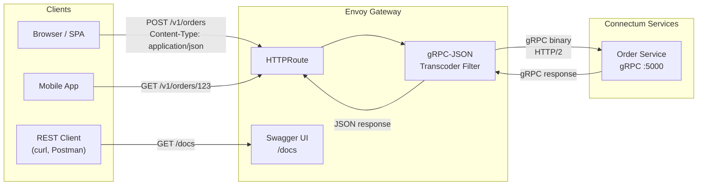

# Envoy Gateway + OpenAPI

::: tip Full Example
All Envoy Gateway configs described below are available in the [production-ready/envoy-gateway](https://github.com/Connectum-Framework/examples/tree/main/production-ready/envoy-gateway) directory.
:::

Connectum services communicate via gRPC, but many external clients (browsers, mobile apps, third-party integrations) need REST/JSON APIs. Envoy Gateway provides **gRPC-JSON transcoding** -- automatically converting REST requests into gRPC calls and vice versa -- without writing any REST handlers.

## Request Flow



## Prerequisites

- Kubernetes cluster with [Envoy Gateway](https://gateway.envoyproxy.io/) installed
- Proto files with `google.api.http` annotations
- `google/api/annotations.proto` and `google/api/http.proto` are available via buf BSR deps

## Step 1: Annotate Proto Files

Add HTTP bindings to your proto service methods using `google.api.http`. The proto file defines CRUD operations for OrderService with REST path mappings (e.g. `POST /v1/orders`, `GET /v1/orders/{order_id}`) and buf validation rules.

See [orders.proto](https://github.com/Connectum-Framework/examples/blob/main/production-ready/envoy-gateway/proto/orders.proto) for the full proto definition.

::: tip
The `google/api/http.proto` and `google/api/annotations.proto` files are available through buf BSR deps. Add them to your [buf.yaml](https://github.com/Connectum-Framework/examples/blob/main/production-ready/envoy-gateway/buf.yaml) dependencies and import them directly in your proto files without vendoring.
:::

## Step 2: Generate OpenAPI Spec

Generate an OpenAPI v3 specification from your annotated proto files using `protoc-gen-openapiv3`:

### Install

```bash
# Install the protoc plugin
go install github.com/google/gnostic/cmd/protoc-gen-openapi@latest

# Or via buf plugin
# Add to buf.gen.yaml
```

### buf.gen.yaml Configuration

This configures buf to generate both ConnectRPC TypeScript stubs (`protoc-gen-es`) and an OpenAPI v3 spec (`protoc-gen-openapi`) with proto-style naming and string enums.

See [buf.gen.yaml](https://github.com/Connectum-Framework/examples/blob/main/production-ready/envoy-gateway/buf.gen.yaml) for the full configuration.

### Generate

```bash
# Generate TypeScript stubs + OpenAPI spec
buf generate

# Output: openapi/mycompany/orders/v1/orders.openapi.yaml
```

### Example Generated OpenAPI

```yaml
openapi: 3.0.3
info:
  title: Order Service API
  version: 1.0.0
paths:
  /v1/orders:
    post:
      operationId: OrderService_CreateOrder
      requestBody:
        content:
          application/json:
            schema:
              $ref: '#/components/schemas/CreateOrderRequest'
      responses:
        '200':
          content:
            application/json:
              schema:
                $ref: '#/components/schemas/CreateOrderResponse'
    get:
      operationId: OrderService_ListOrders
      parameters:
        - name: page_size
          in: query
          schema:
            type: integer
        - name: page_token
          in: query
          schema:
            type: string
      responses:
        '200':
          content:
            application/json:
              schema:
                $ref: '#/components/schemas/ListOrdersResponse'
  /v1/orders/{order_id}:
    get:
      operationId: OrderService_GetOrder
      parameters:
        - name: order_id
          in: path
          required: true
          schema:
            type: string
      responses:
        '200':
          content:
            application/json:
              schema:
                $ref: '#/components/schemas/Order'
```

## Step 3: Generate Proto Descriptor

Envoy's gRPC-JSON transcoder requires a compiled proto descriptor set:

```bash
buf build -o proto-descriptor.pb

# Or with protoc directly:
protoc \
  --include_imports \
  --include_source_info \
  --descriptor_set_out=proto-descriptor.pb \
  -I proto/ \
  proto/mycompany/orders/v1/orders.proto
```

## Step 4: Kubernetes Gateway API Resources

### GatewayClass and Gateway

This manifest defines a GatewayClass and Gateway with three listeners: HTTP on port 80, HTTPS on port 443 (with TLS termination), and a dedicated gRPC listener on port 9090 for native gRPC clients.

See [gateway.yaml](https://github.com/Connectum-Framework/examples/blob/main/production-ready/envoy-gateway/gateway.yaml) for the full manifest.

### GRPCRoute (Native gRPC Traffic)

Routes native gRPC traffic directly to the OrderService backend on port 5000, matching on the fully qualified gRPC service name.

See [grpc-route.yaml](https://github.com/Connectum-Framework/examples/blob/main/production-ready/envoy-gateway/grpc-route.yaml) for the full manifest.

### HTTPRoute (REST-to-gRPC Transcoding)

Maps REST paths (`/v1/orders` prefix) to the gRPC backend for transcoding, and routes `/docs` to the Swagger UI service. Attached to both HTTP and HTTPS listeners.

See [http-route.yaml](https://github.com/Connectum-Framework/examples/blob/main/production-ready/envoy-gateway/http-route.yaml) for the full manifest.

## Step 5: Envoy Filter for gRPC-JSON Transcoding

If your Envoy Gateway version supports EnvoyPatchPolicy, configure the transcoder filter directly. This patch injects the `grpc_json_transcoder` HTTP filter into the listener chain, configuring it with the proto descriptor, target services, and JSON print options (whitespace, primitive fields, proto field names).

See [envoy-patch-policy.yaml](https://github.com/Connectum-Framework/examples/blob/main/production-ready/envoy-gateway/envoy-patch-policy.yaml) for the full manifest.

Alternatively, store the proto descriptor in a ConfigMap. This creates a ConfigMap with the base64-encoded proto descriptor binary that can be mounted into Envoy pods.

See [proto-descriptor-configmap.yaml](https://github.com/Connectum-Framework/examples/blob/main/production-ready/envoy-gateway/proto-descriptor-configmap.yaml) for the full manifest.

## Step 6: Swagger UI Deployment

Deploy Swagger UI to serve the generated OpenAPI spec. This manifest includes a ConfigMap for the OpenAPI spec, a Deployment running the official `swaggerapi/swagger-ui` image with the spec mounted at `/specs`, and a ClusterIP Service exposing port 8080.

See [swagger-ui.yaml](https://github.com/Connectum-Framework/examples/blob/main/production-ready/envoy-gateway/swagger-ui.yaml) for the full manifest.

## Rate Limiting

Add rate limiting at the gateway level to protect your Connectum services. This BackendTrafficPolicy applies local rate limiting of 100 requests per second to the REST HTTPRoute.

See [rate-limit.yaml](https://github.com/Connectum-Framework/examples/blob/main/production-ready/envoy-gateway/rate-limit.yaml) for the full manifest.

## Load Balancing

Configure request-level (L7) load balancing for gRPC backends. This is essential because gRPC uses persistent HTTP/2 connections. The policy applies RoundRobin load balancing to the REST HTTPRoute.

See [backend-traffic-policy.yaml](https://github.com/Connectum-Framework/examples/blob/main/production-ready/envoy-gateway/backend-traffic-policy.yaml) for the full manifest.

## Full Example: End-to-End Request

### REST Client Sends Request

```bash
# Create an order via REST
curl -X POST https://api.example.com/v1/orders \
  -H "Content-Type: application/json" \
  -d '{
    "customer_id": "cust-123",
    "items": [
      {"sku": "ITEM-001", "quantity": 2}
    ]
  }'

# Get an order via REST
curl https://api.example.com/v1/orders/550e8400-e29b-41d4-a716-446655440000
```

### What Happens Under the Hood

1. REST request arrives at Envoy Gateway on port 80/443
2. HTTPRoute matches `/v1/orders` prefix
3. Envoy's `grpc_json_transcoder` filter converts JSON to gRPC binary using the proto descriptor
4. Request is forwarded to `order-service:5000` as a native gRPC call
5. Connectum service processes the gRPC request through its interceptor chain
6. gRPC response is converted back to JSON by the transcoder
7. JSON response is returned to the client

### Native gRPC Client (Unchanged)

```typescript
import { createClient } from '@connectrpc/connect';
import { createGrpcTransport } from '@connectrpc/connect-node';
import { OrderService } from '#gen/mycompany/orders/v1/orders_pb.js';

const transport = createGrpcTransport({
  baseUrl: 'http://api.example.com:9090',
  httpVersion: '2',
});

const client = createClient(OrderService, transport);
const order = await client.getOrder({ orderId: '550e8400-e29b-41d4-a716-446655440000' });
```

## CI/CD: Automate Proto Descriptor Generation

Add proto descriptor generation to your CI pipeline so Envoy always has an up-to-date descriptor:

```yaml
# .github/workflows/proto.yml (excerpt)
- name: Generate proto descriptor
  run: buf build -o proto-descriptor.pb

- name: Update ConfigMap
  run: |
    kubectl create configmap proto-descriptors \
      --from-file=proto-descriptor.pb \
      --namespace=connectum \
      --dry-run=client -o yaml | kubectl apply -f -

- name: Restart Gateway (pick up new descriptor)
  run: kubectl rollout restart deployment envoy-gateway -n connectum
```

::: warning
When you add new services or change HTTP annotations, you must regenerate the proto descriptor and update the Envoy configuration. Automate this in CI to prevent drift between proto definitions and the gateway configuration.
:::

## What's Next

- [Service Mesh with Istio](./service-mesh.md) -- Automatic mTLS and traffic splitting
- [Kubernetes Deployment](./kubernetes.md) -- Core deployment manifests
- [Architecture Patterns](./architecture.md) -- Service communication patterns
