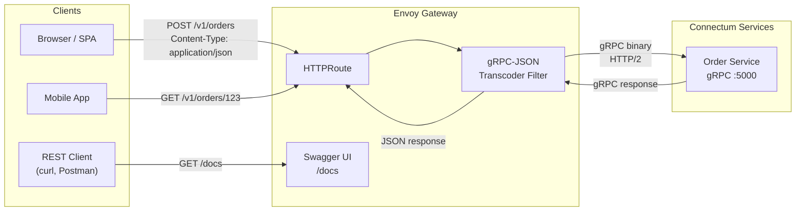

# Envoy Gateway + OpenAPI

::: tip Standalone Envoy Gateway pattern
This page outlines a **standalone Envoy Gateway** integration. It is a configuration
plan, not an executable manifest set: the examples repository has no dedicated
Envoy Gateway example. Follow the linked upstream references for the Gateway
version installed in your cluster. For mesh sidecars, see [Service Mesh](/en/guide/production/service-mesh).
:::

Connectum services communicate via gRPC, but many external clients (browsers, mobile apps, third-party integrations) need REST/JSON APIs. Envoy Gateway provides **gRPC-JSON transcoding** -- automatically converting REST requests into gRPC calls and vice versa -- without writing any REST handlers.

## Request Flow


```mermaid
graph LR
    subgraph Clients
        WEB["Browser / SPA"]
        MOB["Mobile App"]
        CLI["REST Client<br/>(curl, Postman)"]
    end

    subgraph Gateway["Envoy Gateway"]
        ROUTE["HTTPRoute"]
        TRANSCODE["gRPC-JSON<br/>Transcoder Filter"]
        SWAGGER["Swagger UI<br/>/docs"]
    end

    subgraph Services["Connectum Services"]
        SVC["Order Service<br/>gRPC :5000"]
    end

    WEB -->|"POST /v1/orders<br/>Content-Type: application/json"| ROUTE
    MOB -->|"GET /v1/orders/123"| ROUTE
    CLI -->|"GET /docs"| SWAGGER
    ROUTE --> TRANSCODE
    TRANSCODE -->|"gRPC binary<br/>HTTP/2"| SVC
    SVC -->|"gRPC response"| TRANSCODE
    TRANSCODE -->|"JSON response"| ROUTE
```

## Prerequisites

- Kubernetes cluster with [Envoy Gateway](https://gateway.envoyproxy.io/) installed
- Proto files with `google.api.http` annotations
- `google/api/annotations.proto` and `google/api/http.proto` are available via buf BSR deps
- A Connectum backend serving HTTP/2 (`allowHTTP1: false` for plaintext h2c)

## Step 1: Annotate Proto Files

Add HTTP bindings to your proto service methods using `google.api.http`. Define CRUD operations for `OrderService` with REST path mappings (e.g. `POST /v1/orders`, `GET /v1/orders/{order_id}`) and buf validation rules, attaching a `google.api.http` option to each RPC.

::: tip
The `google/api/http.proto` and `google/api/annotations.proto` files are available through buf BSR deps. Add `buf.build/googleapis/googleapis` to your `buf.yaml` dependencies and import them directly in your proto files without vendoring.
:::

## Step 2: Generate OpenAPI Spec

Generate the canonical OpenAPI artifact with the dedicated [OpenAPI and authz
workflow](/en/guide/openapi). Keeping generation in one guide prevents the gateway
from drifting to a different plugin, schema version, or authorization mapping. The
gateway consumes that artifact; it does not own its generation policy.

## Step 3: Generate Proto Descriptor

Envoy's gRPC-JSON transcoder requires a compiled proto descriptor set:

```bash
buf build -o proto-descriptor.pb

# Or with protoc directly:
# Also make the imported Google API and validation protos available locally.
protoc \
  --include_imports \
  --include_source_info \
  --descriptor_set_out=proto-descriptor.pb \
  -I proto/ \
  -I vendor/googleapis/ \
  -I vendor/protovalidate/proto/protovalidate/ \
  proto/mycompany/orders/v1/orders.proto
```

## Step 4: Kubernetes Gateway API Resources

### GatewayClass and Gateway

Define a GatewayClass and Gateway with three listeners: HTTP on port 80, HTTPS on port 443 (with TLS termination), and a dedicated gRPC listener on port 9090 for native gRPC clients.

### GRPCRoute (Native gRPC Traffic)

Route native gRPC traffic directly to the `OrderService` backend on port 5000 with a `GRPCRoute` matching on the fully qualified gRPC service name.

### HTTPRoute (REST-to-gRPC Transcoding)

Map REST paths (`/v1/orders` prefix) to the gRPC backend for transcoding with an `HTTPRoute`, and route `/docs` to the Swagger UI service. Attach the route to both HTTP and HTTPS listeners.

For a route matching the original REST path, set the transcoder's
`match_incoming_request_route: true`. Otherwise it rewrites the path before
routing, so routes must match `/<package>.<service>/<method>`. See the
[Envoy transcoder routing rules](https://www.envoyproxy.io/docs/envoy/latest/configuration/http/http_filters/grpc_json_transcoder_filter#route-configs-for-transcoded-requests).

## Step 5: Envoy Filter for gRPC-JSON Transcoding

Enable `extensionApis.enableEnvoyPatchPolicy` in the controller configuration
before applying a patch; this API is disabled by default. The patch must insert
the transcoder before the router filter. Use the installed version's xDS names;
see [EnvoyPatchPolicy](https://gateway.envoyproxy.io/docs/tasks/extensibility/envoy-patch-policy/).

The descriptor must reach the Envoy data-plane pods independently of the patch.
For a file mount, create a ConfigMap with `--from-file=proto-descriptor.pb` and
mount it read-only at the filter's `proto_descriptor` path. A ConfigMap alone
neither adds a filter nor mounts a volume.

## Step 6: Swagger UI Deployment

Deploy Swagger UI to serve the generated OpenAPI spec: a ConfigMap for the OpenAPI spec, a Deployment running the official `swaggerapi/swagger-ui` image with the spec mounted at `/specs`, and a ClusterIP Service exposing port 8080.

## Rate Limiting

Add rate limiting at the gateway level to protect your Connectum services. A `BackendTrafficPolicy` can apply local rate limiting (e.g. 100 requests per second) to the REST `HTTPRoute`.

## Load Balancing

Configure request-level (L7) load balancing for gRPC backends. This is essential because gRPC uses persistent HTTP/2 connections. A `BackendTrafficPolicy` can apply RoundRobin load balancing to the REST `HTTPRoute`.

## Full Example: End-to-End Request

### REST Client Sends Request

```bash
# Create an order via REST
curl -X POST https://api.example.com/v1/orders \
  -H "Content-Type: application/json" \
  -d '{
    "customer_id": "cust-123",
    "items": [
      {"sku": "ITEM-001", "quantity": 2}
    ]
  }'

# Get an order via REST
curl https://api.example.com/v1/orders/550e8400-e29b-41d4-a716-446655440000
```

### What Happens Under the Hood

1. REST request arrives at Envoy Gateway on port 80/443
2. HTTPRoute matches `/v1/orders` prefix
3. The configured transcoder converts JSON to gRPC using the descriptor and preserves the incoming route when `match_incoming_request_route` is enabled
4. Request is forwarded to `order-service:5000` as a native gRPC call
5. Connectum service processes the gRPC request through its interceptor chain
6. gRPC response is converted back to JSON by the transcoder
7. JSON response is returned to the client

### Native gRPC Client (Unchanged)

```typescript
import { createClient } from '@connectrpc/connect';
import { createGrpcTransport } from '@connectrpc/connect-node';
import { OrderService } from '#gen/mycompany/orders/v1/orders_pb.js';

const transport = createGrpcTransport({
  baseUrl: 'http://api.example.com:9090',
  httpVersion: '2',
});

const client = createClient(OrderService, transport);
const order = await client.getOrder({ orderId: '550e8400-e29b-41d4-a716-446655440000' });
```

## CI/CD: Automate Proto Descriptor Generation

Add proto descriptor generation to your CI pipeline so Envoy always has an up-to-date descriptor:

```yaml
# .github/workflows/proto.yml (excerpt)
- name: Generate proto descriptor
  run: buf build -o proto-descriptor.pb

- name: Update ConfigMap
  env:
    ENVOY_DATA_PLANE_NAMESPACE: ${{ vars.ENVOY_DATA_PLANE_NAMESPACE }}
  run: |
    kubectl create configmap proto-descriptors \
      --from-file=proto-descriptor.pb \
      --namespace="$ENVOY_DATA_PLANE_NAMESPACE" \
      --dry-run=client -o yaml | kubectl apply -f -

- name: Restart the data-plane Deployment that mounts the descriptor
  env:
    ENVOY_DATA_PLANE_DEPLOYMENT: ${{ vars.ENVOY_DATA_PLANE_DEPLOYMENT }}
    ENVOY_DATA_PLANE_NAMESPACE: ${{ vars.ENVOY_DATA_PLANE_NAMESPACE }}
  run: |
    kubectl rollout restart deployment "$ENVOY_DATA_PLANE_DEPLOYMENT" \
      -n "$ENVOY_DATA_PLANE_NAMESPACE"
```

Set those workflow variables from your Gateway's data-plane Deployment and place
the ConfigMap in the same namespace. Restarting the `envoy-gateway` controller
does not reload a descriptor file read by a different Envoy process.

## Verify the integration

Check the accepted Gateway/route/policy conditions, inspect the Envoy configuration
for the descriptor and HTTP/2 upstream, then exercise both a valid REST call and
a rejected request. Compare their JSON bodies with the generated OpenAPI contract.
The templates here have not been applied to a live cluster.

::: warning
When you add new services or change HTTP annotations, you must regenerate the proto descriptor and update the Envoy configuration. Automate this in CI to prevent drift between proto definitions and the gateway configuration.
:::

## What's Next

- [Service Mesh with Istio](./service-mesh.md) -- Automatic mTLS and traffic splitting
- [Kubernetes Deployment](./kubernetes.md) -- Core deployment manifests
- [Architecture Patterns](./architecture.md) -- Service communication patterns
