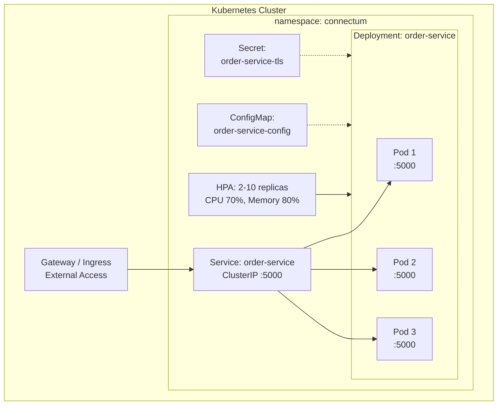
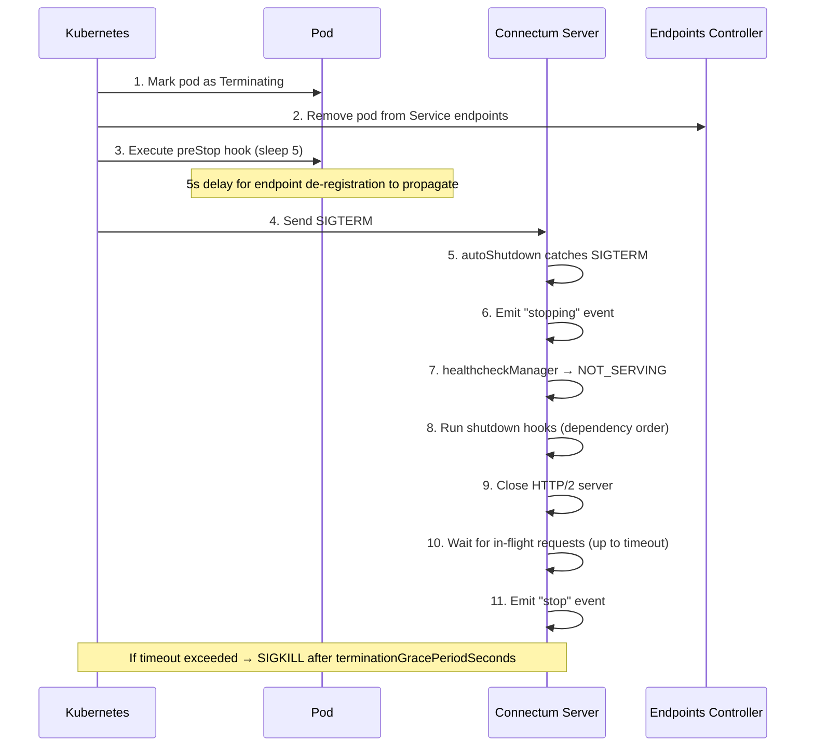

# Kubernetes Deployment

This guide provides production-ready Kubernetes manifests for deploying Connectum services. It covers Deployment, Service, ConfigMap, Secrets, HPA, probes, and graceful shutdown integration.

::: tip Full Example
All Kubernetes manifests described below are available in the [production-ready/k8s](https://github.com/Connectum-Framework/examples/tree/main/production-ready/k8s) directory.
:::

## Architecture Overview



## Namespace

Create a dedicated namespace for your Connectum services. The manifest creates a `connectum` namespace with standard labels and an optional Istio sidecar injection annotation.

See [namespace.yaml](https://github.com/Connectum-Framework/examples/blob/main/production-ready/k8s/namespace.yaml) for the full manifest.

## ConfigMap

Store non-sensitive configuration in a ConfigMap. This manifest defines environment variables for the service port, logging, graceful shutdown, OpenTelemetry export, and downstream service addresses.

See [configmap.yaml](https://github.com/Connectum-Framework/examples/blob/main/production-ready/k8s/configmap.yaml) for the full manifest.

## Secret

Store TLS certificates and sensitive configuration in Secrets. The manifest creates a `kubernetes.io/tls` secret for the service's TLS certificate and private key.

See [secret-tls.yaml](https://github.com/Connectum-Framework/examples/blob/main/production-ready/k8s/secret-tls.yaml) for the full manifest.

::: tip
For production TLS, consider using [cert-manager](https://cert-manager.io/) to automatically provision and renew certificates. If you are using Istio, the service mesh handles mTLS automatically and you may not need application-level TLS at all.
:::

## Deployment

The core manifest. Pay close attention to probes, resource limits, and graceful shutdown configuration. This manifest configures a 3-replica Deployment with rolling update strategy, pod security context, topology spread constraints, startup/liveness/readiness probes against Connectum's HTTP health endpoints, resource limits, and a `preStop` hook for graceful endpoint de-registration.

See [deployment.yaml](https://github.com/Connectum-Framework/examples/blob/main/production-ready/k8s/deployment.yaml) for the full manifest.

## Service

### ClusterIP (Internal gRPC Traffic)

For service-to-service communication within the cluster. This manifest creates a ClusterIP Service on port 5000 with `appProtocol: grpc` to hint service meshes and ingress controllers about the protocol.

See [service.yaml](https://github.com/Connectum-Framework/examples/blob/main/production-ready/k8s/service.yaml) for the full manifest.

### LoadBalancer (External gRPC Access)

For direct external gRPC access (without a gateway). This manifest creates a LoadBalancer Service on port 443 with cloud provider annotations (e.g., AWS NLB with HTTP/2 backend protocol).

See [service-external.yaml](https://github.com/Connectum-Framework/examples/blob/main/production-ready/k8s/service-external.yaml) for the full manifest.

## Horizontal Pod Autoscaler (HPA)

Scale based on CPU and memory utilization. This manifest configures an HPA that scales from 2 to 10 replicas based on 70% CPU and 80% memory thresholds, with stabilization windows and rate-limited scale-up/scale-down policies.

See [hpa.yaml](https://github.com/Connectum-Framework/examples/blob/main/production-ready/k8s/hpa.yaml) for the full manifest.

## RBAC

Minimal ServiceAccount for the service. The manifest creates a dedicated ServiceAccount; add RoleBindings if the service needs Kubernetes API access.

See [rbac.yaml](https://github.com/Connectum-Framework/examples/blob/main/production-ready/k8s/rbac.yaml) for the full manifest.

## Graceful Shutdown Deep Dive

Connectum's graceful shutdown integrates with Kubernetes' pod termination lifecycle. Understanding the sequence is critical for zero-downtime deployments.

### Pod Termination Sequence



### Configuration alignment

It is essential to align timeouts:

```
preStop sleep          : 5s
shutdown.timeout       : 30s (Connectum)
terminationGracePeriod : 35s (Kubernetes, must be >= preStop + shutdown.timeout)
```

::: danger
If `terminationGracePeriodSeconds` is shorter than the sum of `preStop` delay and `shutdown.timeout`, Kubernetes will SIGKILL the pod before Connectum finishes graceful shutdown, causing dropped requests.
:::

### Connectum Server Configuration

```typescript
import { createServer } from '@connectum/core';
import { Healthcheck, healthcheckManager, ServingStatus } from '@connectum/healthcheck';
import { Reflection } from '@connectum/reflection';
import { shutdownProvider } from '@connectum/otel';

const server = createServer({
  services: [routes],
  port: 5000,
  protocols: [
    Healthcheck({ httpEnabled: true }),
    Reflection(),
  ],
  shutdown: {
    autoShutdown: true,        // Catch SIGTERM and SIGINT
    timeout: 30000,            // 30s to drain connections
    signals: ['SIGTERM', 'SIGINT'],
    forceCloseOnTimeout: true, // Force-close after timeout
  },
});

// Register shutdown hooks with dependency ordering
server.onShutdown('otel', async () => {
  await shutdownProvider();
});

server.onShutdown('database', async () => {
  await db.close();
});

// OTel depends on database (database shuts down first)
server.onShutdown('otel', ['database'], async () => {
  await shutdownProvider();
});

server.on('ready', () => {
  healthcheckManager.update(ServingStatus.SERVING);
});

server.on('stopping', () => {
  // Kubernetes readiness probe will start failing
  // because healthcheckManager transitions to NOT_SERVING
  console.log('Server is shutting down...');
});

await server.start();
```

## Probes: Choosing the Right Path

Connectum's `@connectum/healthcheck` package exposes three HTTP paths by default (when `httpEnabled: true`):

| Path | Purpose | Kubernetes Probe | Response |
|---|---|---|---|
| `/healthz` | Is the process alive? | `livenessProbe` | 200 if serving, 503 if not |
| `/readyz` | Ready for traffic? | `readinessProbe` | 200 if serving, 503 if not |
| `/health` | General health (alias) | Any | Same as above |

All three paths check the same `healthcheckManager` status. You can differentiate behavior by registering per-service health statuses:

```typescript
// Report individual service health
healthcheckManager.update(ServingStatus.SERVING, 'mycompany.orders.v1.OrderService');

// Check via HTTP
// GET /healthz?service=mycompany.orders.v1.OrderService
```

## Complete Deployment Script

Apply all manifests:

```bash
# Create namespace
kubectl apply -f namespace.yaml

# Deploy configuration
kubectl apply -f configmap.yaml
kubectl apply -f secret-tls.yaml     # if using application-level TLS
kubectl apply -f rbac.yaml

# Deploy service
kubectl apply -f deployment.yaml
kubectl apply -f service.yaml
kubectl apply -f hpa.yaml

# Verify
kubectl -n connectum get pods -w
kubectl -n connectum get svc

# Check health
kubectl -n connectum exec -it deploy/order-service -- curl http://localhost:5000/healthz

# View logs
kubectl -n connectum logs -f deploy/order-service

# Check HPA status
kubectl -n connectum get hpa order-service
```

## Namespace Strategy

For multi-environment setups:

| Namespace | Purpose | Services |
|---|---|---|
| `connectum-dev` | Development environment | All services, relaxed limits |
| `connectum-staging` | Pre-production testing | All services, prod-like config |
| `connectum` | Production | All services, strict policies |
| `observability` | Monitoring stack | OTel Collector, Jaeger, Prometheus, Grafana |

## What's Next

- [Envoy Gateway](./envoy-gateway.md) -- Expose gRPC services as REST APIs via Envoy
- [Service Mesh with Istio](./service-mesh.md) -- Automatic mTLS and advanced traffic management
- [Microservice Architecture](./architecture.md) -- Architecture patterns and service communication
