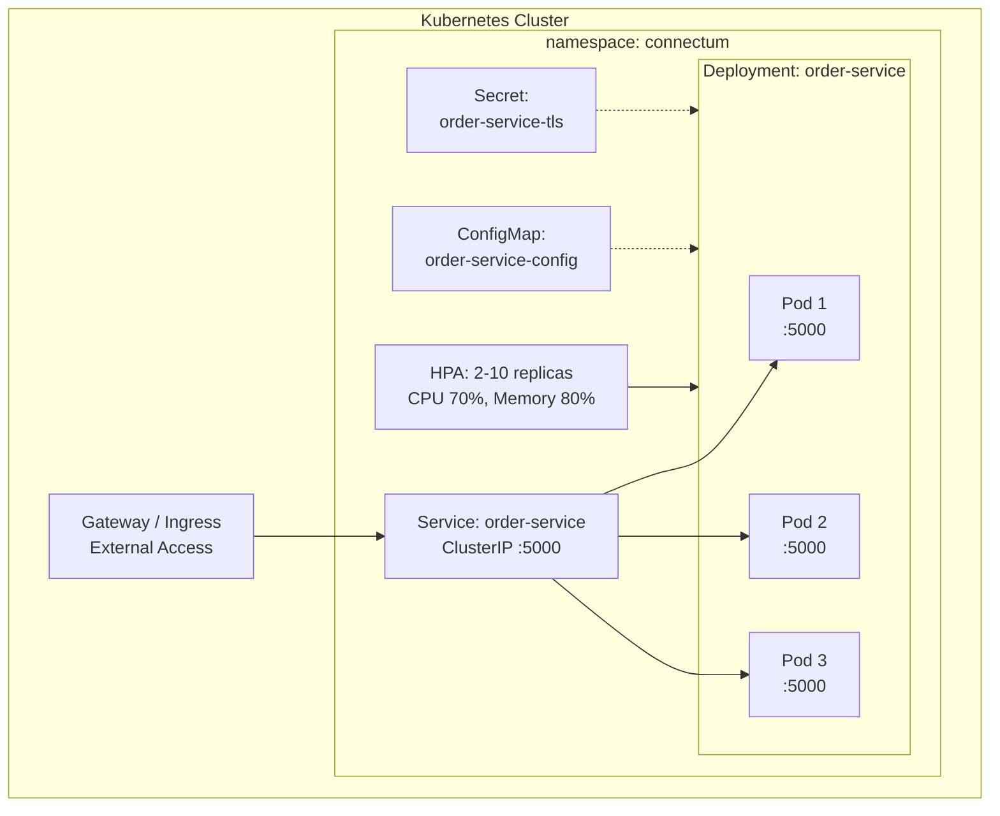

# Kubernetes Deployment

This guide provides production-ready Kubernetes manifests for deploying Connectum services. It covers Deployment, Service, ConfigMap, Secrets, HPA, probes, and graceful shutdown integration.

::: tip Full Example
Kubernetes manifests for a multi-service deployment are available in the [car-sharing/k8s](https://github.com/Connectum-Framework/examples/tree/main/car-sharing/k8s) directory.
:::

## Architecture Overview


```mermaid
graph TB
    subgraph Cluster["Kubernetes Cluster"]
        subgraph NS["namespace: connectum"]
            subgraph Deploy["Deployment: order-service"]
                POD1["Pod 1<br/>:5000"]
                POD2["Pod 2<br/>:5000"]
                POD3["Pod 3<br/>:5000"]
            end
            SVC["Service: order-service<br/>ClusterIP :5000"]
            CM["ConfigMap:<br/>order-service-config"]
            SEC["Secret:<br/>order-service-tls"]
            HPA["HPA: 2-10 replicas<br/>CPU 70%, Memory 80%"]
        end
        INGRESS["Gateway / Ingress<br/>External Access"]
    end

    SVC --> POD1
    SVC --> POD2
    SVC --> POD3
    HPA --> Deploy
    CM -.-> Deploy
    SEC -.-> Deploy
    INGRESS --> SVC
```

## Namespace

Create a dedicated namespace for your Connectum services. The manifest creates a `connectum` namespace with standard labels and an optional Istio sidecar injection annotation.

See [namespace.yaml](https://github.com/Connectum-Framework/examples/blob/main/car-sharing/k8s/namespace.yaml) for the full manifest.

## ConfigMap

Store non-sensitive configuration in a ConfigMap. This manifest defines environment variables for the service port, logging, graceful shutdown, OpenTelemetry export, and downstream service addresses.

See [configmap.yaml](https://github.com/Connectum-Framework/examples/blob/main/car-sharing/k8s/configmap.yaml) for the full manifest.

## Secret

Store TLS certificates and sensitive configuration in Secrets. For application-level TLS, create a `kubernetes.io/tls` secret holding the service's TLS certificate and private key, and mount it into the pod.

The [car-sharing/k8s](https://github.com/Connectum-Framework/examples/tree/main/car-sharing/k8s) example relies on Istio for mTLS rather than application-level TLS secrets; it stores gateway configuration (identity provider endpoints) in `configmap.yaml` instead.

::: tip
For production TLS, consider using [cert-manager](https://cert-manager.io/) to automatically provision and renew certificates. If you are using Istio, the service mesh handles mTLS automatically and you may not need application-level TLS at all.
:::

## Deployment

The core manifest. Pay close attention to probes, resource limits, and graceful shutdown configuration. A Deployment configures a rolling update strategy, pod security context, topology spread constraints, startup/liveness/readiness probes against Connectum's HTTP health endpoints, resource limits, and a `preStop` hook for graceful endpoint de-registration.

For full Deployment manifests, see the [car-sharing/k8s](https://github.com/Connectum-Framework/examples/tree/main/car-sharing/k8s) directory — the example ships one Deployment per role (`deployment-fleet.yaml`, `deployment-billing.yaml`, `deployment-trips.yaml`).

## Service

### ClusterIP (Internal gRPC Traffic)

For service-to-service communication within the cluster. Create a ClusterIP Service on port 5000 with `appProtocol: grpc` to hint service meshes and ingress controllers about the protocol.

See [services.yaml](https://github.com/Connectum-Framework/examples/blob/main/car-sharing/k8s/services.yaml) for the full manifest (the car-sharing example exposes one ClusterIP Service per role — fleet, billing, trips).

### LoadBalancer (External gRPC Access)

For direct external gRPC access (without a gateway), create a LoadBalancer Service on port 443 with cloud provider annotations (e.g., AWS NLB with HTTP/2 backend protocol). The car-sharing example fronts external traffic with an Istio Gateway instead of a LoadBalancer Service — see the [Service Mesh guide](./service-mesh.md) and [car-sharing/istio](https://github.com/Connectum-Framework/examples/tree/main/car-sharing/istio).

## Horizontal Pod Autoscaler (HPA)

Scale based on CPU and memory utilization. This manifest configures an HPA that scales from 2 to 10 replicas based on 70% CPU and 80% memory thresholds, with stabilization windows and rate-limited scale-up/scale-down policies.

See [hpa.yaml](https://github.com/Connectum-Framework/examples/blob/main/car-sharing/k8s/hpa.yaml) for the full manifest.

## RBAC

Minimal ServiceAccount for the service. The manifest creates a dedicated ServiceAccount; add RoleBindings if the service needs Kubernetes API access.

See [rbac.yaml](https://github.com/Connectum-Framework/examples/blob/main/car-sharing/k8s/rbac.yaml) for the full manifest.

## Shutdown and Probe Alignment

The canonical shutdown sequence and hook ordering live in [Graceful shutdown](/en/guide/server/graceful-shutdown); probe semantics and status transitions live in [Kubernetes health checks](/en/guide/health-checks/kubernetes). At deployment level, preserve this deadline invariant:

```
preStop sleep          : 5s
shutdown.timeout       : 30s (Connectum)
terminationGracePeriod : 35s (Kubernetes, must be >= preStop + shutdown.timeout)
```

::: danger
If `terminationGracePeriodSeconds` is shorter than the sum of `preStop` delay and `shutdown.timeout`, Kubernetes will SIGKILL the pod before Connectum finishes graceful shutdown, causing dropped requests.
:::

The deployment manifest should use `/healthz` for liveness and `/readyz` for readiness, enable the HTTP health handler, and let the application move readiness to `NOT_SERVING` before drain. Do not maintain a second status or shutdown timeline in Kubernetes manifests.

## Complete Deployment Script

Apply all manifests:

```bash
# Create namespace
kubectl apply -f namespace.yaml

# Deploy configuration
kubectl apply -f configmap.yaml
kubectl apply -f secret-tls.yaml     # if using application-level TLS
kubectl apply -f rbac.yaml

# Deploy service
kubectl apply -f deployment.yaml
kubectl apply -f service.yaml
kubectl apply -f hpa.yaml

# Verify
kubectl -n connectum get pods -w
kubectl -n connectum get svc

# Check health
kubectl -n connectum exec -it deploy/order-service -- curl http://localhost:5000/healthz

# View logs
kubectl -n connectum logs -f deploy/order-service

# Check HPA status
kubectl -n connectum get hpa order-service
```

## Namespace Strategy

For multi-environment setups:

| Namespace | Purpose | Services |
|---|---|---|
| `connectum-dev` | Development environment | All services, relaxed limits |
| `connectum-staging` | Pre-production testing | All services, prod-like config |
| `connectum` | Production | All services, strict policies |
| `observability` | Monitoring stack | OTel Collector, Jaeger, Prometheus, Grafana |

## What's Next

- [Envoy Gateway](./envoy-gateway.md) -- Expose gRPC services as REST APIs via Envoy
- [Service Mesh with Istio](./service-mesh.md) -- Automatic mTLS and advanced traffic management
- [Microservice Architecture](./architecture.md) -- Architecture patterns and service communication
