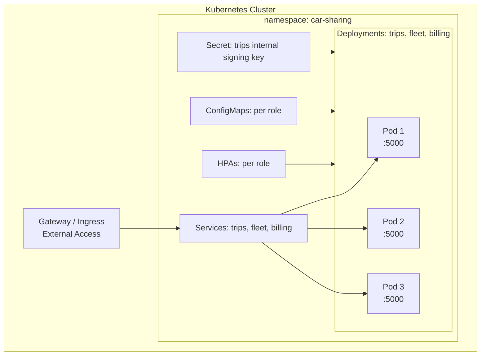

# Kubernetes Deployment

This guide explains the Kubernetes resources used to deploy Connectum services. The linked manifests are a multi-service car-sharing example; adapt names, credentials, scaling limits, and resource requests to your application before applying them.

::: tip Full Example
Kubernetes manifests for a multi-service deployment are available in the [car-sharing/k8s](https://github.com/Connectum-Framework/examples/tree/main/car-sharing/k8s) directory.
:::

## Architecture Overview


```mermaid
graph TB
    subgraph Cluster["Kubernetes Cluster"]
        subgraph NS["namespace: car-sharing"]
            subgraph Deploy["Deployments: trips, fleet, billing"]
                POD1["Pod 1<br/>:5000"]
                POD2["Pod 2<br/>:5000"]
                POD3["Pod 3<br/>:5000"]
            end
            SVC["Services: trips, fleet, billing"]
            CM["ConfigMaps: per role"]
            SEC["Secret: trips internal signing key"]
            HPA["HPAs: per role"]
        end
        INGRESS["Gateway / Ingress<br/>External Access"]
    end

    SVC --> POD1
    SVC --> POD2
    SVC --> POD3
    HPA --> Deploy
    CM -.-> Deploy
    SEC -.-> Deploy
    INGRESS --> SVC
```

## Namespace

Create a dedicated namespace for your Connectum services. The linked example manifest creates the `car-sharing` namespace, labels it for the car-sharing application, and enables Istio sidecar injection.

See [namespace.yaml](https://github.com/Connectum-Framework/examples/blob/main/car-sharing/k8s/namespace.yaml) for the full manifest.

## ConfigMap

Store non-sensitive configuration in a ConfigMap. This manifest defines environment variables for the service port, logging, graceful shutdown, OpenTelemetry export, and downstream service addresses.

See [configmap.yaml](https://github.com/Connectum-Framework/examples/blob/main/car-sharing/k8s/configmap.yaml) for the full manifest.

## Secret

Store TLS certificates and sensitive configuration in Secrets. For application-level TLS, create a `kubernetes.io/tls` secret holding the service's TLS certificate and private key, and mount it into the pod.

The [car-sharing/k8s](https://github.com/Connectum-Framework/examples/tree/main/car-sharing/k8s) example relies on Istio for mTLS rather than application-level TLS secrets; it stores gateway configuration (identity provider endpoints) in `configmap.yaml` instead.

::: tip
For production TLS, consider using [cert-manager](https://cert-manager.io/) to automatically provision and renew certificates. If you are using Istio, the service mesh handles mTLS automatically and you may not need application-level TLS at all.
:::

## Deployment

The example Deployments configure rolling updates, pod security context, topology spread constraints, startup/liveness/readiness probes against Connectum's HTTP health endpoints, resource limits, and a `preStop` hook for endpoint de-registration.

For full manifests, see the [car-sharing/k8s](https://github.com/Connectum-Framework/examples/tree/main/car-sharing/k8s) directory. It ships one Deployment per role: `deployment-trips.yaml`, `deployment-fleet.yaml`, and `deployment-billing.yaml`.

## Service

### ClusterIP (Internal gRPC Traffic)

For service-to-service communication within the cluster. Create a ClusterIP Service on port 5000 with `appProtocol: grpc` to hint service meshes and ingress controllers about the protocol.

See [services.yaml](https://github.com/Connectum-Framework/examples/blob/main/car-sharing/k8s/services.yaml) for the full manifest (the car-sharing example exposes one ClusterIP Service per role — fleet, billing, trips).

### LoadBalancer (External gRPC Access)

For direct external gRPC access (without a gateway), create a LoadBalancer Service on port 443 with cloud provider annotations (e.g., AWS NLB with HTTP/2 backend protocol). The car-sharing example fronts external traffic with an Istio Gateway instead of a LoadBalancer Service — see the [Service Mesh guide](./service-mesh.md) and [car-sharing/istio](https://github.com/Connectum-Framework/examples/tree/main/car-sharing/istio).

## Horizontal Pod Autoscaler (HPA)

Scale based on CPU and memory utilization. This manifest configures an HPA that scales from 2 to 10 replicas based on 70% CPU and 80% memory thresholds, with stabilization windows and rate-limited scale-up/scale-down policies.

See [hpa.yaml](https://github.com/Connectum-Framework/examples/blob/main/car-sharing/k8s/hpa.yaml) for the full manifest.

## RBAC

Minimal ServiceAccount for the service. The manifest creates a dedicated ServiceAccount; add RoleBindings if the service needs Kubernetes API access.

See [rbac.yaml](https://github.com/Connectum-Framework/examples/blob/main/car-sharing/k8s/rbac.yaml) for the full manifest.

## Shutdown and Probe Alignment

The canonical shutdown sequence and hook ordering live in [Graceful shutdown](/en/guide/server/graceful-shutdown); probe semantics and status transitions live in [Kubernetes health checks](/en/guide/health-checks/kubernetes). At deployment level, preserve this deadline invariant:

```
terminationGracePeriodSeconds >= preStop duration
                               + shutdown.timeout (connection drain)
                               + maximum application-hook duration
                               + safety margin
```

::: danger
If `terminationGracePeriodSeconds` is shorter than this sum, Kubernetes can SIGKILL the
pod before cleanup finishes. The car-sharing `deployment-trips.yaml` currently configures
a 5-second `preStop` sleep, a 10-second `buildServer()` shutdown timeout, and a 20-second
grace period. The remaining configured time is available for application cleanup and
other shutdown overhead; it is not a measured hook duration or a guarantee that cleanup
will finish. Choose the hook budget and margin from your application's shutdown work.
:::

The deployment manifest should use `/healthz` for liveness and `/readyz` for readiness, enable the HTTP health handler, and let the application move readiness to `NOT_SERVING` before drain. Do not maintain a second status or shutdown timeline in Kubernetes manifests.

## Complete Deployment Script

The following commands mirror the car-sharing example. They create its `car-sharing` namespace and role resources; the trips Deployment also requires the internal signing key file shown below. These manifests are configuration examples, are not exercised by the automated tests, and do not install Istio or Oathkeeper. Install and configure those components separately before applying the Istio resources.

```bash
# Create namespace
kubectl apply -f k8s/namespace.yaml

# Deploy configuration
kubectl apply -f k8s/rbac.yaml
node src/internalKeygen.ts ./keys trips
kubectl -n car-sharing create secret generic trips-internal-signing-key \
  --from-file=trips.pem=./keys/trips.pem
kubectl apply -f k8s/configmap.yaml

# Deploy service
kubectl apply -f k8s/deployment-fleet.yaml
kubectl apply -f k8s/deployment-billing.yaml
kubectl apply -f k8s/deployment-trips.yaml
kubectl apply -f k8s/services.yaml
kubectl apply -f k8s/hpa.yaml

# Apply the mesh policies after Istio is installed and configured
kubectl apply -f istio/peer-authentication.yaml
kubectl apply -f istio/authorization-policy.yaml
kubectl apply -f istio/destination-rule.yaml
kubectl apply -f istio/virtual-service.yaml
kubectl apply -f istio/gateway.yaml

# Verify
kubectl -n car-sharing get pods -w
kubectl -n car-sharing get svc

# Check health
kubectl -n car-sharing exec -it deploy/trips -- \
  curl -fsS --http2-prior-knowledge http://localhost:5000/healthz

# View logs
kubectl -n car-sharing logs -f deploy/trips

# Check HPA status
kubectl -n car-sharing get hpa trips
```

## Namespace Strategy

For multi-environment setups:

| Namespace | Purpose | Services |
|---|---|---|
| `connectum-dev` | Development environment | All services, relaxed limits |
| `connectum-staging` | Pre-production testing | All services, prod-like config |
| `connectum` | Production | All services, strict policies |
| `observability` | Monitoring stack | OTel Collector, Jaeger, Prometheus, Grafana |

## What's Next

- [Envoy Gateway](./envoy-gateway.md) -- Expose gRPC services as REST APIs via Envoy
- [Service Mesh with Istio](./service-mesh.md) -- Automatic mTLS and advanced traffic management
- [Microservice Architecture](./architecture.md) -- Architecture patterns and service communication
