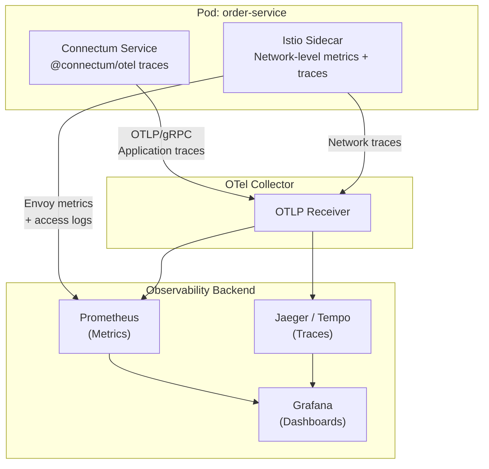

# Istio Service Mesh

A service mesh adds infrastructure-level capabilities -- mTLS, traffic management, observability, and policy enforcement -- without modifying application code. This guide covers deploying Connectum services with [Istio](https://istio.io/) and how its features complement Connectum's built-in functionality.

::: tip Full Example
All Istio manifests described below are available in the [production-ready/istio](https://github.com/Connectum-Framework/examples/tree/main/production-ready/istio) directory.
:::

## When to Use a Service Mesh

A service mesh adds value when your deployment has:

| Requirement | Without Mesh | With Istio |
|---|---|---|
| Mutual TLS between services | Implement per-service with `@connectum/core` TLS options | Automatic, zero-config mTLS |
| Traffic splitting (canary) | Manual DNS/LB configuration | Declarative VirtualService rules |
| Distributed tracing | Requires `@connectum/otel` in every service | Automatic span injection via sidecar |
| Access policies | Implement in application code | Declarative AuthorizationPolicy |
| Rate limiting | Application-level only | Mesh-wide + application-level |

::: tip
**Rule of thumb:** If you run 3+ Connectum services that communicate with each other, a service mesh pays for itself in reduced operational complexity. For 1-2 services, Connectum's built-in features are sufficient.
:::

## Enabling Istio Sidecar Injection

Label your namespace to enable automatic Envoy sidecar injection. The manifest creates the `connectum` namespace with the `istio-injection: enabled` label so that every new pod receives an Istio sidecar proxy automatically.

See [namespace.yaml](https://github.com/Connectum-Framework/examples/blob/main/production-ready/istio/namespace.yaml) for the full manifest.

After applying, every new pod in the `connectum` namespace will automatically receive an Istio sidecar proxy.

### Verify Injection

```bash
kubectl -n connectum get pods

# Expected output:
# NAME                            READY   STATUS    RESTARTS
# order-service-7b9f8c6d4-abc12   2/2     Running   0
#                                  ^^^
#                                  2 containers: app + istio-proxy
```

## Automatic mTLS

### PeerAuthentication

Enforce strict mTLS for all traffic within the namespace. This policy sets `STRICT` mode, meaning all inter-service communication must use mutual TLS.

See [peer-authentication.yaml](https://github.com/Connectum-Framework/examples/blob/main/production-ready/istio/peer-authentication.yaml) for the full manifest.

This means:
- All inter-service traffic is encrypted with mutual TLS
- Both client and server identities are verified via SPIFFE certificates
- No application code changes needed -- Connectum services communicate in plaintext to their local sidecar, which handles encryption

::: tip
When using Istio mTLS, you do **not** need to configure TLS in `createServer()`. The sidecar handles encryption transparently. Remove any `tls` configuration from your Connectum server options to avoid double encryption:

```typescript
const server = createServer({
  services: [routes],
  port: 5000,
  // No tls configuration needed -- Istio handles it
  protocols: [Healthcheck({ httpEnabled: true }), Reflection()],
});
```
:::

### Per-Service Override

If a specific service needs to accept non-mTLS traffic (e.g., from external clients), you can override the namespace-wide policy with a `PERMISSIVE` mode selector targeting that specific service.

See [peer-authentication-permissive.yaml](https://github.com/Connectum-Framework/examples/blob/main/production-ready/istio/peer-authentication-permissive.yaml) for the full manifest.

## Traffic Management

### VirtualService

Control how traffic flows to your Connectum services. This manifest configures timeouts, retry policies, and routing for the order-service.

See [virtual-service.yaml](https://github.com/Connectum-Framework/examples/blob/main/production-ready/istio/virtual-service.yaml) for the full manifest.

### DestinationRule

Configure connection pooling, outlier detection, load balancing, and subset definitions (stable/canary) for your service.

See [destination-rule.yaml](https://github.com/Connectum-Framework/examples/blob/main/production-ready/istio/destination-rule.yaml) for the full manifest.

### Canary Deployments

Route a percentage of traffic to a new version. The canary VirtualService splits traffic between stable (90%) and canary (10%) subsets.

See [canary-virtual-service.yaml](https://github.com/Connectum-Framework/examples/blob/main/production-ready/istio/canary-virtual-service.yaml) for the full manifest.

Deploy the canary with a different version label. This Deployment creates a single-replica canary pod labeled `version: canary` running the release candidate image.

See [deployment-canary.yaml](https://github.com/Connectum-Framework/examples/blob/main/production-ready/istio/deployment-canary.yaml) for the full manifest.

### Header-Based Routing

Route specific users or test traffic to the canary. This VirtualService matches requests with the `x-canary: true` header and sends them to the canary subset, while all other traffic goes to stable.

See [header-routing.yaml](https://github.com/Connectum-Framework/examples/blob/main/production-ready/istio/header-routing.yaml) for the full manifest.

## Observability Integration

### Istio Telemetry + @connectum/otel

Istio sidecars automatically generate metrics, traces, and access logs. Connectum's `@connectum/otel` package provides application-level traces and metrics. Together, they offer complete observability.



### Telemetry Resource

Configure Istio to export telemetry to the same OTel Collector used by Connectum. This manifest enables tracing (100% sampling), Prometheus metrics, and OTel access logging for the namespace.

See [telemetry.yaml](https://github.com/Connectum-Framework/examples/blob/main/production-ready/istio/telemetry.yaml) for the full manifest.

### Trace Propagation

For end-to-end traces that span both Istio sidecars and application code, Connectum's `@connectum/otel` interceptor automatically propagates W3C Trace Context headers (`traceparent`, `tracestate`). Istio's sidecar reads these same headers, creating a unified trace.

The `createOtelInterceptor()` from `@connectum/otel` handles this automatically:

```typescript
import { initProvider } from '@connectum/otel';

// Initialize OTel before creating the server
initProvider({
  serviceName: 'order-service',
  serviceVersion: '1.0.0',
});
```

No additional configuration is needed -- both `@connectum/otel` and Istio use OpenTelemetry-compatible trace context propagation.

## Circuit Breaking: Mesh vs Application

Connectum and Istio both provide circuit breaking. Understanding when to use each is critical.

### Comparison

| Feature | `@connectum/interceptors` | Istio DestinationRule |
|---|---|---|
| **Scope** | Per-method, per-service | Per-host (all methods) |
| **Granularity** | Fine: different thresholds per RPC method | Coarse: same threshold for all methods |
| **State visibility** | Application logs, custom metrics | Envoy stats, Kiali dashboard |
| **Fallback** | Custom fallback handlers | 503 Unavailable |
| **Retry** | Exponential backoff with jitter | Fixed retry count |
| **Bulkhead** | Concurrency limiting per method | Connection pool limits |

### Recommended Strategy

Use **both layers** with complementary roles:

1. **Istio (outer layer):** Outlier detection to eject unhealthy pods from the load balancer pool. This handles infrastructure-level failures (crashed pods, network issues).

2. **Connectum interceptors (inner layer):** Application-level circuit breaking with per-method configuration, custom fallbacks, and retry with backoff. This handles application-level failures (timeouts, business logic errors).

For the Istio infrastructure-level resilience DestinationRule with outlier detection, see [destination-rule.yaml](https://github.com/Connectum-Framework/examples/blob/main/production-ready/istio/destination-rule.yaml) (the same manifest also covers connection pooling and subsets).

```typescript
import { createDefaultInterceptors } from '@connectum/interceptors';

// Connectum: application-level resilience
const server = createServer({
  services: [routes],
  port: 5000,
  interceptors: createDefaultInterceptors({
    circuitBreaker: { threshold: 3 },
    timeout: { duration: 10_000 },
    retry: { maxRetries: 2 },
    bulkhead: { capacity: 20, queueSize: 10 },
  }),
});
```

::: warning
When using both Istio retries and Connectum retries, be careful about **retry amplification**. If Istio retries 3 times and Connectum retries 3 times, a single failing request can generate up to 9 downstream calls. Set Istio retries to 0 or 1 when using Connectum's retry interceptor.
:::

## Authorization Policies

Control which services can communicate with each other. This policy allows traffic only from the API gateway service account and from pods within the `connectum` namespace, denying everything else.

See [authorization-policy.yaml](https://github.com/Connectum-Framework/examples/blob/main/production-ready/istio/authorization-policy.yaml) for the full manifest.

## Sidecar Resource Limits

Configure resource limits for the Istio sidecar to prevent it from starving the Connectum application container. This Deployment annotates the pod template with CPU and memory requests/limits for the Envoy proxy.

See [sidecar-resources.yaml](https://github.com/Connectum-Framework/examples/blob/main/production-ready/istio/sidecar-resources.yaml) for the full manifest.

## Health Check Configuration with Istio

Istio rewrites health check probes by default. Ensure your probe configuration works correctly:

```yaml
# In your Deployment pod template
spec:
  containers:
    - name: order-service
      # Connectum healthcheck HTTP endpoints work through the Istio sidecar
      # because Istio automatically handles probe rewriting
      livenessProbe:
        httpGet:
          path: /healthz
          port: 5000
        periodSeconds: 15
      readinessProbe:
        httpGet:
          path: /readyz
          port: 5000
        periodSeconds: 10
```

::: tip
Istio 1.20+ rewrites HTTP health probes automatically to route through the sidecar. Connectum's `/healthz`, `/readyz`, and `/health` endpoints work without any special configuration.
:::

## Kiali: Service Mesh Dashboard

[Kiali](https://kiali.io/) provides a visual dashboard for your Istio service mesh, showing real-time traffic flow between Connectum services:

```bash
# Install Kiali (if not already installed with Istio)
kubectl apply -f https://raw.githubusercontent.com/istio/istio/release-1.24/samples/addons/kiali.yaml

# Access the dashboard
kubectl port-forward svc/kiali -n istio-system 20001:20001

# Open http://localhost:20001
```

Kiali shows:
- Service graph with real-time traffic
- Per-service health indicators
- Traffic policies and configuration validation
- Distributed traces (integrated with Jaeger)

## Migration Path

### Starting Without a Mesh

If you are deploying Connectum services without Istio initially:

1. Use `@connectum/core` TLS options for service-to-service encryption
2. Use `@connectum/interceptors` for all resilience patterns
3. Use `@connectum/otel` for observability

### Adding Istio Later

When you add Istio:

1. **Remove** application-level TLS (`tls` option in `createServer()`) -- Istio handles it
2. **Keep** `@connectum/interceptors` for application-level resilience
3. **Keep** `@connectum/otel` -- it complements Istio's network-level telemetry
4. **Add** Istio traffic policies for infrastructure-level resilience
5. **Tune** retry settings to avoid amplification (reduce Connectum retries or Istio retries)

```typescript
// Before Istio (application-level TLS)
const server = createServer({
  services: [routes],
  port: 5000,
  tls: { dirPath: '/etc/tls' },  // Remove this
  // ...
});

// After Istio (no application-level TLS)
const server = createServer({
  services: [routes],
  port: 5000,
  // No tls -- Istio sidecar handles mTLS
  // ...
});
```

## What's Next

- [Kubernetes Deployment](./kubernetes.md) -- Core deployment manifests
- [Envoy Gateway](./envoy-gateway.md) -- gRPC-JSON transcoding for REST clients
- [Architecture Patterns](./architecture.md) -- Service communication and scaling
