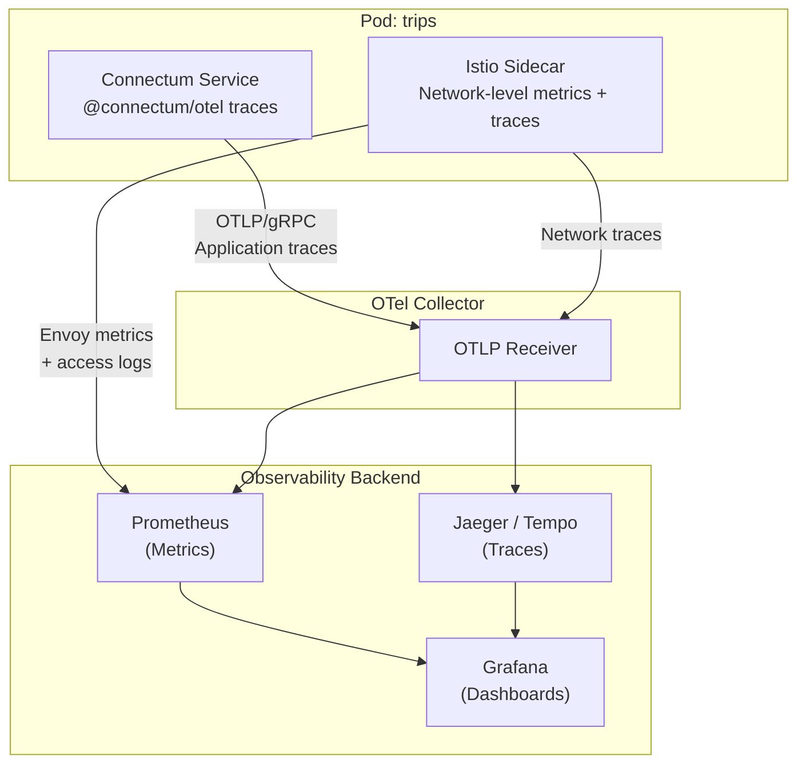

# Istio Service Mesh

A service mesh adds infrastructure-level capabilities -- mTLS, traffic management, observability, and policy enforcement -- without modifying application code. This guide covers deploying Connectum services with [Istio](https://istio.io/) and how its features complement Connectum's built-in functionality.

::: tip Full Example
Istio manifests for a multi-service deployment are available in the [car-sharing/istio](https://github.com/Connectum-Framework/examples/tree/main/car-sharing/istio) directory.
:::

## When to Use a Service Mesh

A service mesh adds value when your deployment has:

| Requirement | Without Mesh | With Istio |
|---|---|---|
| Mutual TLS between services | Configure certificates and verification in server/client TLS | Workload mTLS after mesh identity and policy configuration |
| Traffic splitting (canary) | Manual DNS/LB configuration | Declarative VirtualService rules |
| Distributed tracing | Instrument applications, for example with `@connectum/otel` | Proxy spans when tracing is configured; application propagation is still needed |
| Access policies | Implement in application code | Declarative AuthorizationPolicy |
| Rate limiting | Application-level only | Mesh-wide + application-level |

Choose a mesh based on the operational capabilities you need, such as workload identity, traffic policy, or network telemetry. Service count alone does not determine whether the added mesh components are useful.

## Enabling Istio Sidecar Injection

Label your namespace to enable automatic Envoy sidecar injection. The manifest
uses `istio-injection: enabled`; injection also requires Istio's admission webhook
and can be disabled per pod. See [Istio sidecar injection](https://istio.io/latest/docs/setup/additional-setup/sidecar-injection/).

See [namespace.yaml](https://github.com/Connectum-Framework/examples/blob/main/car-sharing/k8s/namespace.yaml) for the full manifest.

The label affects newly created pods. Inspect their containers to verify injection.

### Verify Injection

```bash
kubectl -n car-sharing get pods

# Expected output:
# NAME                            READY   STATUS    RESTARTS
# trips-7b9f8c6d4-abc12           2/2     Running   0
#                                  ^^^
#                                  2 containers: app + istio-proxy
```

## Automatic mTLS

### PeerAuthentication

Enforce strict mTLS for all traffic within the namespace. This policy sets `STRICT` mode, meaning all inter-service communication must use mutual TLS.

See [peer-authentication.yaml](https://github.com/Connectum-Framework/examples/blob/main/car-sharing/istio/peer-authentication.yaml) for the full manifest.

This means:
- All inter-service traffic is encrypted with mutual TLS
- Both client and server identities are verified via SPIFFE certificates
- No application code changes needed -- Connectum services communicate in plaintext to their local sidecar, which handles encryption

::: tip
When the sidecar owns workload mTLS and forwards plaintext HTTP/2 to the
application, configure Connectum for h2c. Application TLS is optional and requires
matching proxy upstream configuration; do not remove it from an existing
deployment without checking that boundary:

```typescript
const server = createServer({
  services: [routes],
  port: 5000,
  allowHTTP1: false,
  // No tls configuration needed -- Istio handles it
  protocols: [Healthcheck({ httpEnabled: true }), Reflection()],
});
```
:::

### Per-Service Override

If a specific service needs to accept non-mTLS traffic (e.g., from external clients), override the namespace-wide policy with a second `PeerAuthentication` that sets `PERMISSIVE` mode and a `selector` targeting that specific service. The car-sharing example enforces namespace-wide `STRICT` mTLS in [peer-authentication.yaml](https://github.com/Connectum-Framework/examples/blob/main/car-sharing/istio/peer-authentication.yaml); add a `PERMISSIVE` override only for services that must accept plaintext.

## Traffic Management

### VirtualService

Control traffic among the `trips`, `fleet`, and `billing` services in the example. The manifests configure routing and resilience policies for these roles.

See [virtual-service.yaml](https://github.com/Connectum-Framework/examples/blob/main/car-sharing/istio/virtual-service.yaml) for the full manifest.

The fleet and billing routes select a `stable` subset. Add matching subsets and
pod labels before applying them: the linked DestinationRule currently defines
subsets only for trips.

### DestinationRule

Configure connection pooling, outlier detection, load balancing, and subset definitions (stable/canary) for your service.

See [destination-rule.yaml](https://github.com/Connectum-Framework/examples/blob/main/car-sharing/istio/destination-rule.yaml) for the full manifest.

### Canary Deployments

Route a percentage of traffic to a new version. The canary VirtualService splits traffic between stable (90%) and canary (10%) subsets.

See [canary-virtual-service.yaml](https://github.com/Connectum-Framework/examples/blob/main/car-sharing/istio/canary-virtual-service.yaml) for the full manifest.

Deploy the canary with a different version label: create a single-replica canary pod labeled `version: canary` running the release candidate image, alongside the stable Deployment. The [car-sharing/istio](https://github.com/Connectum-Framework/examples/tree/main/car-sharing/istio) example wires the canary subsets in `canary-virtual-service.yaml` and `destination-rule.yaml`.

Before applying the fleet canary route, add `stable` and `canary` subsets to the
fleet DestinationRule. The linked `destination-rule.yaml` currently declares
those subsets only for trips, while the canary route targets fleet; without
fleet subsets and matching pod labels the route has no selected endpoints.

### Header-Based Routing

Route specific users or test traffic to the canary by adding an HTTP `match` block to the VirtualService: match requests carrying an `x-canary: true` header and route them to the canary subset, while all other traffic goes to stable. See [virtual-service.yaml](https://github.com/Connectum-Framework/examples/blob/main/car-sharing/istio/virtual-service.yaml) in the car-sharing example for the VirtualService structure to extend.

## Observability Integration

### Istio Telemetry + @connectum/otel

Istio sidecars can generate network metrics, traces, and access logs when telemetry is configured. Connectum's `@connectum/otel` package provides application-level telemetry; together they expose different parts of a request path.


```mermaid
graph TB
    subgraph Pod["Pod: trips"]
        APP["Connectum Service<br/>@connectum/otel traces"]
        SIDECAR["Istio Sidecar<br/>Network-level metrics + traces"]
    end

    subgraph Collector["OTel Collector"]
        RECV["OTLP Receiver"]
    end

    subgraph Backend["Observability Backend"]
        JAEGER["Jaeger / Tempo<br/>(Traces)"]
        PROM["Prometheus<br/>(Metrics)"]
        GRAFANA["Grafana<br/>(Dashboards)"]
    end

    APP -->|"OTLP/gRPC<br/>Application traces"| RECV
    SIDECAR -->|"Envoy metrics<br/>+ access logs"| PROM
    SIDECAR -->|"Network traces"| RECV
    RECV --> JAEGER
    RECV --> PROM
    PROM --> GRAFANA
    JAEGER --> GRAFANA
```

### Telemetry Resource

Configure Istio to export telemetry to the same OTel Collector used by Connectum. An Istio `Telemetry` resource enables tracing (e.g. 100% sampling), Prometheus metrics, and OTel access logging for the namespace. See the [Istio Telemetry API](https://istio.io/latest/docs/reference/config/telemetry/) for the resource schema, and the [car-sharing/istio](https://github.com/Connectum-Framework/examples/tree/main/car-sharing/istio) directory for the example's mesh manifests.

### Trace Propagation

For traces that span Istio sidecars and application code, Connectum's `@connectum/otel` interceptor propagates W3C Trace Context headers (`traceparent`, `tracestate`). Istio can use the same headers when tracing is configured.

Initialize the provider and attach server and client instrumentation explicitly:

```typescript
import { createOtelInterceptor, createOtelClientInterceptor, initProvider } from '@connectum/otel';
import { createServer } from '@connectum/core';
import { createGrpcTransport } from '@connectrpc/connect-node';

// Initialize OTel before creating the server
initProvider({
  serviceName: 'trips',
  serviceVersion: '1.0.0',
});

const server = createServer({
  services: [routes],
  allowHTTP1: false,
  interceptors: [createOtelInterceptor()],
});
const upstreamTransport = createGrpcTransport({
  baseUrl: 'http://upstream:5000',
  interceptors: [createOtelClientInterceptor({ serverAddress: 'upstream', serverPort: 5000 })],
});
```

Configure the collector and Istio telemetry resource for your deployment; both sides use W3C Trace Context propagation.

## Circuit Breaking: Mesh vs Application

Connectum and Istio both provide circuit breaking. Understanding when to use each is critical.

### Comparison

| Feature | `@connectum/interceptors` | Istio DestinationRule |
|---|---|---|
| **Scope** | Per interceptor instance; use separate instances to isolate methods | Per destination host/cluster policy |
| **Granularity** | Method filtering can select separate configured instances | DestinationRule policy and subsets |
| **State visibility** | Application logs, custom metrics | Envoy stats, Kiali dashboard |
| **Fallback** | Custom fallback handlers | 503 Unavailable |
| **Retry** | Exponential backoff with jitter | Fixed retry count |
| **Bulkhead** | Concurrency limiting per interceptor instance | Connection pool limits |

### Recommended Strategy

Use **both layers** with complementary roles:

1. **Istio (outer layer):** Outlier detection to eject unhealthy pods from the load balancer pool. This handles infrastructure-level failures (crashed pods, network issues).

2. **Connectum client interceptors:** Circuit breaking and retry for infrastructure
   failures on outbound calls. Expected business errors do not trip the default
   breaker. Inbound protection uses explicit timeout and bulkhead limits; see
   [Built-in interceptors](/en/guide/interceptors/built-in#circuit-breaker-placement-and-error-classification).

For the Istio infrastructure-level resilience DestinationRule with outlier detection, see [destination-rule.yaml](https://github.com/Connectum-Framework/examples/blob/main/car-sharing/istio/destination-rule.yaml) (the same manifest also covers connection pooling and subsets).

```typescript
import { createDefaultInterceptors } from '@connectum/interceptors';

// Connectum: explicit inbound limits
const server = createServer({
  services: [routes],
  port: 5000,
  interceptors: createDefaultInterceptors({
    timeout: { duration: 10_000 },
    bulkhead: { capacity: 20, queueSize: 10 },
  }),
});
```

::: warning
Retries at multiple layers multiply attempts. A policy with 3 retries can issue
4 attempts including the initial call; two such layers can issue up to 16
attempts if their budgets allow it. Choose one retry owner for each call path,
and retry mutations only when duplicate execution is safe.
:::

## Authorization Policies

Control which services can communicate with each other. In the linked example, fleet and billing admit requests from the `trips` service account; the policy is scoped to the `car-sharing` namespace.

See [authorization-policy.yaml](https://github.com/Connectum-Framework/examples/blob/main/car-sharing/istio/authorization-policy.yaml) for the full manifest.

## Sidecar Resource Limits

Configure resource limits for the Istio sidecar to prevent it from starving the Connectum application container. Annotate the pod template with `sidecar.istio.io/proxyCPU`, `sidecar.istio.io/proxyMemory` (and their `*Limit` variants) to set CPU and memory requests/limits for the Envoy proxy. See the [Istio resource annotations](https://istio.io/latest/docs/reference/config/annotations/) reference.

## Health Check Configuration with Istio

Use the same `/healthz` liveness and `/readyz` readiness probes documented in
[Kubernetes health checks](/en/guide/health-checks/kubernetes). Istio rewrites probes
by default; see [Istio health checking](https://istio.io/latest/docs/ops/configuration/mesh/app-health-check/).
The probe forwarded to the application must still use its accepted protocol:
for plaintext h2c use a gRPC probe or an exec probe speaking HTTP/2. Verify the
injected PodSpec and an unhealthy result before rollout.

## Kiali: Service Mesh Dashboard

[Kiali](https://kiali.io/) provides a visual dashboard for your Istio service mesh, showing real-time traffic flow between Connectum services:

```bash
# Access the dashboard
kubectl port-forward svc/kiali -n istio-system 20001:20001

# Open http://localhost:20001
```

Install a Kiali release compatible with your mesh using the
[Kiali installation guide](https://kiali.io/docs/installation/); the command above
assumes its Service is named `kiali` in `istio-system`.

Kiali shows:
- Service graph with real-time traffic
- Per-service health indicators
- Traffic policies and configuration validation
- Distributed traces (integrated with Jaeger)

## Migration Path

### Starting Without a Mesh

If you are deploying Connectum services without Istio initially:

1. Use `@connectum/core` TLS options for service-to-service encryption
2. Use `@connectum/interceptors` for all resilience patterns
3. Use `@connectum/otel` for observability

### Adding Istio Later

When you add Istio:

1. **Choose** the sidecar-to-application transport. For plaintext h2c, omit application TLS and set `allowHTTP1: false`; retain application TLS if your proxy is configured for it.
2. **Keep** `@connectum/interceptors` for application-level resilience
3. **Keep** `@connectum/otel` -- it complements Istio's network-level telemetry
4. **Add** Istio traffic policies for infrastructure-level resilience
5. **Tune** retry settings to avoid amplification (reduce Connectum retries or Istio retries)

```typescript
// Before Istio (application-level TLS)
const server = createServer({
  services: [routes],
  port: 5000,
  tls: { dirPath: '/etc/tls' },
  // ...
});

// After Istio (no application-level TLS)
const server = createServer({
  services: [routes],
  port: 5000,
  allowHTTP1: false,
  // No tls -- Istio sidecar handles mTLS
  // ...
});
```

## What's Next

- [Kubernetes Deployment](./kubernetes.md) -- Core deployment manifests
- [Envoy Gateway](./envoy-gateway.md) -- gRPC-JSON transcoding for REST clients
- [Architecture Patterns](./architecture.md) -- Service communication and scaling
