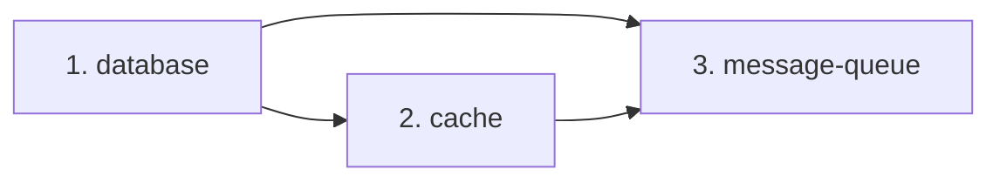
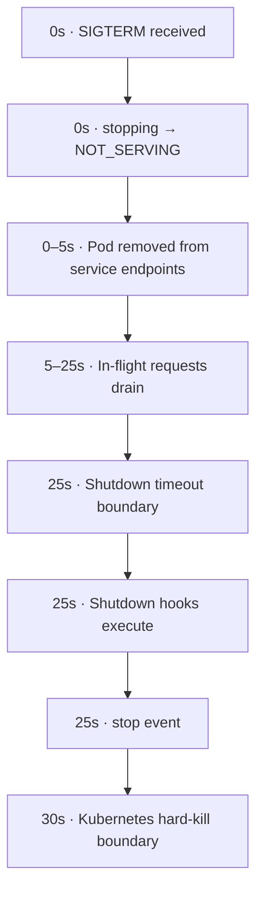

# Graceful Shutdown

Connectum provides built-in graceful shutdown support that handles signal interception, connection draining, shutdown hooks with dependency ordering, and integration with Kubernetes lifecycle.

## Quick Setup

```typescript
import { createServer } from '@connectum/core';
import { Healthcheck, healthcheckManager, ServingStatus } from '@connectum/healthcheck';

const server = createServer({
  services: [routes],
  protocols: [Healthcheck({ httpEnabled: true })],
  shutdown: {
    autoShutdown: true,    // Handle SIGTERM/SIGINT automatically
    timeout: 30000,        // 30 seconds to drain connections
  },
});

server.on('ready', () => {
  healthcheckManager.update(ServingStatus.SERVING);
});

server.on('stopping', () => {
  healthcheckManager.update(ServingStatus.NOT_SERVING);
});

await server.start();
```

## Shutdown Options

The `shutdown` option in `createServer()` accepts a `ShutdownOptions` object:

```typescript
interface ShutdownOptions {
  /** Timeout in ms for graceful shutdown (default: 30000) */
  timeout?: number;

  /** Signals to listen for (default: ['SIGTERM', 'SIGINT']) */
  signals?: NodeJS.Signals[];

  /** Auto-handle signals (default: false) */
  autoShutdown?: boolean;

  /** Force close every client connection on timeout (default: true) */
  forceCloseOnTimeout?: boolean;
}
```

| Option | Default | Description |
|--------|---------|-------------|
| `timeout` | `30000` | Maximum time (ms) to wait for in-flight requests |
| `signals` | `['SIGTERM', 'SIGINT']` | OS signals that trigger shutdown |
| `autoShutdown` | `false` | Automatically install signal handlers |
| `forceCloseOnTimeout` | `true` | Destroy every remaining client connection (HTTP/1.1, h2c, TLS) if the timeout is exceeded |

`createServer()` validates both values and throws instead of starting a server that would cut connections at once:

- `timeout` must be an integer from `0` to `2147483647` (the largest delay a Node.js timer accepts). `0` means "do not wait for in-flight requests". A number outside that range (`NaN`, `Infinity`, a negative or fractional number, a larger value) throws a `RangeError`; a value that is not a number throws a `TypeError`.
- `forceCloseOnTimeout` must be a boolean; anything else throws a `TypeError`.

Both error messages name the option and the rejected value, in the same form as the [`readMaxBytes`](/en/guide/security/request-admission) check. Leaving an option out, or setting it to `undefined`, keeps the default.

## Shutdown Sequence

When `server.stop()` is called (or a signal is received with `autoShutdown: true`), the following sequence executes:

```
1. STOPPING event     -- Notify listeners (update health check to NOT_SERVING)
2. Abort signal       -- Abort context.signal of every in-flight RPC, over HTTP and
                         in-process (localClient, ctx.call), and long-running operations
3. Transport close    -- Stop accepting new connections, send GOAWAY to every HTTP/2 session
4. Timeout race       -- Wait for in-flight requests OR timeout
5. Force close        -- If timeout + forceCloseOnTimeout: destroy every remaining connection
6. Shutdown hooks     -- Execute registered hooks in dependency order
7. Dispose            -- Clean up internal state
8. STOP event         -- Server is fully stopped
```

Steps 6 and 7 run even if closing the transport fails before the timeout, so your hooks always get to release their resources, and step 7 also runs if a hook fails. On this failure path the server emits `error` and then still emits `stop`, and `stop()` rejects with the error that occurred — or with an `AggregateError` carrying both when the transport close and a hook both failed. A close failure that only arrives after the timeout has already won is logged, not thrown: if the hooks succeed, `stop()` resolves normally.

### In-process calls

Since 1.3.0, step 2 also aborts `context.signal` of calls made through `server.localClient()`, `server.client()` for a local service, `createLocalTransport()`, and `ctx.call` / `ctx.stream` to a local service — every hop of a local `ctx.call` chain sees it directly. A handler or stream that rethrows the abort ends the call with `canceled`, as over HTTP.

Steps 4 and 5 act on connections, and an in-process call has none: `stop()` neither waits for it nor destroys it, so a handler that ignores the signal keeps running and still completes its call. A local call made after `stop()` starts with an already-aborted signal. Upgrading from 1.2: see [In-process calls on shutdown](/en/migration/in-process-shutdown).

### EventBus

A bus passed as `createServer({ eventBus })` is stopped by a shutdown hook named
`eventbus` in step 6, after the timeout race. Its handler and publish drain
budgets therefore add to the time `stop()` takes; they are not bounded by
`shutdown.timeout`. See [Shutdown drain](/en/guide/events#shutdown-drain).

## Shutdown Hooks

Shutdown hooks allow you to run cleanup logic during shutdown with dependency ordering. Register them via `server.onShutdown()`.

### Anonymous Hooks

```typescript
server.onShutdown(async () => {
  await db.close();
});

server.onShutdown(() => {
  console.log('Cleanup complete');
});
```

### Named Hooks

Give hooks names for better logging and dependency management:

```typescript
server.onShutdown('database', async () => {
  await db.close();
  console.log('Database connections closed');
});

server.onShutdown('cache', async () => {
  await redis.quit();
  console.log('Cache connections closed');
});
```

### Hooks with Dependency Ordering

Specify dependencies to control execution order. Dependencies execute **first**:

```typescript
// Database must shut down before the server's HTTP layer
server.onShutdown('database', async () => {
  await db.close();
});

// Cache depends on database (database shuts down first)
server.onShutdown('cache', ['database'], async () => {
  await redis.quit();
});

// Message queue depends on both database and cache
server.onShutdown('message-queue', ['database', 'cache'], async () => {
  await mq.disconnect();
});
```

Execution order follows the dependency edges:



::: warning Cycle detection
The shutdown manager detects dependency cycles at registration time and throws an error:

```typescript
server.onShutdown('a', ['b'], () => {});
server.onShutdown('b', ['a'], () => {}); // Throws: dependency cycle detected
```
:::

### Multiple Handlers per Module

You can register multiple handlers for the same named module. They run in parallel:

```typescript
server.onShutdown('database', async () => {
  await primaryDb.close();
});

server.onShutdown('database', async () => {
  await replicaDb.close();
});
// Both database handlers run in parallel during shutdown
```

## Automatic vs Manual Shutdown

### Automatic Shutdown

With `autoShutdown: true`, the server installs signal handlers automatically:

```typescript
const server = createServer({
  services: [routes],
  shutdown: {
    autoShutdown: true,
    signals: ['SIGTERM', 'SIGINT'],  // default
    timeout: 30000,
  },
});

await server.start();
// Server stops cleanly on SIGTERM or SIGINT (Ctrl+C)
```

### Manual Shutdown

Without `autoShutdown`, call `server.stop()` yourself:

```typescript
const server = createServer({
  services: [routes],
  // autoShutdown defaults to false
});

await server.start();

// Manual shutdown handler
process.on('SIGTERM', async () => {
  console.log('Received SIGTERM');
  healthcheckManager.update(ServingStatus.NOT_SERVING);

  // Optional: wait for load balancers to drain
  await new Promise(resolve => setTimeout(resolve, 5000));

  await server.stop();
  process.exit(0);
});
```

::: tip When to use manual shutdown
Manual shutdown is useful when you need to perform actions **before** calling `server.stop()`, such as waiting for load balancer drain or notifying external services.
:::

### Idempotent stop()

`server.stop()` is safe to call multiple times. Concurrent calls return the same Promise:

```typescript
// Both resolve when the single shutdown completes
await Promise.all([
  server.stop(),
  server.stop(),
]);
```

## Kubernetes Integration

### Recommended Configuration

For Kubernetes deployments, combine graceful shutdown with health checks and a pre-stop hook:

```typescript
const server = createServer({
  services: [routes],
  protocols: [Healthcheck({ httpEnabled: true })],
  shutdown: {
    autoShutdown: true,
    timeout: 25000,  // Less than Kubernetes terminationGracePeriodSeconds
  },
});

server.on('ready', () => {
  healthcheckManager.update(ServingStatus.SERVING);
});

server.on('stopping', () => {
  healthcheckManager.update(ServingStatus.NOT_SERVING);
});
```

### Pod Specification

```yaml
apiVersion: v1
kind: Pod
spec:
  terminationGracePeriodSeconds: 30  # Must be > shutdown.timeout
  containers:
    - name: my-service
      image: my-service:latest
      ports:
        - containerPort: 5000
      readinessProbe:
        httpGet:
          path: /healthz
          port: 5000
        periodSeconds: 5
      lifecycle:
        preStop:
          exec:
            # Give load balancers time to remove this pod
            command: ["sleep", "5"]
```

### Shutdown Timeline



::: danger Critical
Always set `shutdown.timeout` to a value **less than** Kubernetes `terminationGracePeriodSeconds`. Otherwise, Kubernetes may SIGKILL the process before your shutdown hooks complete.
:::

## Timeout and Force Close Behavior

### With forceCloseOnTimeout: true (default)

Until the timeout, the server does not force-close any connection: HTTP/2 clients have been sent GOAWAY so they can finish and disconnect, and in-flight requests are allowed to complete. Handlers that observe the abort signal (step 2 above) — typically long-running streaming RPCs — are asked to stop at the start of shutdown and may end earlier than the timeout. When the timeout is exceeded, every connection that is still open is destroyed, on every transport — plaintext HTTP/1.1 (the default), h2c, and TLS, including connections that never finished a request or a TLS handshake. Requests still in flight at that moment are aborted.

```typescript
shutdown: {
  timeout: 30000,
  forceCloseOnTimeout: true,  // default
}
```

This bounds the connection drain by the timeout even if a client holds its connection open (ignores GOAWAY, idles, or stalls mid-request), so no connection accepted by the server keeps the process alive afterwards. `stop()` runs the shutdown hooks as soon as every connection has closed or the timeout has won, whichever comes first, and completes when your hooks have finished — keep hooks fast. Connectum never calls `process.exit()`; anything your own code keeps open (timers, handlers that ignore the abort signal, other sockets) can still keep the process running.

### With forceCloseOnTimeout: false

No connection is destroyed. Shutdown still moves on when every connection has closed or the timeout has won, whichever comes first: `stop()` runs the shutdown hooks and completes when they have finished (or rejects if one fails), exactly as with the default. Connections that clients keep open stay open, though, and keep the process alive until those clients close them:

```typescript
shutdown: {
  timeout: 30000,
  forceCloseOnTimeout: false,
}
```

::: warning
With `forceCloseOnTimeout: false`, the process may not exit if a client holds a connection open indefinitely. Use only when you control all clients and can guarantee they will close connections.
:::

## Complete Production Example

```typescript
import { createServer } from '@connectum/core';
import { Healthcheck, healthcheckManager, ServingStatus } from '@connectum/healthcheck';
import { Reflection } from '@connectum/reflection';
import { createDefaultInterceptors } from '@connectum/interceptors';
import { shutdownProvider } from '@connectum/otel';
import routes from '#gen/routes.js';

const server = createServer({
  services: [routes],
  port: 5000,
  protocols: [Healthcheck({ httpEnabled: true }), Reflection()],
  interceptors: createDefaultInterceptors(),
  shutdown: {
    autoShutdown: true,
    timeout: 25000,
    forceCloseOnTimeout: true,
  },
});

// Register shutdown hooks with dependencies
server.onShutdown('database', async () => {
  await db.close();
});

server.onShutdown('cache', async () => {
  await redis.quit();
});

server.onShutdown('otel', ['database', 'cache'], async () => {
  await shutdownProvider();
});

// Lifecycle hooks
server.on('ready', () => {
  healthcheckManager.update(ServingStatus.SERVING);
});

server.on('stopping', () => {
  healthcheckManager.update(ServingStatus.NOT_SERVING);
});

server.on('stop', () => {
  console.log('Server stopped');
});

server.on('error', (err) => {
  console.error('Server error:', err);
});

await server.start();
```

## Related

- [Server Overview](/en/guide/server) -- quick start and key concepts
- [Lifecycle](/en/guide/server/lifecycle) -- states, events, and the shutdownSignal
- [Health Checks & Kubernetes](/en/guide/health-checks) -- configure health monitoring
- [Configuration](/en/guide/server/configuration) -- environment variables and TLS
- [@connectum/core](/en/packages/core) -- Package Guide
- [@connectum/core API](/en/api/@connectum/core/) -- Full API Reference
