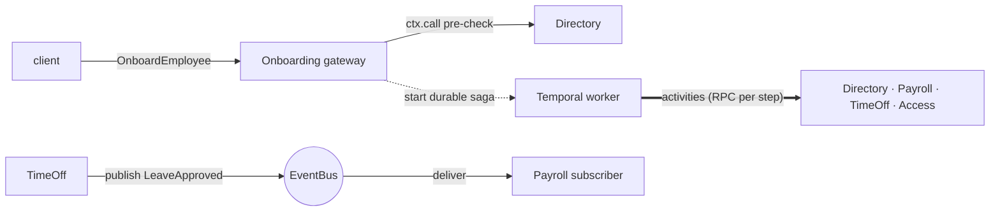

# Choosing a Communication Mechanism

A microservice rarely works alone. When one service needs another, Connectum
gives you **three orthogonal mechanisms** — and the hard part is not wiring any
one of them, it is **picking the right one for each interaction**. They are not
competitors; a single request flow often uses all three, each for the job it is
best at.

| Mechanism | Shape | Use it when | Connectum API |
|---|---|---|---|
| **`ctx.call` / `ctx.stream`** | synchronous request → response | you need the **answer now** to continue (validation, a lookup, a pre-check) | built in — the [service catalog](/en/guide/service-communication/service-catalog) |
| **EventBus** | asynchronous fire-and-forget | you want to **announce a fact** and let any number of consumers react, decoupled in time | built in — [`@connectum/events`](/en/guide/events) |
| **Durable saga** | long, multi-step transaction with rollback | a workflow **spans several services** and partial progress must be **compensated** on failure | the framework serves the RPCs; an external durable engine ([Temporal](https://temporal.io)) owns the orchestration |

The decision is about **coupling in time** and **failure semantics**, not about
performance. Ask, in order:

1. **Do I need the reply to proceed?** → `ctx.call` (synchronous).
2. **Am I just announcing that something happened?** → EventBus (fire-and-forget).
3. **Is this a multi-step transaction that must roll back as a unit?** → a durable saga.

::: tip Connectum stays thin
Two of the three mechanisms ship **in the framework** (`ctx.call`, EventBus). The
third — durable orchestration — is deliberately **not** reinvented: Connectum
serves the RPCs and you bring a best-of-breed engine (Temporal). The
[examples](#reference-examples) show all three composed in one codebase without
the framework growing a workflow engine of its own.
:::

## Synchronous: `ctx.call` / `ctx.stream`

Use it when the caller **cannot continue without the answer** — validating that
an entity exists, reading a value, a pre-check before committing to work. The
call is typed by the generated [service catalog](/en/guide/service-communication/service-catalog)
and **auto-routes**: in-process when the target service is mounted locally, over
the network via a [remote resolver](/en/guide/service-communication/resolvers)
when it lives in another process — the **handler code is identical either way**.

```typescript
// TimeOffService validates the employee before approving a leave request.
// In a monolith this dispatches in-process; split across pods it goes over
// the network — same line of code.
const employee = await ctx.call(
  'directory.v1.DirectoryService/GetEmployee',
  create(GetEmployeeRequestSchema, { id: req.employeeId }),
);
// A Code.NotFound from the directory propagates straight back to the caller.
```

The inbound deadline and cancellation signal **cascade** to the downstream call,
so a client that gives up tears down the whole chain. For request-response
chains, fan-out / fan-in, and streaming, see
[Communication Patterns](/en/guide/service-communication/patterns).

**Trade-off:** synchronous calls **couple availability** — if the callee is down,
the caller's request fails now. That is correct for a validation you cannot skip,
and wrong for a notification that can wait.

## Asynchronous: the EventBus

Use it when a service **announces a fact** and does not care who reacts — or
whether anyone reacts yet. The publisher emits an event on a topic; subscribers
consume it independently, decoupled in time and (with a broker) across processes.

```typescript
// After approving the leave, TimeOffService publishes a fact and moves on —
// it does not call payroll, and does not wait for it.
await eventBus.publish(
  LeaveApprovedSchema,
  create(LeaveApprovedSchema, { leaveRequestId, employeeId: req.employeeId, days: req.days }),
  { topic: LEAVE_APPROVED_TOPIC },
);
```

```typescript
// PayrollService subscribes to the topic and reacts on its own schedule.
events.service(PayrollEventHandlers, {
  async onLeaveApproved(event, ctx) {
    decrementBalance(event.employeeId, event.days);
    await ctx.ack();
  },
});
```

The adapter is pluggable — an in-memory adapter for tests, NATS / Kafka / Redis /
AMQP in production (see [Adapters](/en/guide/events/adapters)). The publisher and
subscriber never reference each other; they agree only on the **topic**.

**Trade-off:** you gain decoupling and resilience, but lose the immediate answer
and the simple call-stack. There is **no return value** and **no built-in
rollback** — which is exactly why a multi-step transaction needs the third tool.

## Durable: a saga with compensations

Use it when a single business operation **spans several services** and partial
progress is unacceptable — onboarding a hire (create the record, set up payroll,
grant time off, provision access) or a trip lifecycle (reserve, record, bill,
settle). Neither `ctx.call` (no durability if the process dies mid-flow) nor the
EventBus (no rollback) fits. This is the **saga** pattern: run the forward steps,
and on any failure run each completed step's **compensation** in reverse (LIFO)
order.

Connectum does **not** ship a workflow engine — it serves the RPCs and you drive
the saga from a durable orchestrator. The examples use [Temporal](https://temporal.io):

- The orchestration (the forward steps, the compensation stack, retries) lives in
  a **workflow** run by a dedicated **worker** process. The worker is the only
  process that loads the native Temporal addon; the RPC roles stay no-build.
- Each step is an **activity** — one ordinary `ctx.call`-style RPC against a role
  service. A step's **business** failure (e.g. a duplicate id → `AlreadyExists`)
  is made **non-retryable** so the workflow fails fast with nothing to undo;
  transient failures keep retrying (the durability the saga buys you).
- The compensations are **idempotent**, so an unwind after a partially-applied
  step is safe.

```
createEmployee ─▶ setupPayroll ─▶ grantTimeOff ─▶ provisionAccess ─▶ activate   ✓ COMPLETED
   on any failure ──▶ compensations run in reverse: revoke… ▶ teardown… ▶ offboard…   ✗ FAILED
```

A thin **gateway** RPC starts the workflow and exposes its status, so callers see
an ordinary service while the durable machinery runs behind it. The gateway can
still run a **synchronous pre-check** with `ctx.call` *before* starting the
workflow — so an invalid request is rejected immediately, with no durable run
created.

**Trade-off:** the most powerful and the most operationally heavy option — it
adds an external dependency and a worker process. Reach for it only when the
transaction genuinely spans services and must be atomic; a single-service
mutation does not need a saga.

## Combining them

The three are **complementary**, and a real flow uses each where it fits. In the
HRIS reference example, one codebase runs all three:



- **`ctx.call`** validates the new hire's id and an employee before approving leave.
- The **EventBus** broadcasts `LeaveApproved`, which payroll consumes to decrement
  the balance.
- The **durable saga** provisions the hire across four services with automatic
  compensation.

## Reference examples

Two end-to-end examples put these mechanisms to work — clone, read, and run them:

- **[car-sharing](https://github.com/Connectum-Framework/examples/tree/main/car-sharing)**
  — split microservices behind a JWT / proto-authz gateway, cross-service
  `ctx.call`, and a **durable trip saga** (reserve → record → bill → settle, with
  compensation), on Kubernetes + Istio.
- **[hris](https://github.com/Connectum-Framework/examples/tree/main/hris)** — one
  codebase that runs as a monolith *or* microservices by env, demonstrating **all
  three** mechanisms side by side: `ctx.call` validation, an EventBus
  `LeaveApproved` flow, and a **durable onboarding saga**.

## Related

- [Communication Patterns](/en/guide/service-communication/patterns) — request-response chains, fan-out / fan-in, streaming, error handling
- [Service Catalog](/en/guide/service-communication/service-catalog) — how `ctx.call` / `ctx.stream` are typed
- [Remote Resolvers](/en/guide/service-communication/resolvers) — routing a call to a remote process
- [Events](/en/guide/events) — the EventBus, topics, middleware, and adapters
- [Architecture Overview](/en/guide/production/architecture) — deployment-level patterns
