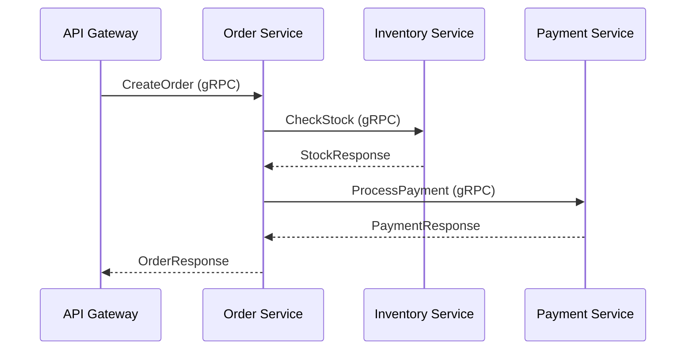

# Communication Patterns

Common inter-service communication patterns for gRPC/ConnectRPC microservices.

## Request-Response Chain

The most common pattern -- one service calls another sequentially, each call waiting for a response before proceeding.



```typescript
import { createClient } from '@connectrpc/connect';
import { createGrpcTransport } from '@connectrpc/connect-node';
import { InventoryService } from '#gen/inventory/v1/inventory_pb.js';
import { PaymentService } from '#gen/payment/v1/payment_pb.js';

const inventoryClient = createClient(InventoryService, inventoryTransport);
const paymentClient = createClient(PaymentService, paymentTransport);

// Sequential: check stock, then process payment
const routes = (router) => {
  router.service(OrderService, {
    async createOrder(req) {
      const stock = await inventoryClient.checkStock({ sku: req.sku });
      if (!stock.available) {
        throw new ConnectError('Out of stock', Code.FailedPrecondition);
      }

      const payment = await paymentClient.processPayment({
        amount: stock.price,
        customerId: req.customerId,
      });

      // ... create order with stock and payment data
    },
  });
};
```

::: tip When to use
Use sequential chains when each step depends on the result of the previous one. If steps are independent, prefer [Fan-Out / Fan-In](#fan-out-fan-in) for better latency.
:::

## Fan-Out / Fan-In

When a service needs data from multiple independent downstream services, call them in parallel with `Promise.all`:

```typescript
async createOrder(req) {
  // Fan-out: parallel calls to independent services
  const [stock, pricing, customerProfile] = await Promise.all([
    inventoryClient.checkStock({ sku: req.sku }),
    pricingClient.getPrice({ sku: req.sku }),
    customerClient.getProfile({ customerId: req.customerId }),
  ]);

  // Fan-in: combine results
  return createOrderFromData(stock, pricing, customerProfile);
}
```

**Benefits:**
- Total latency = max(individual latencies) instead of sum
- Each downstream call gets its own OTel client span
- Circuit breakers operate independently per client

**Considerations:**
- If one call fails, `Promise.all` rejects immediately -- use `Promise.allSettled` if partial results are acceptable
- Each parallel call consumes a connection from the HTTP/2 connection pool

### Partial Failure Handling

```typescript
const results = await Promise.allSettled([
  inventoryClient.checkStock({ sku: req.sku }),
  pricingClient.getPrice({ sku: req.sku }),
  recommendationClient.getSuggestions({ sku: req.sku }),
]);

const [stockResult, pricingResult, suggestionsResult] = results;

// Stock and pricing are required
if (stockResult.status === 'rejected' || pricingResult.status === 'rejected') {
  throw new ConnectError('Required service unavailable', Code.Unavailable);
}

// Suggestions are optional -- degrade gracefully
const suggestions = suggestionsResult.status === 'fulfilled'
  ? suggestionsResult.value.items
  : [];
```

## Server Streaming

For real-time data feeds -- the server sends a stream of messages in response to a single request:

```typescript
// Client consuming a server stream
for await (const update of orderClient.watchOrderStatus({ orderId: '123' })) {
  console.log(`Order status: ${update.status}`);
}
```

Streaming RPCs are fully instrumented by `createOtelClientInterceptor()`. The span covers the entire stream lifecycle -- from the initial request to stream completion. Individual messages are recorded as span events when `recordMessages` is enabled.

See [Client Interceptors -- Streaming Instrumentation](./client-interceptors#streaming-instrumentation) for details.

## Error Handling

gRPC errors propagate as `ConnectError` with standard status codes. Handle them explicitly when calling downstream services:

```typescript
import { ConnectError, Code } from '@connectrpc/connect';

try {
  const stock = await inventoryClient.checkStock({ sku: req.sku });
} catch (err) {
  if (err instanceof ConnectError) {
    switch (err.code) {
      case Code.NotFound:
        throw new ConnectError('SKU not found', Code.InvalidArgument);
      case Code.Unavailable:
        // Circuit breaker may have opened, or service is down
        throw new ConnectError('Inventory service unavailable', Code.Unavailable);
      case Code.DeadlineExceeded:
        throw new ConnectError('Inventory check timed out', Code.DeadlineExceeded);
      default:
        throw new ConnectError('Inventory check failed', Code.Internal);
    }
  }
  throw err;
}
```

### Error Translation

When forwarding errors from a downstream service, translate status codes to match your service's API contract. Don't leak internal error details to callers:

| Downstream Error | Recommended Translation |
|-----------------|------------------------|
| `NotFound` | `InvalidArgument` or `NotFound` (depending on context) |
| `Unavailable` | `Unavailable` (propagate) |
| `DeadlineExceeded` | `DeadlineExceeded` (propagate) |
| `Internal` | `Internal` (log details, return generic message) |
| `PermissionDenied` | `Internal` (don't expose auth details) |

## Related

- [Service Communication](/en/guide/service-communication) -- overview, transport configuration, service discovery
- [Client Interceptors](./client-interceptors) -- OTel, resilience, circuit breaker configuration
- [Architecture Patterns](/en/guide/production/architecture) -- full production architecture reference
- [Interceptors](/en/guide/interceptors) -- server-side interceptor chain
